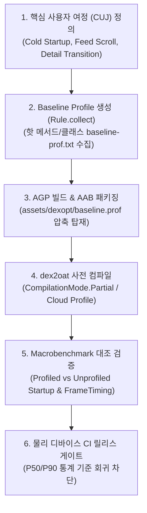

## Benchmark와 Baseline Profile 계약

이 지도는 Macrobenchmark 라이브러리와 Baseline Profile을 결합하여, 실제 사용자 여정(CUJ), ART 컴파일 조건(`CompilationMode`), 시작 상태(`StartupMode`), 물리 디바이스 CI 통제 환경에서 앱 성능을 결정론적으로 측정하고 회귀를 방지하는 계약을 다룬다.

---

### 1. Baseline Profile & Macrobenchmark 수명주기 파이프라인

---

### 2. 벤치마크 도구 및 컴파일 모드 비교 매트릭스

| 영역 | 주요 도구 / 모드 | 핵심 역할 및 측정 메커니즘 | 실행 환경 및 격리 수준 |
| :--- | :--- | :--- | :--- |
| **Profile Generation** | `BaselineProfileRule` | CUJ 실행 중 ART 트레이서로 핫 메서드 심볼(`baseline-prof.txt`) 수집 | 온디바이스 / 에뮬레이터 (GMD ATD) |
| **Profile Verification** | `CompilationMode.Partial(Require vs Disable)` | 동일 바이너리에서 프로필 적용 유무에 따른 시작 시간($\Delta\%$) 대조 증명 | 실제 물리 기기 (Thermal 통제) |
| **Macrobenchmark** | `MacrobenchmarkRule` | 외부 프로세스에서 UI Automator로 앱 전체 여정(시작/스크롤) 측정 | Out-of-Process (`com.app.benchmark`) |
| **Microbenchmark** | `BenchmarkRule` | 개별 함수/알고리즘 CPU 클럭 및 메모리 할당 루프 측정 | In-Process (CPU Lock 권장) |

---

## 정본 노트

- [Macrobenchmark는 실제 사용자 여정을 측정한다](macrobenchmark-user-journeys.md) - Out-of-process 실행, `StartupTimingMetric`, `FrameTimingMetric`
- [Macrobenchmark의 컴파일 모드는 테스트 계약의 일부다](macrobenchmark-compilation-modes.md) - `None`, `Partial(BaselineProfile)`, `Full(speed filter)`
- [Startup mode와 reportFullyDrawn이 시작 측정 기준을 정한다](startup-measurement-reportfullydrawn.md) - `COLD`, `WARM`, `HOT` 리셋 모델 및 `reportFullyDrawn()` 신호
- [CUJ 선택은 벤치마크 행동을 안정화한다](cuj-selection-stability.md) - Selector 안정화, `device.wait`, 시스템 엣지 제스처 마진
- [Baseline Profile 생성은 핵심 사용자 여정을 기록한다](baseline-profile-generation.md) - `baseline-prof.txt` 생성, `H/S/L` 플래그, AGP 번들링
- [Baseline Profile 검증은 profiled와 unprofiled 성능을 비교한다](baseline-profile-verification.md) - A/B 대조 측정, 개선율($\Delta\%$) 산출, 릴리스 게이트
- [Benchmark 결과는 물리 기기와 CI 조건을 통제해야 한다](benchmark-physical-device-controls.md) - Thermal Throttling, 배터리/클럭 통제, 실제 기기 vs GMD

---

### 관련 지도 (Related Maps)

- [Android 성능, 품질, 빌드 최적화 지도](../android-performance-testing-map.md)
- [런타임 성능 계약](../performance/performance.md)
- [테스트 품질 계약](../testing/testing-quality.md)
- [디버깅 도구 계약](../debugging/debugging.md)

