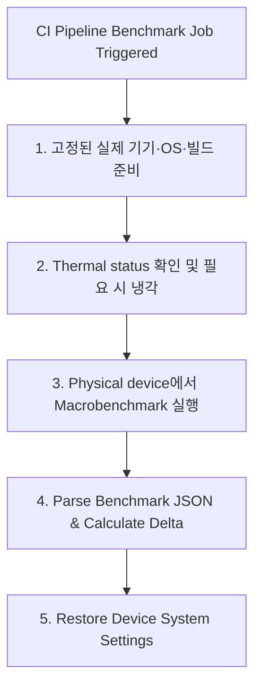

## Benchmark 결과는 물리 기기와 CI 조건을 통제해야 한다

상위 문서: [Android 성능, 품질, 빌드 최적화 지도](../android-performance-testing-map.md)
관련 지도: [Benchmark와 Baseline Profile 계약](benchmark-baseline.md)
관련 노트: [Macrobenchmark는 실제 사용자 여정을 측정한다](macrobenchmark-user-journeys.md)

회귀 판단에 쓰는 Macrobenchmark 수치는 고정된 물리 기기 또는 실제 기기 서비스에서 수집하는 것이 원칙이다. 에뮬레이터와 Gradle Managed Virtual Device(GMD)는 실행 가능성 확인에는 쓸 수 있지만 호스트 OS·하드웨어에 종속되어 실제 사용자 성능을 대표하지 않는다. 전원, 발열, OS 이미지, 백그라운드 작업과 측정 절차를 일정하게 유지하고 분산을 함께 기록한다.

### 1. 벤치마크 노이즈 차단 메커니즘

- **Thermal Throttling (발열 스로틀링)**: 연속 벤치마크 실행 시 CPU 온도가 상승하면 OS가 DVFS(Dynamic Voltage and Frequency Scaling)를 작동시켜 클럭을 강제 다운시키므로 측정치가 왜곡된다.
- **CPU Scaling Governor Lock**: rooted 기기의 clock lock은 Microbenchmark 안정화에 사용할 수 있다. Macrobenchmark의 일반 필수 조건으로 적용하거나 상용 기기에서 임의 sysfs 쓰기를 가정하지 않는다.
- **전원 및 시스템 환경 기록**: 충전 상태, 배터리 잔량, thermal status, OS 빌드를 측정 메타데이터에 남긴다. `dumpsys battery set`으로 값을 가장하는 것은 실제 발열·전원 상태를 고정하지 않는다.

### 2. CI 벤치마크 통제 워크플로우



### 3. 디바이스 사전 점검 및 Gradle GMD 스모크 설정 예시

#### 비파괴 사전 점검 쉘 스크립트 (`check_benchmark_device.sh`)

```bash
#!/usr/bin/env bash
set -euo pipefail

adb wait-for-device
adb shell getprop ro.build.fingerprint
adb shell dumpsys battery | grep -E "level:|status:|temperature:"
adb shell dumpsys thermalservice | grep -E "Thermal Status|mStatus"
```

#### Gradle Managed Virtual Device 스모크 실행 설정 (`build.gradle.kts`)

```kotlin
android {
    testOptions {
        managedDevices {
            devices {
                create<com.android.build.api.dsl.ManagedVirtualDevice>("pixel6Api33") {
                    device = "Pixel 6"
                    apiLevel = 33
                    systemImageSource = "aosp-atd" // Automated Test Device 이미지
                }
            }
        }
    }
}
```

### 4. 관측 가능한 실행 증거 (Observable Evidence)

#### ADB 시스템 설정 조회 덤프

```bash
adb shell settings get global window_animation_scale
adb shell dumpsys battery | grep level
```

```text
0
  level: 100
  status: 1
  health: 2
```

이 GMD 결과는 benchmark가 실행되는지 확인하는 스모크 신호로 사용하고, 사용자 성능 회귀 임계값은 실제 기기 결과로 판정한다. ATD 이미지는 계측 테스트용으로 최적화된 선택지이지 Macrobenchmark 에뮬레이터 실행의 필수 조건이 아니다.

### 5. CI 운영 원칙

- 에뮬레이터는 기능·파이프라인 검증용으로 제한한다. 필요에 따라 ATD(Automated Test Device)나 일반 AOSP 이미지를 고르되, 어느 쪽도 실제 기기 성능 수치로 승격하지 않는다.
- 분산 또는 이상치 기준은 지표·기기별 baseline으로 정한다. 임의의 단일 백분율로 실패시키지 말고 thermal 상태와 Perfetto trace를 함께 조사한다.

### 공식 문서

- https://developer.android.com/topic/performance/benchmarking/benchmarking-in-ci
- https://developer.android.com/topic/performance/benchmarking/macrobenchmark-overview

검증일: 2026-08-06. 공식 가이드의 실제 기기 권장과 에뮬레이터 비권장 원칙을 반영하고, ATD를 필수 조건이나 실제 성능 대체재로 설명한 부분을 교정했다.
