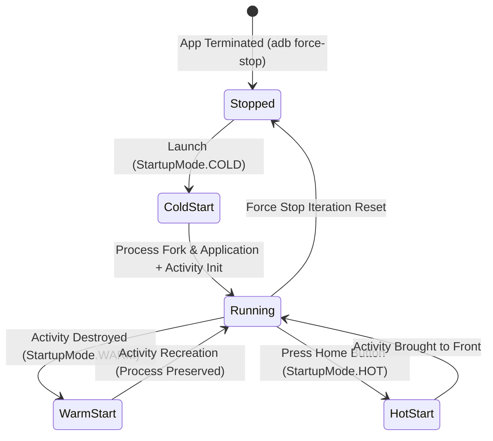

## Startup mode와 reportFullyDrawn이 시작 측정 기준을 정한다

상위 문서: [Android 성능, 품질, 빌드 최적화 지도](../android-performance-testing-map.md)
관련 지도: [Benchmark와 Baseline Profile 계약](benchmark-baseline.md)
관련 노트: [Android 시작 성능은 TTID와 TTFD로 나눈다](../performance/startup-performance-metrics.md)

Macrobenchmark에서 시작 성능 지표를 도출하기 위해서는 `StartupMode`(`COLD`, `WARM`, `HOT`)로 프로세스 힙/클래스 초기화 상대를 정의하고, `reportFullyDrawn()` 신호로 유효 렌더링 종료점을 명시해야 한다.

### 1. StartupMode별 리셋 동작 및 측정 구체 메커니즘

- **`StartupMode.COLD`**:
  - 매 반복(iteration) 전 `adb shell am force-stop <package>`를 실행하여 앱 프로세스를 강제 종료하고 힙/정적 클래스 변수를 백지화한다. **Zygote**(모든 앱 프로세스가 공통으로 상속하는 사전 초기화된 부모 프로세스 — 시스템 부팅 시 미리 뜬 채로 대기하다가 새 앱을 실행할 때마다 `fork()`로 자신을 복제해 준다) Fork부터 완전히 새로 시작하는 최고 측정 비용 조건이다.
- **`StartupMode.WARM`**:
  - 프로세스는 힙 메모리에 생존시켜 두고, `Activity` 인스턴스만 `finish()` 후 다시 Launch한다. 정적 싱글톤/DI 그래프 재사용성을 검증한다.
- **`StartupMode.HOT`**:
  - `Activity`와 프로세스가 모두 대기 상태에 있는 백그라운드 상태에서 `startActivity`로 전면(Foreground) 전환 비용만 측정한다.
- **`reportFullyDrawn()` 신호 경계**:
  - **Choreographer**(하드웨어 VSYNC 신호를 받아 매 프레임 `doFrame()` 콜백을 호출해 입력·애니메이션·그리기 작업을 하나의 타이밍 축에 정렬시키는 Android 프레임 스케줄러)의 단순 첫 프레임 draw(TTID)를 넘어 비동기 데이터 렌더링(TTFD) 완료 시점을 `StartupTimingMetric`에 포착시킨다.

### 2. StartupMode 상태 전환 모델



### 3. Startup Benchmark Kotlin 코드 구체 예시

```kotlin
import androidx.benchmark.macro.CompilationMode
import androidx.benchmark.macro.StartupMode
import androidx.benchmark.macro.StartupTimingMetric
import androidx.benchmark.macro.junit4.MacrobenchmarkRule
import androidx.test.ext.junit.runners.AndroidJUnit4
import org.junit.Rule
import org.junit.Test
import org.junit.runner.RunWith

@RunWith(AndroidJUnit4::class)
class StartupBenchmark {

    @get:Rule
    val benchmarkRule = MacrobenchmarkRule()

    @Test
    fun measureColdStartup() = benchmarkRule.measureRepeated(
        packageName = "com.example.app",
        metrics = listOf(StartupTimingMetric()),
        compilationMode = CompilationMode.Partial(),
        startupMode = StartupMode.COLD,
        iterations = 10
    ) {
        pressHome()
        startActivityAndWait()
    }

    @Test
    fun measureWarmStartup() = benchmarkRule.measureRepeated(
        packageName = "com.example.app",
        metrics = listOf(StartupTimingMetric()),
        compilationMode = CompilationMode.Partial(),
        startupMode = StartupMode.WARM,
        iterations = 10
    ) {
        pressHome()
        startActivityAndWait()
    }
}
```

### 4. 관측 가능한 실행 증거 (Observable Evidence)

#### Macrobenchmark COLD vs WARM 측정 결과 JSON 덤프

```json
{
  "benchmarks": [
    {
      "name": "measureColdStartup",
      "metrics": {
        "timeToInitialDisplayMs": { "median": 340.5, "P90": 380.2 },
        "timeToFullDisplayMs": { "median": 720.1, "P90": 810.0 }
      }
    },
    {
      "name": "measureWarmStartup",
      "metrics": {
        "timeToInitialDisplayMs": { "median": 112.4, "P90": 135.0 },
        "timeToFullDisplayMs": { "median": 310.8, "P90": 345.2 }
      }
    }
  ]
}
```

### 5. 측정 원칙

- Cold Start와 Warm Start를 단일 벤치마크 루프에 섞어 다루지 않는다.
- `reportFullyDrawn()`을 호출하지 않으면 `StartupTimingMetric`의 `timeToFullDisplayMs` 수치는 출력되지 않거나 `timeToInitialDisplayMs`와 동일한 값으로 반환된다.
- 1. 시작 전 앱 프로세스와 화면 상태를 정한다.
- 2. `startActivityAndWait()` 이후 기다릴 UI 신호를 정한다.
- 3. 필요하면 `reportFullyDrawn()` 호출 조건을 코드로 명확히 한다.
- 4. 로딩 스피너가 사라지는 것과 데이터 콘텐츠가 보이는 것을 구분한다.
- 5. cold, warm, hot 결과를 같은 표에서 섞지 않는다.

## 흔한 오류

- 모든 시작을 cold로 부르면서 실제로는 이전 프로세스를 재사용한다.
- 고정된 sleep으로 화면 준비를 추정해 기기별 오차를 만든다.
- TTFD를 사용하면서 앱이 해당 신호를 올바른 시점에 보고하지 않는다.
- 첫 프레임과 완전한 화면을 동일한 품질 목표로 취급한다.
- 시작 후 추가 클릭을 포함하고도 시작 metric의 범위를 설명하지 않는다.

## 공식 참고

- [Macrobenchmark 개요](https://developer.android.com/topic/performance/benchmarking/macrobenchmark-overview)
- [Baseline Profile 측정](https://developer.android.com/topic/performance/baselineprofiles/measure-baselineprofile)
