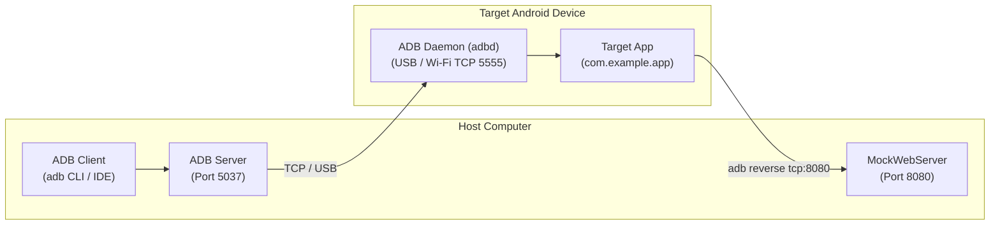

## ADB, Emulator, 디바이스 도구는 테스트 환경을 제어한다

상위 문서: [Android 성능, 품질, 빌드 최적화 지도](../android-performance-testing-map.md)

관련 지도: [디버깅 도구 계약](debugging.md)

관련 노트: [테스트 레이어는 피드백 비용으로 선택한다](../testing/test-pyramid-strategy.md)

ADB (Android Debug Bridge)와 에뮬레이터 툴킷은 개발자 호스트 PC 와 안드로이드 타겟 기기 런타임 간의 통신/제어 채널을 형성하여, 네트워크 프록시 포워딩, 시스템 상태 오버라이드, 패키지 바이너리 설치 및 액티비티 강제 전환을 결정론적으로 조작하는 환경 제어 계약이다.

### 1. ADB 통신 메커니즘 및 3 계층 구조

- **ADB Client**: 개발자 개발 컴퓨터(Host PC)의 CLI Terminal 또는 Android Studio IDE 에서 명령어를 수신하는 프로세스.
- **ADB Server**: Host PC 백그라운드에서 5037 포트로 상주하며 Client 명령어와 타겟 기기의 `adbd` 데몬 소켓 통신을 중계.
- **ADB Daemon (`adbd`)**: 타겟 안드로이드 기기 또는 에뮬레이터 OS 내부에서 root 또는 shell 권한으로 실행되는 백그라운드 서비스.
- **Port Forwarding & Reverse**:
  - `adb forward tcp:8080 tcp:9090`: Host 의 8080 포트 접속을 기기의 9090 포트로 전달.
  - `adb reverse tcp:8080 tcp:8080`: 기기의 8080 로컬 접속을 Host 의 MockServer 8080 포트로 전달 (인스투르멘테이션 E2E 필수 요소).

### 2. ADB 시스템 구성도 및 통신 흐름



### 3. 테스트 환경 고정 Shell Script 구체 예시

테스트 실행 전 에뮬레이터/디바이스의 포트 포워딩, 애니메이션 비활성화, 위치 및 딥링크를 전개하는 쉘 스크립트:

```bash
#!/usr/bin/env bash
set -euo pipefail

TARGET_PKG="com.example.app"

echo "===[ 1. Reverse Proxy Port Forwarding Setup ]==="
# 에뮬레이터의 localhost:8080 접속을 개발자 컴퓨터의 8080(MockServer)으로 매핑
adb reverse tcp:8080 tcp:8080

echo "===[ 2. Clear Package State & Install APK ]==="
adb shell am force-stop "$TARGET_PKG"
adb shell pm clear "$TARGET_PKG"

echo "===[ 3. Grant Runtime Permissions ]==="
adb shell pm grant "$TARGET_PKG" android.permission.CAMERA
adb shell pm grant "$TARGET_PKG" android.permission.ACCESS_FINE_LOCATION

echo "===[ 4. Trigger DeepLink Activity Launch ]==="
adb shell am start \
  -a android.intent.action.VIEW \
  -d "https://example.com/feed?item_id=99" \
  "$TARGET_PKG"
```

### 4. 관측 가능한 실행 증거 (Observable Evidence)

#### ADB 명령 실행 및 포트 반전/패키지 상태 출력

```bash
adb reverse --list
adb shell pm list packages -e com.example
```

```text
usb:33819022 tcp:8080 tcp:8080
package:com.example.app
package:com.example.app.benchmark
```

#### ADB Intent Launch 실행 응답

```text
Starting: Intent { act=android.intent.action.VIEW dat=https://example.com/... pkg=com.example.app }
Status: ok
Activity: com.example.app/.ui.feed.FeedDetailActivity
```

### 5. 디바이스 제어 가이던스

- **멀티 디바이스 명시**: 여러 디바이스가 호스트에 연결된 경우 반드시 `adb -s <device_serial>` 옵션을 붙여 잘못된 기기로 조작 명령이 전송되는 사고를 막는다.
- **Clean State 수집**: 성능/기능 테스트 전 `adb shell pm clear` 를 적용하여 SharedPreferences 및 로컬 샌드박스 디렉토리를 완전히 태운 상태에서 시작한다.
