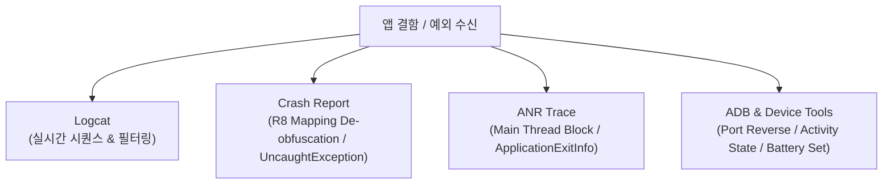

## 디버깅 도구 계약

이 지도는 테스트와 프로덕션에서 수집된 결함 신호를 Logcat, crash stack trace, ANR traces, JDWP debugger, ADB 디바이스 제어 도구로 좁히는 진단 계약을 다룬다.

### 디버깅 도구 체계 및 진단 분기

## 정본 노트

- [Logcat, crash, ANR, debugger는 서로 다른 질문에 답한다](./logcat-crash-anr-and-debugger-answer-different-questions.md)
- [ADB, emulator, device tool은 테스트 환경을 제어한다](./adb-emulator-and-device-tools-control-test-environment.md)

관련 지도: [Android 성능, 품질, 빌드 최적화 지도](../../performance/android-performance-quality-and-build-optimization.md), [테스트 품질 계약](../../testing/testing-quality-contracts/testing-quality-contracts.md), [런타임 성능 계약](../../performance/performance-contracts/performance-contracts.md)

