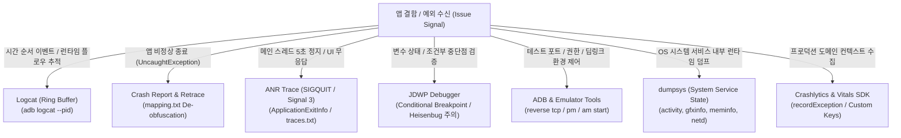

## 디버깅 도구 계약

이 지도는 개발, 계측 테스트, 프로덕션 런타임에서 발생하는 결함 신호(Crash, ANR, 런타임 로직 오류, 환경 결함)를 Logcat, de-obfuscated crash stack trace, ANR traces, JDWP debugger, ADB 디바이스 제어, dumpsys 시스템 서비스 스냅샷으로 좁히는 진단 계약을 다룬다.

---

### 1. 디버깅 도구 체계 및 진단 분기 트리

---

### 2. 진단 도구별 역할 및 특성 비교 매트릭스

| 도구 | 주요 진단 질문 | 수집 메커니즘 | 오버헤드 및 주의점 |
| :--- | :--- | :--- | :--- |
| **Logcat** | "어떤 순서로 이벤트와 상태 전이가 발생했는가?" | OS 커널 링 버퍼 (`main`, `system`, `crash`, `events`) | 링 버퍼 순환으로 오래된 로그 유실 가능 (`adb logcat -c` 필수) |
| **Crash Report / Retrace** | "어떤 코드 라인에서 치명적 런타임 예외가 발생했는가?" | `UncaughtExceptionHandler` + R8 `mapping.txt` | 릴리스 빌드 난독화 해제를 위한 `mapping.txt` 영구 보존 필수 |
| **ANR Trace** | "메인 스레드가 왜 5초 이상 블로킹되었는가?" | OS 커널 `SIGQUIT`(Signal 3) + `ApplicationExitInfo` | Lock contention, synchronous Disk I/O, 무한 루프 식별 |
| **JDWP Debugger** | "특정 분기 진입 시 메모리 힙 변수 상태는 무엇인가?" | JDWP 소켓 인터랙티브 인터럽트 | 인터프리터 런타임 스위칭으로 타이밍 왜곡(Heisenbug) 유발 |
| **ADB & Device Tools** | "테스트 환경(포트, 권한, 프로세스)을 어떻게 고정할 것인가?" | Host Client $\leftrightarrow$ Server $\leftrightarrow$ `adbd` 3계층 통신 | `adb reverse`, `pm clear`, `am start` 결정론적 환경 제어 |
| **dumpsys** | "OS 시스템 서비스(AMS, WMS, Netd, Gfx)의 내부 상태는 어떠한가?" | `ServiceManager` 조회 $\rightarrow$ `IBinder.dump()` IPC | 특정 시점의 전체 시스템 서비스 내부 상태 텍스트 덤프 |
| **Crashlytics / Vitals** | "프로덕션 사용자 환경에서 어떤 도메인 맥락으로 예외가 났는가?" | 자동 OS Vitals 수집 + 앱 코드 옵트인 `recordException()` | Non-fatal 예외는 배치 업로드 지연 발생 (보완적 관계) |

---

## 정본 노트

- [Logcat, crash, ANR, debugger는 서로 다른 질문에 답한다](logcat-crash-anr-diagnosis.md)
- [ADB, emulator, device tool은 테스트 환경을 제어한다](adb-emulator-device-tools.md)
- [dumpsys (안드로이드 시스템 서비스 상태 진단 도구)](dumpsys.md)
- [Crashlytics/Analytics SDK는 Android vitals에 없는 옵트인 컨텍스트를 더한다](crashlytics-analytics-vitals.md)

---

### 관련 지도 (Related Maps)

- [Android 성능, 품질, 빌드 최적화 지도](../android-performance-testing-map.md)
- [테스트 품질 계약](../testing/testing-quality.md)
- [런타임 성능 계약](../performance/performance.md)
- [Benchmark와 Baseline Profile 계약](../benchmark/benchmark-baseline.md)

