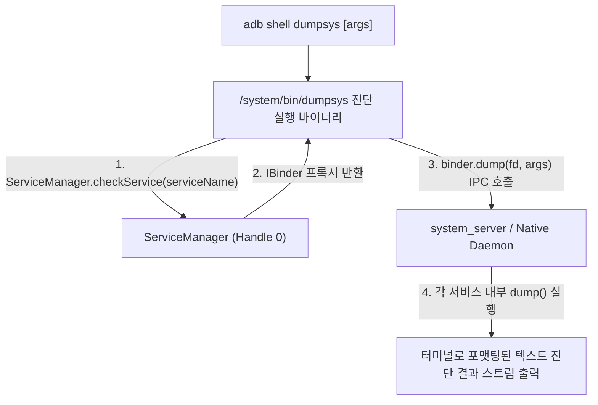

## dumpsys (안드로이드 시스템 서비스 상태 진단 도구)

상위 문서: [디버깅 도구 계약](debugging.md)
관련 지도: [Android 성능, 품질, 빌드 최적화 지도](../android-performance-testing-map.md), [런타임 성능 계약](../performance/performance.md)
관련 노트: [Profiler, Perfetto, dumpsys는 벤치마크가 아니라 진단 도구다](../performance/profiler-perfetto-diagnosis.md)

### 1. 개요 (Overview)

**`dumpsys`** 는 Android 기기에서 실행 중인 모든 시스템 서비스(`system_server` 내부 상주 자바 서비스 및 네이티브 데몬들)의 **내부 런타임 상태, 메모리 할당, 바인더 IPC 통계, 그래픽 렌더링 지표, 네트워크 라우팅 룰을 텍스트 형태로 덤프하여 출력하는 안드로이드 대표 CLI 시스템 진단 및 디버깅 도구**이다.

개발자 및 OS 엔지니어는 `adb shell dumpsys <service_name>` 명령을 통해 앱 수명주기, 그래픽 잔크 프레임 통계, 메모리 PSS/Heap 분포, 배터리 소모 전력, 네트워크 score, 윈도우 레이아웃 현황을 런타임에 실시간 관측할 수 있다.

---

### 2. 내부 동작 메커니즘

* **`dumpsys` (시청 종합 현황 실시간 관제 대장)**:
  - 스마트폰이라는 시청 내부의 모든 부서(건축과-WMS, 주민과-[AMS](../../04_system_services/service-lookup/activity-manager-service.md), 그래픽-RenderThread, 교통과-ConnectivityService)에 **"현재 처리 중인 모든 장부와 상태 서류를 당장 출력해 제출하라"**고 명령하여 관제실 모니터에 한눈에 출력시키는 정밀 진단 시스템.



---

### 3. 주요 시스템 서비스별 `dumpsys` 활용 가이드

| 진단 서비스 명칭 | 주요 관측 항목 및 역할 | 관련 레퍼런스 노드 |
| :--- | :--- | :--- |
| **`dumpsys gfxinfo`** | 렌더링 프레임 지속 시간, 50th/90th/95th 백분위수, Dropped/Janky frames | [렌더링 성능은 프레임 지연의 원인을 분리한다](../performance/rendering-jank-frame-deadlines.md) |
| **`dumpsys meminfo`** | Native/Dalvik Heap, PSS(Proportional Set Size), Graphics, Objects 카운트 | [Android 메모리는 사용량보다 회수되지 않는 객체를 본다](../performance/memory-performance-leak-evidence.md) |
| **`dumpsys batterystats`** | 셀룰러 라디오 활성 시간, Wakelock 횟수, UID별 전력 소모량(mAh) | [배터리, 네트워크, 저장소 성능은 자원 정책이다](../performance/resource-efficiency-policies.md) |
| **`dumpsys activity`** | 앱 컴포넌트 수명주기, Task 백스택, Process OOM 점수, `exit-info` ANR 트레이스 | [system_server](../../01_system_internals/boot-and-runtime/system-server/system-server.md) |
| **`dumpsys window`** | 화면 Window z-order, Focus 상태, Surface 크기 및 가시성 | [WindowManagerService](../../04_system_services/service-lookup/window-manager-service.md) |
| **`dumpsys connectivity`** | 활성 네트워크 score, Capabilities, Default Network 디스패치 상태 | [Android Connectivity](../../01_system_internals/connectivity/android-connectivity.md) |
| **`dumpsys netd`** | eBPF penalty_box 맵 상태, NetId 라우팅 테이블 룰 | [NetId 라우팅 테이블](../../01_system_internals/connectivity/netid-routing-table.md) |
| **`dumpsys dnsresolver`** | Private DNS (DNS-over-TLS) Validation 및 캐싱 상태 | [DNS-over-TLS DoT](../../../../computer-science/networking/dns-over-tls-dot.md) |

---

### 4. 핵심 CLI 명령어 및 진단 덤프 예시

```bash
# 1. 그래픽 렌더링 프레임 통계 덤프 (잔크 비율 및 VSYNC 누락 진단)
adb shell dumpsys gfxinfo com.example.app framestats

# 2. 프로세스 힙 및 PSS 메모리 분포 덤프 (메모리 누수 진단)
adb shell dumpsys meminfo com.example.app

# 3. 비정상 종료 및 ANR 이력 트레이스 덤프 (ApplicationExitInfo)
adb shell dumpsys activity exit-info com.example.app

# 4. 배터리 소모 및 무선 라디오 활성 통계 덤프
adb shell dumpsys batterystats --charged com.example.app

# 5. 활성 네트워크 라우팅 및 기본 네트워크 연결 상태 덤프
adb shell dumpsys connectivity
```

---

### 5. 연결 문서 (Related Links)

- [디버깅 도구 계약](debugging.md) - 디버깅 진단 체계 허브
- [Profiler, Perfetto, dumpsys는 벤치마크가 아니라 진단 도구다](../performance/profiler-perfetto-diagnosis.md) - 진단 도구와 벤치마크의 경계
- [system_server 표준 레퍼런스](../../01_system_internals/boot-and-runtime/system-server/system-server.md) - dumpsys 가 조회하는 시스템 서비스 총괄
- [ServiceManager](../../04_system_services/service-lookup/service-manager.md) - dumpsys 가 바인더 핸들을 조회하는 등록소
- [Binder IPC](../../01_system_internals/ipc-and-process/binder-ipc.md) - dumpsys 가 호출하는 `IBinder.dump()` 인터페이스

