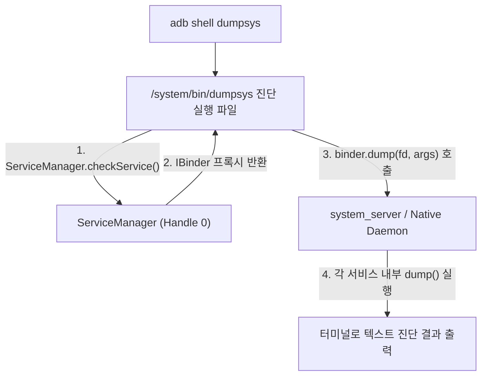

# dumpsys (안드로이드 시스템 서비스 상태 진단 도구)

## 1. 개요 (Overview)

**`dumpsys`** 는 Android 기기에서 실행 중인 모든 시스템 서비스(`system_server` 내부 상주 서비스 및 네이티브 데몬들)의 **내부 런타임 상태, 메모리 할당, 바인더 IPC 통계, 네트워크 라우팅 룰을 텍스트 형태로 덤프하여 출력하는 안드로이드 대표 CLI 시스템 진단 및 디버깅 도구**이다.

개발자 및 OS 엔지니어는 `adb shell dumpsys <service_name>` 명령을 통해 앱 런타임 수명주기, 네트워크 score, 배터리 상태, 윈도우 레이아웃 현황을 런타임에 실시간 관측할 수 있다.

---

### 초보자를 위한 쉽게 이해하는 비유

* **`dumpsys` (시청 종합 현황 실시간 관제 대장)**:
  - 스마트폰이라는 시청 내부의 모든 부서(건축과-WMS, 주민과-[AMS](../../04_system_services/activity-manager-service.md), 교통과-ConnectivityService)에 **"현재 처리 중인 모든 장부와 상태 서류를 당장 출력해 제출하라"**고 명령하여 관제실 모니터에 한눈에 출력시키는 정밀 진단 시스템.



---

## 2. 주요 시스템 서비스별 `dumpsys` 활용 가이드

| 진단 서비스 명칭 | 주요 관측 항목 및 역할 | 관련 레퍼런스 노드 |
| :--- | :--- | :--- |
| **`dumpsys connectivity`** | 활성 네트워크 score, Capabilities, Default Network 디스패치 상태 | [Android Connectivity](../../01_system_internals/connectivity/android-connectivity.md) |
| **`dumpsys netd`** | eBPF penalty_box 맵 상태, NetId 라우팅 테이블 룰 | [NetId 라우팅 테이블](../../01_system_internals/connectivity/netid-routing-table.md) |
| **`dumpsys dnsresolver`** | Private DNS (DNS-over-TLS) Validation 및 캐싱 상태 | [DNS-over-TLS DoT](../../../../computer-science/networking/dns-over-tls-dot.md) |
| **`dumpsys activity`** | 앱 컴포넌트 수명주기, Task 백스택, Process OOM 점수 | [system_server](../../04_system_services/system-server.md) |
| **`dumpsys window`** | 화면 Window z-order, Focus 상태, Surface 위치 | [WindowManagerService](../../04_system_services/window-manager-service.md) |
| **`dumpsys vpn`** | Always-on 및 Lockdown VPN 설정 및 active 상태 | [VPN Always-on vs Lockdown](../../05_security_privacy/vpn-always-on-vs-lockdown.md) |

---

## 3. 코드 및 CLI 명령어 예시

```bash
# 1. 활성 네트워크 및 디폴트 네트워크 상태 덤프
adb shell dumpsys connectivity

# 2. 특정 앱 패키지의 프로세스 및 메모리 상태만 덤프
adb shell dumpsys activity processes com.example.myapp

# 3. eBPF 및 방화벽 패킷 필터링 현황 덤프
adb shell dumpsys netd
```

---

## 4. 연결 문서 (Related Links)

- [system_server 표준 레퍼런스](../../04_system_services/system-server.md) - dumpsys 가 조회하는 자바 시스템 서비스 종합 프로세스
- [ServiceManager](../../04_system_services/service-manager.md) - dumpsys 가 바인더 핸들을 조회하는 등록소
- [Android Connectivity 런타임](../../01_system_internals/connectivity/android-connectivity.md) - 네트워크 덤프 수집
- [Binder IPC](../../01_system_internals/ipc-and-process/binder-ipc.md) - dumpsys 가 호출하는 IBinder.dump() 인터페이스
