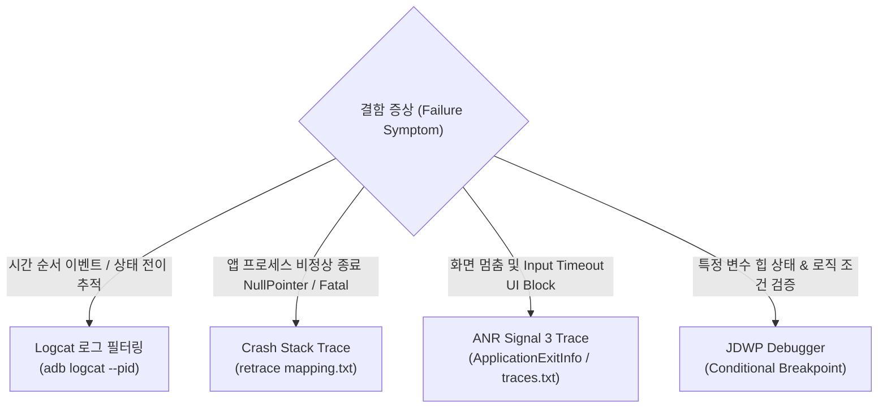

## Logcat, crash, ANR, debugger 는 서로 다른 질문에 답한다

상위 문서: [Android 성능, 품질, 빌드 최적화 지도](../android-performance-testing-map.md)
배경 지식: [순환 버퍼(Ring Buffer)](../../../../../02_references/operating-systems/buffer.md), [POSIX 시그널](../../../../operating-systems/ipc-contracts/posix-signal-contracts.md)

관련 지도: [디버깅 도구 계약](debugging.md)

관련 노트: [테스트 레이어는 피드백 비용으로 선택한다](../testing/test-pyramid-strategy.md)

각 진단 도구는 서로 전혀 다른 각도의 시스템 질문에 답하므로, 결함의 성격(실시간 시퀀스 관측 vs 치명적 런타임 예외 스택 vs 메인 스레드 응답 정지 vs 변수 상태 인스펙션)에 따라 적절한 증거 수집 도구를 일치시키는 진단 계약을 준수해야 한다.

### 1. 진단 도구별 역할 및 메커니즘

- **Logcat (시간축 이벤트 관측)**:
  - Android 시스템 **링 버퍼**(Ring Buffer — 크기가 고정돼 있어 꽉 차면 가장 오래된 항목부터 덮어쓰며 순환하는 버퍼. 그래서 오래 켜둔 세션일수록 과거 로그가 새 로그에 밀려 사라진다)(`main`, `system`, `crash`, `events`)에서 실행 순서대로 수집되는 1 차 시퀀스 로그.
  - `--pid=$(adb shell pidof -s <package>)` 로 해당 프로세스 로그만 격리 수집.
- **Crash Report (치명적 크래시 디코딩)**:
  - `UncaughtExceptionHandler` 에 의해 힙 포인터 및 예외 스택 수집.
  - **R8 Mapping De-obfuscation (`retrace`)**: ProGuard/R8 난독화된 릴리스 덤프를 `mapping.txt` 와 결합하여 라인 번호 및 원본 클래스/메서드 심볼 복원.
- **ANR (Application Not Responding Trace)**:
  - 메인 스레드가 5 초 이상 블로킹될 때 OS 가 전달하는 **`SIGQUIT`**(Signal 3 — 커널이 프로세스에 비동기로 보내는 POSIX 시그널 중 하나로, 기본 동작은 프로세스의 현재 스레드 상태를 스택 덤프로 남기는 것이다) 트레이스. `/data/anr/traces.txt` 및 Android 11+ `ApplicationExitInfo` 수집.
- **Debugger (JDWP Breakpoint)**:
  - JDWP (Java Debug Wire Protocol) 기반 인터랙티브 인스펙션. 브레이크포인트 연결 시 인터프리터 런타임 스위칭으로 타이밍이 왜곡되어 **Heisenbug**(디버거를 붙이거나 로그를 추가하는 등 "관찰"하려는 행위 자체가 실행 타이밍을 바꿔서, 관찰하지 않을 때는 재현되던 버그가 관찰하는 순간 사라지거나 다르게 동작하는 현상)가 발생하기 쉬우므로 동기화/레이스 조건 진단에는 불리함.

### 2. 결함 증상별 진단 도구 선택 매트릭스



### 3. Logcat 및 Retrace 디코딩 Shell Command 구체 예시

#### Logcat PID 필터링 명령

```bash
# 버퍼 정리 후 앱 프로세스 전용 로그만 실시간 출력
adb logcat -c
adb logcat --pid=$(adb shell pidof -s com.example.app) *:V
```

#### R8 Mapping De-obfuscation (`retrace`) 명령

```bash
# R8 난독화된 크래시 로그를 원본 코드로 디코딩
$ANDROID_HOME/cmdline-tools/latest/bin/retrace build/outputs/mapping/release/mapping.txt obfuscated_stacktrace.txt
```

### 4. 관측 가능한 실행 증거 (Observable Evidence)

#### De-obfuscated Crash Stack Trace 덤프 예시

```text
# Before De-obfuscation (Raw Obfuscated Crash Log)
java.lang.NullPointerException: Attempt to invoke virtual method 'a.b.c.d()' on a null object reference
    at com.example.app.a.b.a(SourceFile:12)
    at com.example.app.ui.a.onViewCreated(SourceFile:45)

# After Retrace (Symbolic Stack Trace)
java.lang.NullPointerException: Attempt to invoke virtual method 'com.example.app.model.User.getName()' on a null object reference
    at com.example.app.repository.UserRepository.getUserName(UserRepository.kt:28)
    at com.example.app.ui.MainFragment.onViewCreated(MainFragment.kt:102)
```

#### ANR traces.txt 메인 스레드 덤프 예시

```text
"main" prio=5 tid=1 Native
  | group="main" sCount=1 dsCount=0 flags=1 obj=0x72a01b40 self=0xb400007821c21000
  | sysTid=14201 nice=-10 cgrp=default sched=0/0 handle=0x7b21a84498
  at android.os.MessageQueue.nativePollOnce(Native Method)
  at android.os.MessageQueue.next(MessageQueue.java:335)
  at android.os.Looper.loopOnce(Looper.java:161)
  at android.os.Looper.loop(Looper.java:288)
  at android.app.ActivityThread.main(ActivityThread.java:7898)
```

### 5. 진단 운영 수칙

- **Logcat 비우기**: 재현 시나리오를 시작하기 전 반드시 `adb logcat -c` 로 이전 버퍼 노이즈를 비운다.
- **R8 Mapping 보존**: 모든 배포 빌드 생성 시 `mapping.txt` 를 CI 아티팩트로 영구 보존하여 프로덕션 Crashlytics 리포트 복원력을 유지한다.
