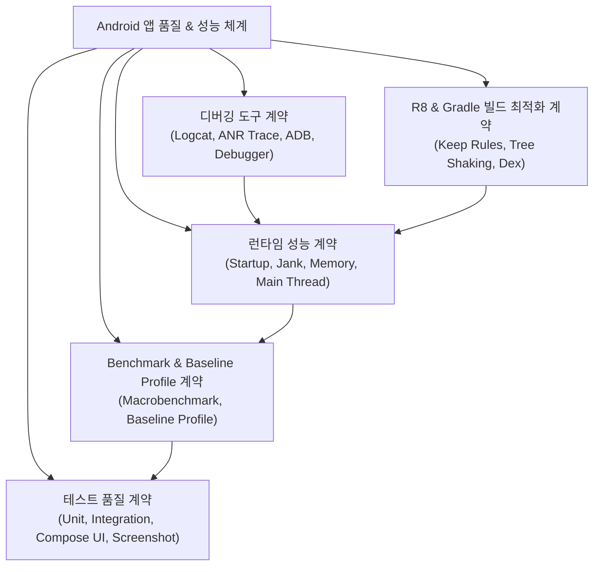

## Android 성능, 품질, 빌드 최적화 지도

이 지도는 Android 앱 품질을 한 덩어리로 보지 않고 사용자 성능, 반복 가능한 측정, 테스트 피드백, 진단 도구, 배포 산출물 최적화로 분리한다.

배경 지식: [Learning Spine 11장 — 관찰·테스트·품질 feedback](../../00_foundations/learning-spine/11-observation-testing-and-quality-feedback.md)

빌드 산출물 최적화의 소유권은 [Packaging and Deployment](../../03_packaging_deployment/android-packaging-deployment.md)에 있다. 이 지도는 runtime quality와 검증 feedback을 중심으로 하고 R8·Gradle은 성능 결과와 만나는 경계만 연결한다.

### 품질 및 성능 체계도

## 정본 노트

- [런타임 성능 계약](./performance/performance.md)
- [Benchmark와 Baseline Profile 계약](./benchmark-baseline/benchmark-baseline.md)
- [Compose 성능 계약](../../02_app_framework/jetpack-compose/performance/compose-performance.md)
- [테스트 품질 계약](../testing/testing-quality/testing-quality.md)
- [디버깅 도구 계약](../debugging/debugging/debugging.md)
- [R8와 Gradle 빌드 최적화 계약](../../03_packaging_deployment/optimization/build-optimization.md)
