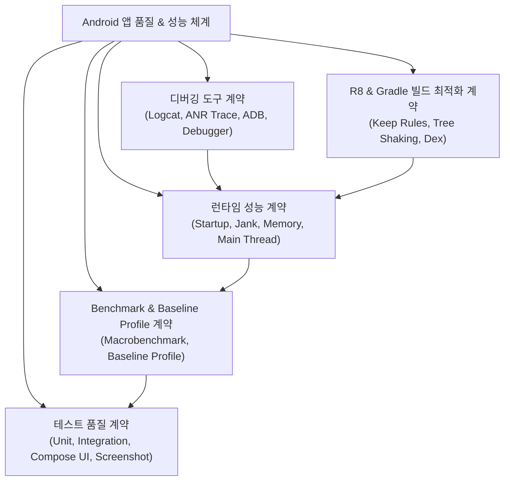

## Android 성능, 품질, 빌드 최적화 지도

이 지도는 Android 앱 품질을 한 덩어리로 보지 않고 사용자 성능, 반복 가능한 측정, 테스트 피드백, 진단 도구, 배포 산출물 최적화로 분리한다.

### 품질 및 성능 체계도

## 정본 노트

- [런타임 성능 계약](./performance-contracts/performance-contracts.md)
- [Benchmark와 Baseline Profile 계약](./benchmark-baseline-contracts/benchmark-baseline-contracts.md)
- [Compose 성능 계약](../../02_app_framework/jetpack-compose/performance/compose-performance-contracts/compose-performance-contracts.md)
- [테스트 품질 계약](../testing/testing-quality-contracts/testing-quality-contracts.md)
- [디버깅 도구 계약](../debugging/debugging-contracts/debugging-contracts.md)
- [R8와 Gradle 빌드 최적화 계약](../../03_packaging_deployment/optimization/build-optimization-contracts/build-optimization-contracts.md)

