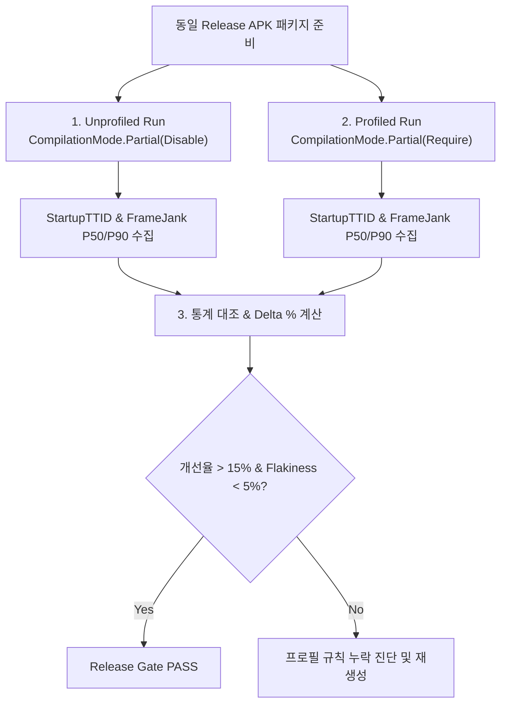

## Baseline Profile 검증은 profiled와 unprofiled 성능을 비교한다

상위 문서: [Android 성능, 품질, 빌드 최적화 지도](../android-performance-quality-and-build-optimization.md)
관련 지도: [Benchmark와 Baseline Profile 계약](./benchmark-baseline-contracts.md)
관련 노트: [Android 성능은 측정 후 최적화한다](../performance-contracts/measure-before-optimizing-android-performance.md)

Baseline Profile의 유효성 검증은 단순 생성을 넘어서 동일한 기기 및 빌드 바이너리 환경에서 Profile 미적용(`BaselineProfileMode.Disable`) 대비 Profile 적용(`BaselineProfileMode.Require`) 시의 시작 및 프레임 렌더링 지표 개선율을 대조 증명하는 수량적 검증 계약이다.

### 1. A/B 대조 검증 메커니즘

- **Profiled vs Unprofiled 조건**:
  - **Unprofiled (`BaselineProfileMode.Disable`)**: Baseline Profile 규칙을 강제로 비활성화하고 `dex2oat` 사전 컴파일을 취소하여 순수 JIT / Interpreter 상태로 시작 시간 산출.
  - **Profiled (`BaselineProfileMode.Require`)**: `baseline-prof.txt`에 기록된 핫 경로를 `dex2oat`로 사전 컴파일한 후 시작 시간 및 스크롤 프레임 산출.
- **개선 지표 통계**:
  $$\text{Improvement Ratio (\%)} = \left( \frac{\text{Unprofiled Median} - \text{Profiled Median}}{\text{Unprofiled Median}} \right) \times 100$$
  - 일반적으로 Cold Startup TTID 기준 15% ~ 30% 수준의 개선이 확인되어야 정상 적용으로 판정한다.

### 2. 검증 대조 워크플로우



### 3. Profiled 대조 검증 Kotlin 테스트 코드 구체 예시

```kotlin
import androidx.benchmark.macro.BaselineProfileMode
import androidx.benchmark.macro.CompilationMode
import androidx.benchmark.macro.StartupMode
import androidx.benchmark.macro.StartupTimingMetric
import androidx.benchmark.macro.junit4.MacrobenchmarkRule
import androidx.test.ext.junit.runners.AndroidJUnit4
import org.junit.Rule
import org.junit.Test
import org.junit.runner.RunWith

@RunWith(AndroidJUnit4::class)
class BaselineProfileVerificationTest {

    @get:Rule
    val benchmarkRule = MacrobenchmarkRule()

    @Test
    fun verifyStartupNoProfile() = measureStartup(
        CompilationMode.Partial(baselineProfileMode = BaselineProfileMode.Disable)
    )

    @Test
    fun verifyStartupWithProfile() = measureStartup(
        CompilationMode.Partial(baselineProfileMode = BaselineProfileMode.Require)
    )

    private fun measureStartup(mode: CompilationMode) {
        benchmarkRule.measureRepeated(
            packageName = "com.example.app",
            metrics = listOf(StartupTimingMetric()),
            compilationMode = mode,
            startupMode = StartupMode.COLD,
            iterations = 10
        ) {
            pressHome()
            startActivityAndWait()
        }
    }
}
```

### 4. 관측 가능한 검증 증거 (Observable Evidence)

#### Macrobenchmark 대조 리포트 산출 결과

```json
{
  "benchmarks": [
    {
      "name": "verifyStartupNoProfile",
      "metrics": {
        "timeToInitialDisplayMs": { "median": 482.0, "P90": 530.4 }
      }
    },
    {
      "name": "verifyStartupWithProfile",
      "metrics": {
        "timeToInitialDisplayMs": { "median": 334.5, "P90": 362.1 }
      }
    }
  ],
  "summary": {
    "metric": "timeToInitialDisplayMs",
    "unprofiledMedian": 482.0,
    "profiledMedian": 334.5,
    "deltaMs": -147.5,
    "improvementPercentage": "30.60%"
  }
}
```

### 5. 검증 미달 시 진단 원칙

- 개선율이 5% 미만이거나 미미하다면:
  1. `baseline-prof.txt`에 핵심 `MainActivity` 및 Compose 라이브러리 핫 메서드가 누락되었는지 확인한다.
  2. 릴리스 APK의 `assets/dexopt/baseline.prof` 파일이 정상 탑재되었는지 APK Analyzer로 검증한다.

