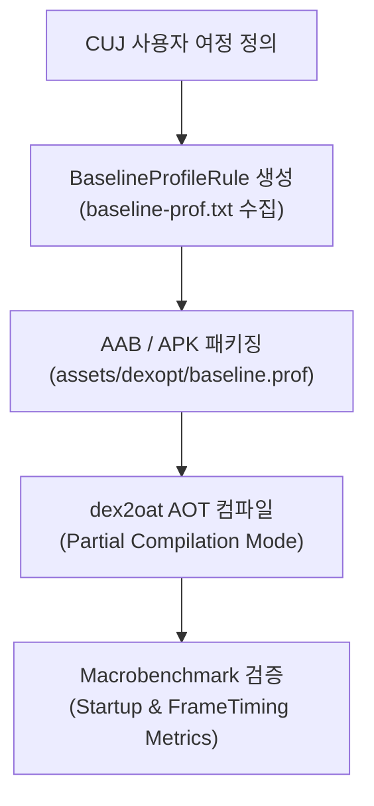

## Benchmark와 Baseline Profile 계약

이 지도는 Macrobenchmark와 Baseline Profile을 실제 사용자 여정, 컴파일 조건, 검증 조건으로 분리한다.

### Baseline Profile & Benchmark 파이프라인

## 정본 노트

- [Macrobenchmark는 실제 사용자 여정을 측정한다](./macrobenchmark-measures-real-user-journeys.md)
- [Macrobenchmark의 컴파일 모드는 테스트 계약의 일부다](./macrobenchmark-compilation-mode-is-part-of-test-contract.md)
- [Startup mode와 reportFullyDrawn이 시작 측정 기준을 정한다](./startup-mode-and-reportfullydrawn-define-startup-measurement.md)
- [CUJ 선택은 벤치마크 행동을 안정화한다](./cuj-selection-keeps-benchmark-actions-stable.md)
- [Baseline Profile 생성은 핵심 사용자 여정을 기록한다](./baseline-profile-generation-records-critical-user-journeys.md)
- [Baseline Profile 검증은 profiled와 unprofiled 성능을 비교한다](./baseline-profile-verification-compares-profiled-and-unprofiled-performance.md)
- [Benchmark 결과는 물리 기기와 CI 조건을 통제해야 한다](./benchmark-results-require-physical-device-and-ci-controls.md)

관련 지도: [Android 성능, 품질, 빌드 최적화 지도](../android-performance-quality-and-build-optimization.md), [런타임 성능 계약](../performance-contracts/performance-contracts.md), [테스트 품질 계약](../../testing/testing-quality-contracts/testing-quality-contracts.md)
