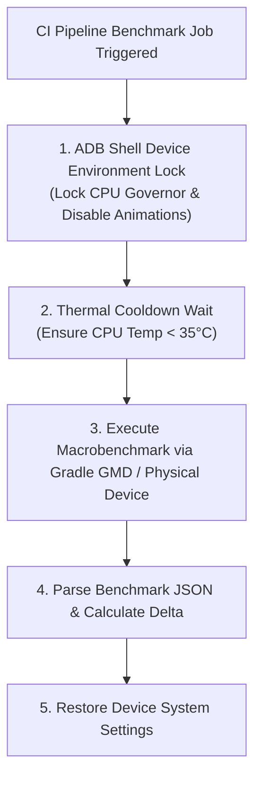

## Benchmark 결과는 물리 기기와 CI 조건을 통제해야 한다

상위 문서: [Android 성능, 품질, 빌드 최적화 지도](../android-performance-quality-and-build-optimization.md)
관련 지도: [Benchmark와 Baseline Profile 계약](./benchmark-baseline-contracts.md)
관련 노트: [Macrobenchmark는 실제 사용자 여정을 측정한다](./macrobenchmark-measures-real-user-journeys.md)

Macrobenchmark 수치는 호스트 시스템 스케줄링 변동이 심한 일반 에뮬레이터 대신 고정된 물리 기기(Physical Device) 또는 AGP Gradle Managed Device(GMD)에서 전원, 발열, 애니메이션, CPU 클럭 환경을 물리적으로 통제(Environment Pinning)한 상태로 수집해야 한다.

### 1. 벤치마크 노이즈 차단 메커니즘

- **Thermal Throttling (발열 스로틀링)**: 연속 벤치마크 실행 시 CPU 온도가 상승하면 OS가 DVFS(Dynamic Voltage and Frequency Scaling)를 작동시켜 클럭을 강제 다운시키므로 측정치가 왜곡된다.
- **CPU Scaling Governor Lock**: CPU 주파수를 `performance` 모드로 고정하여 클럭 주동을 제거한다.
- **전원 및 시스템 환경 고정**:
  - `dumpsys battery set status 1`: 배터리 충전 상태 고정 (충전 발열 방지).
  - 애니메이션 스케일 0 처리: `window_animation_scale`, `transition_animation_scale`, `animator_duration_scale`.

### 2. CI 벤치마크 통제 워크플로우



### 3. 디바이스 고정 Shell Script 및 Gradle GMD 설정 코드 예시

#### 디바이스 통제 쉘 스크립트 (`setup_benchmark_device.sh`)

```bash
#!/usr/bin/env bash
set -euo pipefail

echo "===[ Locking Benchmark Device Environment ]==="

# 1. 시스템 애니메이션 끄기
adb shell settings put global window_animation_scale 0
adb shell settings put global transition_animation_scale 0
adb shell settings put global animator_duration_scale 0

# 2. 화면 노티피케이션 및 상태바 드로어 닫기
adb shell cmd statusbar collapse

# 3. 배터리 소모 및 충전 발열 시뮬레이션 해제
adb shell dumpsys battery set status 1
adb shell dumpsys battery set level 100

# 4. (Rooted Device) CPU Governor를 performance로 고정
adb shell "echo performance > /sys/devices/system/cpu/cpu0/cpufreq/scaling_governor" || true

echo "Device environment successfully pinned."
```

#### Gradle Managed Devices (GMD) 벤치마크 설정 (`build.gradle.kts`)

```kotlin
android {
    testOptions {
        managedDevices {
            devices {
                create<com.android.build.api.dsl.ManagedVirtualDevice>("pixel6Api33") {
                    device = "Pixel 6"
                    apiLevel = 33
                    systemImageSource = "aosp-atd" // Automated Test Development 전용 경량 이미지
                }
            }
        }
    }
}
```

### 4. 관측 가능한 실행 증거 (Observable Evidence)

#### ADB 시스템 설정 조회 덤프

```bash
adb shell settings get global window_animation_scale
adb shell dumpsys battery | grep level
```

```text
0
  level: 100
  status: 1
  health: 2
```

### 5. CI 운영 원칙

- 에뮬레이터를 쓸 경우 반드시 ATD(Automated Test Development) 시스템 이미지를 채택하여 Google Play Services 배경 작업을 제거한다.
- 벤치마크 수치에 이상치(Variance > 10%)가 다수 포함되면 실행 시점의 발열 로그를 확인하고 조사를 즉시 중단한다.
