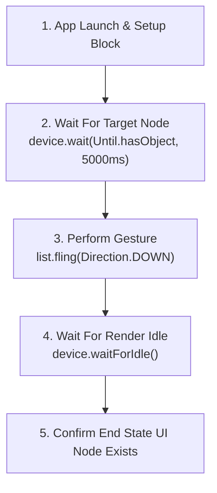

## CUJ 선택은 벤치마크 행동을 안정화한다

상위 문서: [Android 성능, 품질, 빌드 최적화 지도](../android-performance-quality-and-build-optimization.md)
관련 지도: [Benchmark와 Baseline Profile 계약](./benchmark-baseline-contracts.md)
관련 노트: [Macrobenchmark는 실제 사용자 여정을 측정한다](./macrobenchmark-measures-real-user-journeys.md)

핵심 사용자 여정(Critical User Journey, CUJ) 선택은 비즈니스 가치가 높은 대표 경로(시작, 목록 스크롤, 상세 진입, 결제)로 한정하고, UI Automator 동기화를 통해 제스처 타임아웃 플래키니스(Flakiness)를 사전에 통제하는 안정화 계약이다.

### 1. CUJ 안정화 및 UI Automator 동기화 메커니즘

- **안정적 UI Selector**: `By.text()`나 dynamic string 기반 검색을 지양하고, `Modifier.testTag("feed_list")` 또는 `android:id="@+id/feed_list"` 기반의 `By.res()` 선언을 강제한다.
- **Explicit Wait 동기화**: `device.waitForIdle()` 대신 `device.wait(Until.hasObject(By.res("feed_item")), timeoutMs)`를 사용하여 네트워크/DB 로딩 완료 시점을 명시적으로 기다린다.
- **제스처 여백 (Gesture Margin)**: 화면 엣지 시스템 제스처(Android Back Swipe)와의 충돌을 막기 위해 `setGestureMargin(device.displayWidth / 5)`를 적용한다.

### 2. 결정적 CUJ 실행 흐름



### 3. 안정화된 CUJ UI Automator Kotlin 코드 구체 예시

```kotlin
import androidx.benchmark.macro.FrameTimingMetric
import androidx.benchmark.macro.StartupMode
import androidx.benchmark.macro.junit4.MacrobenchmarkRule
import androidx.test.uiautomator.By
import androidx.test.uiautomator.Direction
import androidx.test.uiautomator.Until
import org.junit.Rule
import org.junit.Test

class FeedCujBenchmark {

    @get:Rule
    val benchmarkRule = MacrobenchmarkRule()

    @Test
    fun benchmarkFeedToDetailJourney() = benchmarkRule.measureRepeated(
        packageName = "com.example.app",
        metrics = listOf(FrameTimingMetric()),
        startupMode = StartupMode.WARM,
        iterations = 10,
        setupBlock = {
            pressHome()
            startActivityAndWait()
        }
    ) {
        // 1. 피드 리스트 노드 표출까지 5초 동기화 대기
        val feedListFound = device.wait(Until.hasObject(By.res("feed_list_tag")), 5_000)
        assert(feedListFound) { "Feed list not loaded in time!" }

        val feedList = device.findObject(By.res("feed_list_tag"))
        
        // 2. 시스템 엣지 제스처 방지 마진 설정 후 스크롤
        feedList.setGestureMargin(device.displayWidth / 6)
        feedList.scroll(Direction.DOWN, 0.8f)
        device.waitForIdle()

        // 3. 첫 번째 아이템 클릭하여 상세 화면 진입
        val firstItem = device.findObject(By.res("feed_item_0"))
        firstItem.click()

        // 4. 상세 화면 전환 표출 검증
        device.wait(Until.hasObject(By.res("detail_title_tag")), 3_000)
    }
}
```

### 4. 관측 가능한 실행 증거 (Observable Evidence)

#### UI Automator 노드 탐색 및 iteration 성공 로그

```text
I/Macrobenchmark: Iteration 1/10 starting...
I/UIAutomator: Waiting for selector [resource-id="feed_list_tag"] (timeout 5000ms) -> Found in 240ms
I/UIAutomator: Performing scroll DOWN on UiObject2 [resource-id="feed_list_tag"]
I/UIAutomator: Waiting for selector [resource-id="detail_title_tag"] (timeout 3000ms) -> Found in 180ms
I/Macrobenchmark: Iteration 1/10 completed successfully (Frame Overrun P50: -3.2ms)
```

### 5. CUJ 설계 운영 원칙

- 앱 내 모든 화면을 CUJ 벤치마크로 만들지 않고, 사용자 트래픽의 80% 이상을 차지하는 Top 3-5 핵심 경로에 집중한다.
- UI 노드를 찾지 못해 발생하는 Timeout Exception은 성능 결함이 아닌 테스트 안정화 결함으로 분류하고 Selectors를 보정한다.
- 테스트는 대상 앱과 분리된 프로세스에서 실행된다.
- Compose 요소는 안정적인 테스트 태그나 접근 가능한 식별자를 제공해야 한다.
- 텍스트 검색만 사용하면 다국어와 카피 변경에 취약할 수 있다.
- 리소스 ID, 콘텐츠 설명, 테스트 태그 중 팀의 규칙을 정한다.

1. setup에서 홈 이동과 초기 화면 준비를 수행한다.
2. 측정 블록에는 사용자가 수행하는 핵심 액션만 둔다.
3. 네트워크 대기나 애니메이션 종료는 안정적인 조건으로 기다린다.
4. 측정 끝에는 여정의 완료 상태가 실제로 도달했는지 확인한다.
5. 동일한 CUJ를 Baseline Profile 생성과 검증에 재사용한다.

## 피해야 할 패턴

- 임의의 좌표 클릭으로 화면 구조에 강하게 결합하기
- 너무 짧은 timeout으로 간헐적 실패를 만들기
- 성능과 무관한 긴 sleep을 매 반복에 포함하기
- 프로필 생성용 흐름과 측정용 흐름을 다르게 만들기
- 한 테스트에 너무 많은 독립 여정을 넣어 원인을 흐리기

## 공식 참고

- [Macrobenchmark 개요](https://developer.android.com/topic/performance/benchmarking/macrobenchmark-overview)
- [Baseline Profile 생성](https://developer.android.com/topic/performance/baselineprofiles/create-baselineprofile)
