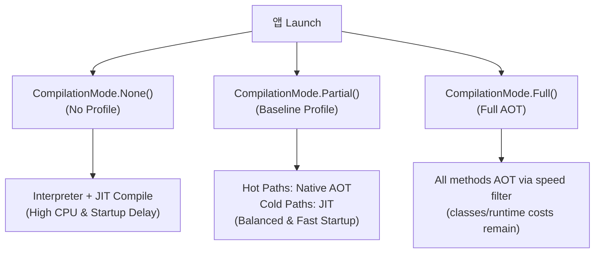

## Macrobenchmark의 컴파일 모드는 테스트 계약의 일부다

상위 문서: [Android 성능, 품질, 빌드 최적화 지도](../android-performance-quality-and-build-optimization.md)
관련 지도: [Benchmark와 Baseline Profile 계약](./benchmark-baseline-contracts.md)
관련 노트: [Baseline Profile 생성은 핵심 사용자 여정을 기록한다](./baseline-profile-generation-records-critical-user-journeys.md)

Macrobenchmark 실행 시 적용하는 ART 컴파일 모드(`CompilationMode`)는 앱의 실행 패러다임(JIT vs Baseline Profile AOT vs Full AOT)을 결정하므로, 이를 명시하지 않는 측정 결과는 회귀 분석의 기준이 될 수 없다.

### 1. ART 컴파일 모드 메커니즘과 차이점

- **`CompilationMode.None()`**:
  - **동작**: 프로필 및 미리 컴파일된 AOT DEX 코드를 삭제하고 인터프리터(Interpreter) 및 JIT (Just-In-Time) 컴파일러에 전적으로 의존.
  - **용도**: 첫 설치 직후 Baseline Profile이 전혀 적용되지 않은 최악(Worst-case) 실행 성능 측정.
- **`CompilationMode.Partial(BaselineProfileMode.Require)`**:
  - **동작**: `baseline-prof.txt`에 기록된 핫 메서드/클래스는 설치 전 `dex2oat`에 의해 AOT(Ahead-Of-Time) 바이너리로 사전 컴파일하고, 나머지 코드는 JIT로 보완.
  - **용도**: Google Play Store를 통해 배포된 실제 사용자의 앱 체감 성능 검증.
- **`CompilationMode.Full()`**:
  - **동작**: 대상 앱의 모든 메서드와 클래스를 AOT 컴파일한다. API 24+에서 `cmd package compile -f -m speed`와 동일한 효과를 가진다.
  - **용도**: 앱 전체가 완전히 사전 컴파일된 최적의 성능 상태를 측정. 단, JIT·런타임 비용이 완전히 사라지는 것은 아님을 유의한다.

### 2. ART 컴파일 상태 및 실행 경로 차이



### 3. 컴파일 모드별 파라미터화 Kotlin 테스트 코드 구체 예시

```kotlin
import androidx.benchmark.macro.BaselineProfileMode
import androidx.benchmark.macro.CompilationMode
import androidx.benchmark.macro.StartupMode
import androidx.benchmark.macro.StartupTimingMetric
import androidx.benchmark.macro.junit4.MacrobenchmarkRule
import androidx.test.ext.junit.runners.AndroidJUnit4
import org.junit.Rule
import org.junit.Test
import org.junit.runner.RunWith
import org.junit.runners.Parameterized

@RunWith(Parameterized::class)
class StartupCompilationBenchmark(
    private val compilationMode: CompilationMode
) {
    @get:Rule
    val benchmarkRule = MacrobenchmarkRule()

    companion object {
        @JvmStatic
        @Parameterized.Parameters(name = "mode={0}")
        fun data(): Collection<Array<Any>> {
            return listOf(
                arrayOf(CompilationMode.None()),
                arrayOf(CompilationMode.Partial(BaselineProfileMode.Require)),
                arrayOf(CompilationMode.Full())
            )
        }
    }

    @Test
    fun benchmarkStartup() = benchmarkRule.measureRepeated(
        packageName = "com.example.app",
        metrics = listOf(StartupTimingMetric()),
        compilationMode = compilationMode,
        startupMode = StartupMode.COLD,
        iterations = 5
    ) {
        pressHome()
        startActivityAndWait()
    }
}
```

### 4. 관측 가능한 실행 증거 (Observable Evidence)

#### Shell 컴파일 강제 적용 및 로그 Output

```bash
# Baseline Profile 적용 상태로 패키지 컴파일
adb shell cmd package compile -m speed-profile -f com.example.app
```

```text
Success
# Macrobenchmark console result summary:
StartupCompilationBenchmark_benchmarkStartup[mode=CompilationMode.None]
  timeToInitialDisplayMs: min=480.2, median=512.4, max=589.1

StartupCompilationBenchmark_benchmarkStartup[mode=CompilationMode.Partial]
  timeToInitialDisplayMs: min=320.1, median=341.0, max=368.5  <-- 33.4% Improvement!

StartupCompilationBenchmark_benchmarkStartup[mode=CompilationMode.Full]
  timeToInitialDisplayMs: min=305.0, median=325.2, max=342.0
```

### 5. 테스트 계약 명시 가이던스

- CI 회귀 테스트 제출 시 `CompilationMode` 옵션을 테스트 이름 태그나 리포트 메타데이터에 필수로 명시한다.
- 실제 프로젝트에서 지원되는 API와 라이브러리 버전에 맞춰 모드를 선택한다.

## 해석 규칙

1. 먼저 동일한 앱과 동일한 여정을 기준군으로 측정한다.
2. 다음으로 Baseline Profile이 포함된 릴리스 변형을 측정한다.
3. 두 결과의 차이를 프로필 효과의 후보 신호로 본다.
4. 차이가 없으면 프로필이 여정의 핫 경로를 충분히 포함하는지 확인한다.
5. 차이가 있어도 기기 열 상태와 반복 분산을 함께 검토한다.

## 주의할 점

- 컴파일 모드 이름만 보고 실제 사용자 설치 상태를 완전히 동일하다고 단정하지 않는다.
- 디버그 빌드의 계측, 로그, 최적화 설정은 릴리스 결과를 왜곡할 수 있다.
- 프로필이 없는 상태와 프로필이 적용된 상태의 APK 또는 설치 절차를 구분한다.
- 측정 중 앱이 이전 반복의 상태를 이어받지 않도록 시작 조건을 초기화한다.
- 모드 변경과 코드 변경을 한 번에 수행하면 원인 분석이 어려워진다.

## 보고서에 남길 항목

- 앱 버전과 빌드 변형
- 대상 기기와 Android 버전
- 컴파일 모드와 Baseline Profile 포함 여부
- startup mode와 반복 횟수
- 사용한 metric과 대표 통계량
- 측정 날짜와 실행 환경

## 공식 참고

- [Macrobenchmark 개요](https://developer.android.com/topic/performance/benchmarking/macrobenchmark-overview)
- [Baseline Profile 측정](https://developer.android.com/topic/performance/baselineprofiles/measure-baselineprofile)
- [CompilationMode.Full API](https://developer.android.com/reference/androidx/benchmark/macro/CompilationMode.Full)

검증일: 2026-08-06. `CompilationMode.Full`의 공식 계약과 API 24+ `speed` compile filter를 반영했다.
