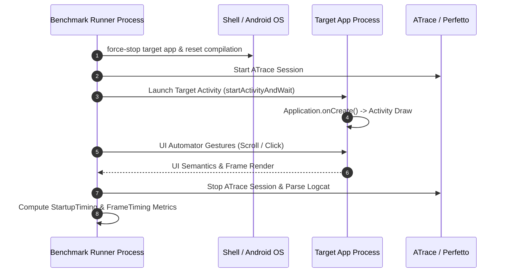

## Macrobenchmark는 실제 사용자 여정을 측정한다

상위 문서: [Android 성능, 품질, 빌드 최적화 지도](../android-performance-quality-and-build-optimization.md)
관련 지도: [Benchmark와 Baseline Profile 계약](./benchmark-baseline-contracts.md)
관련 노트: [Android 성능은 측정 후 최적화한다](../performance-contracts/measure-before-optimizing-android-performance.md)

Macrobenchmark는 앱 프로세스 외부(Out-of-process)에서 UI Automator를 조작하여 앱 시작, 화면 전환, 피드 스크롤과 같은 사용자 체감 전과정을 실제 컴파일 상태(AOT/JIT)에서 반복 측정한다.

### 1. 외부 프로세스 측정 메커니즘

- **Out-of-Process Execution**: 테스트 러너가 별도 테스트 모듈 패키지(`com.example.app.benchmark`)에서 실행되며 `adb shell am force-stop`으로 대상 패키지(`com.example.app`)를 완전히 격리 조작한다.
- **Metric 수집기**:
  - `StartupTimingMetric`: `timeToInitialDisplayMs` (TTID) 및 `timeToFullDisplayMs` (TTFD) 캡처.
  - `FrameTimingMetric`: UI 스레드 및 RenderThread 프레임 지속 시간(`frameDurationCpuMs`), Jank 비율 및 꼬리 지표(P50, P90, P95, P99) 계산.
  - `TraceSectionMetric`: `Trace.beginSection` 커스텀 태그 실행 시간 별도 집계.

### 2. Macrobenchmark 외부 제어 시퀀스 흐름



### 3. Macrobenchmark 스크롤 측정 Kotlin 코드 구체 예시

```kotlin
import androidx.benchmark.macro.CompilationMode
import androidx.benchmark.macro.FrameTimingMetric
import androidx.benchmark.macro.StartupMode
import androidx.benchmark.macro.junit4.MacrobenchmarkRule
import androidx.test.ext.junit.runners.AndroidJUnit4
import androidx.test.uiautomator.By
import androidx.test.uiautomator.Direction
import androidx.test.uiautomator.Until
import org.junit.Rule
import org.junit.Test
import org.junit.runner.RunWith

@RunWith(AndroidJUnit4::class)
class FeedScrollBenchmark {

    @get:Rule
    val benchmarkRule = MacrobenchmarkRule()

    @Test
    fun scrollFeedCompilationPartial() = benchmarkRule.measureRepeated(
        packageName = "com.example.app",
        metrics = listOf(FrameTimingMetric()),
        compilationMode = CompilationMode.Partial(),
        startupMode = StartupMode.WARM,
        iterations = 10,
        setupBlock = {
            pressHome()
            startActivityAndWait()
        }
    ) {
        // UI가 준비될 때까지 리소스 ID 대기
        device.wait(Until.hasObject(By.res("feed_list")), 5_000)
        val feedList = device.findObject(By.res("feed_list"))
        
        // 반복적 다운 스크롤 조작
        feedList.setGestureMargin(device.displayWidth / 5)
        feedList.fling(Direction.DOWN)
        device.waitForIdle()
    }
}
```

### 4. 관측 가능한 실행 증거 (Observable Evidence)

#### Benchmark JSON 측정 결과 출력

```json
{
  "benchmark": "scrollFeedCompilationPartial",
  "iterations": 10,
  "metrics": {
    "frameDurationCpuMs": {
      "P50": 8.4,
      "P90": 14.2,
      "P95": 16.9,
      "P99": 24.1
    },
    "frameOverrunMs": {
      "P50": -4.2,
      "P90": 1.1,
      "P95": 4.8
    }
  },
  "sampledMetrics": {},
  "traces": [
    "/sdcard/Android/media/com.example.app.benchmark/FeedScrollBenchmark_scrollFeed_iter001.perfetto-trace"
  ]
}
```

### 5. 측정 계약 및 원칙

- **네트워크 고정**: 외부 API 응답 변동성을 배제하기 위해 MockWebServer 또는 고정 로컬 시드 데이터를 채택한다.
- **반복 횟수 통제**: 최소 10회 이상의 `iterations`를 지정하여 이상치(Outlier) 수치를 평탄화한다.
