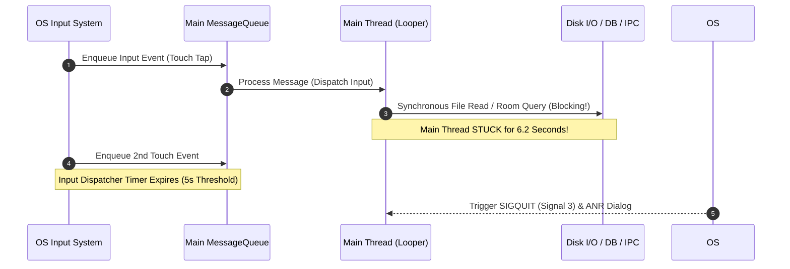

## 메인 스레드 작업은 앱 응답성을 결정한다

상위 문서: [Android 성능, 품질, 빌드 최적화 지도](../android-performance-testing-map.md)
관련 지도: [런타임 성능 계약](./performance.md)

메인 스레드(UI Thread)는 입력 이벤트 수신, 뷰 트리 측정/배치, 프레임 바인딩을 순차 처리하는 단일 `Looper` 기반 실행 축이므로, 메인 스레드가 블로킹되면 앱 전체 응답성이 멈추고 ANR(Application Not Responding)로 이어진다.

### 1. Main Looper, StrictMode 및 ANR 메커니즘

- **Main Looper & MessageQueue**: `Looper.loop()`가 단일 메시지 큐에서 `Message` 및 `Runnable`을 이탈시키며 실행한다.
- **ANR 임계조건 (ANR Timeouts)**:
  - **InputDispatching Timeout**: 입력 이벤트(Touch, Key)가 5초 내에 처리되지 않음.
  - **BroadcastQueue Timeout**: `BroadcastReceiver.onReceive()`가 Foreground 10초, Background 60초 내 종료되지 않음.
  - **Service Timeout**: `Service` 생명주기가 Foreground 20초, Background 200초 내 종료되지 않음.
- **StrictMode 디버깅 정책**:
  - `ThreadPolicy`: 디스크 읽기/쓰기, 네트워크 액세스, 불필요한 메인 스레드 커스텀 락 감지.
  - `VmPolicy`: Leaked Closable 객체, Activity/Context 메모리 누수 감지.

### 2. Main Thread Event Loop 및 ANR 블로킹 발생 흐름



### 3. StrictMode 수집 및 설정 Kotlin 코드 구체 예시

디버그 빌드 시 메인 스레드의 디스크/네트워크 침범을 즉시 포착하기 위한 `Application.onCreate()` 설정:

```kotlin
import android.application.Application
import android.os.Build
import android.os.StrictMode

class MainApplication : Application() {
    override fun onCreate() {
        super.onCreate()

        if (BuildConfig.DEBUG) {
            // 메인 스레드 I/O 및 위반 탐지 정책 설정
            StrictMode.setThreadPolicy(
                StrictMode.ThreadPolicy.Builder()
                    .detectDiskReads()
                    .detectDiskWrites()
                    .detectNetwork()
                    .detectCustomSlowCalls()
                    .penaltyLog()
                    // .penaltyDeath() // 디버그 빌드에서 위반 시 즉시 프로세스 종료 옵션
                    .build()
            )

            // VM 메모리 누수 탐지 정책 설정
            StrictMode.setVmPolicy(
                StrictMode.VmPolicy.Builder()
                    .detectLeakedSqlLiteObjects()
                    .detectLeakedClosableObjects()
                    .detectActivityLeaks()
                    .penaltyLog()
                    .build()
            )
        }
    }
}
```

### 4. 관측 가능한 실행 증거 (Observable Evidence)

#### StrictMode 위반 Logcat 출력
메인 스레드에서 SharedPreference 또는 Room DB를 동기 호출했을 때 즉시 수신되는 로그:

```text
D/StrictMode: StrictMode policy violation; ~duration=145 ms: android.os.strictmode.DiskReadViolation
    at android.os.StrictMode$AndroidBlockGuardPolicy.onReadFromDisk(StrictMode.java:1596)
    at libcore.io.BlockGuardOs.read(BlockGuardOs.java:230)
    at com.example.app.data.UserPreferencesRepository.getThemeSync(UserPreferencesRepository.kt:42)
    at com.example.app.ui.MainActivity.onCreate(MainActivity.kt:28)
```

#### ANR 발생 시 ApplicationExitInfo 덤프
`adb shell dumpsys activity exit-info com.example.app` 명령으로 ANR 진단 트레이스 관측:

```text
ApplicationExitInfo raw image text:
  Timestamp: 2026-08-04 14:20:11
  Pid: 18402
  Reason: ANR (Application Not Responding)
  Subreason: WAIT_FOR_TOUCH_INPUT
  Status: 0
  Importance: FOREGROUND
  Trace File: /data/anr/traces.txt
  Cmdline: com.example.app
  State:
    "main" prio=5 tid=1 Waiting
      | group="main" sCount=1 dsCount=0 flags=1 obj=0x73842100 self=0xb4000076a1a24000
      | sysTid=18402 nice=-10 cgrp=default sched=0/0 handle=0x79a0e1a498
      | at com.example.app.repository.Database.queryBlocking(Database.kt:88)
```

### 5. 스레딩 및 응답성 개선 수칙

- IO 연산은 `Dispatchers.IO`, 비선형 자원 연산은 `Dispatchers.Default`로 명확히 분리하여 실행한다.
- 메인 스레드에서 무거운 Binder 동기 호출(`IBinder.transact()`)을 즉시 비동기 콜백/Flow로 전환한다.

