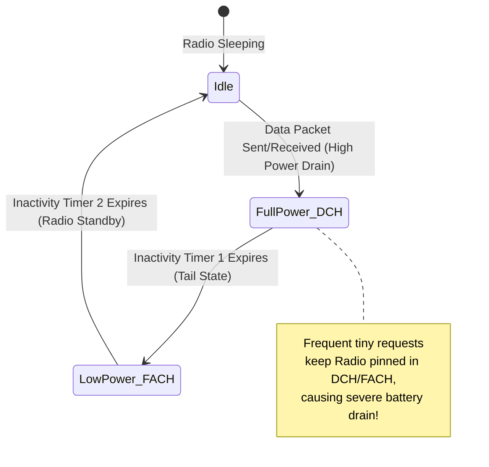

## 배터리, 네트워크, 저장소 성능은 자원 정책이다

상위 문서: [Android 성능, 품질, 빌드 최적화 지도](../android-performance-quality-and-build-optimization.md)
관련 지도: [런타임 성능 계약](./performance-contracts.md)

배터리 및 디바이스 자원 소비는 단순히 CPU 명령 처리 시간뿐만 아니라 무선 라디오 깨움(Radio Wakeup), 센서 활성화, 시스템 디스크 I/O 락 수명주기와 같은 시스템 정책에 의해 결정된다.

### 1. 무선 라디오 및 저장소 자원 정책 메커니즘

- **Cellular Radio Power State (라디오 전력 상태)**:
  - **Full Power (DCH)**: 데이터 송수신 시 최대 전력 소비.
  - **Low Power (FACH)**: 소량 유지 관리 전력 소비.
  - **Idle**: 라디오 휴면 상태.
  - **Tail Time Penalty**: 소용량 요청을 잦은 주기(예: 매 10초마다 1KB)로 전송하면 라디오가 Idle로 복귀하지 못하고 DCH/FACH 테일 전력 상태에 고착되어 소모 전류가 극대화된다.
- **배터리 저감 정책**:
  - **WorkManager Batching**: 개별 네트워크 작업을 묶어 무선 라디오 깨움 횟수를 최소화.
  - **Constraints 적용**: `NetworkType.UNMETERED`, `RequiresCharging`, `RequiresDeviceIdle` 등의 조건 부여.
  - **Doze Mode**(화면이 꺼진 채 기기가 오래 정지해 있으면 시스템이 자동으로 진입시키는 절전 상태 — 앱의 네트워크 접속과 백그라운드 작업, 알람을 주기적인 짧은 유지보수 구간(maintenance window)으로 묶어 지연시킨다) **Compliance**: `AlarmManager.setAndAllowWhileIdle()`처럼 Doze 를 우회해 즉시 깨우는 API 의 과도한 사용을 지양하고 시스템 배치 작업 활용.
- **저장소 I/O 최적화**:
  - SQLite WAL (Write-Ahead Logging) 모드를 통한 읽기/쓰기 동시성 확보.
  - `@Transaction` 블록 내 소형 쓰기 묶음 처리로 디스크 fsync overhead 저감.

### 2. 셀룰러 라디오 전력 상태 전환 모델



### 3. WorkManager 배치 및 제약조건 Kotlin 코드 구체 예시

```kotlin
import android.content.Context
import androidx.work.*
import java.util.concurrent.TimeUnit

fun scheduleBatchedSync(context: Context) {
    val constraints = Constraints.Builder()
        .setRequiredNetworkType(NetworkType.UNMETERED) // Wi-Fi 접속 시에만 실행
        .setRequiresCharging(true)                    // 충전 중에만 실행
        .setRequiresBatteryNotLow(true)
        .build()

    val syncWorkRequest = OneTimeWorkRequestBuilder<DataSyncWorker>()
        .setConstraints(constraints)
        .setBackoffCriteria(
            BackoffPolicy.EXPONENTIAL,
            WorkRequest.MIN_BACKOFF_MILLIS,
            TimeUnit.MILLISECONDS
        )
        .addTag("batched_sync_job")
        .build()

    WorkManager.getInstance(context).enqueueUniqueWork(
        "batched_sync_unique",
        ExistingWorkPolicy.KEEP,
        syncWorkRequest
    )
}
```

### 4. 관측 가능한 실행 증거 (Observable Evidence)

#### ADB dumpsys batterystats 자원 덤프
`adb shell dumpsys batterystats --charged <package>` 명령으로 앱의 Wakelock 소이지간, 라디오 바이트 수 및 시스템 깨움 횟수를 관측한다.

```bash
adb shell dumpsys batterystats --charged com.example.app
```

```text
Estimated power use (mAh):
  Capacity: 3400, Computed drain: 14.2, actual drain: 14.0-15.0
  App com.example.app (uid 10185): 1.84 mAh

  JobScheduler:
    Total time: 45s (3 calls)
  Wakelock count: 4, Total time: 1m 12s
  Mobile radio packet metrics:
    Tx packets: 1250, Rx packets: 3410
    Tx bytes: 245100, Rx bytes: 1450200
    Mobile radio active time: 18s (4 wakeups)
  AlarmManager wakeups: 2
```

### 5. 자원 효율화 운영 원칙

- **백오프 정책 필수**: 네트워크 장애 발생 시 상한선(Max Backoff Limit)이 있는 지수 백오프를 강제 적용한다.
- **Paging 3 및 LruCache**: 메모리 힙 및 로컬 디스크 파일 캐시의 물리적 상한을 지정하여 무제한 디스크 팽창을 방지한다.

