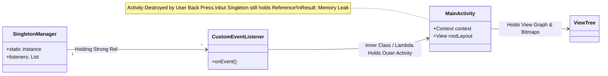

## Android 메모리는 사용량보다 회수되지 않는 객체를 본다

상위 문서: [Android 성능, 품질, 빌드 최적화 지도](../android-performance-quality-and-build-optimization.md)
관련 지도: [런타임 성능 계약](./performance-contracts.md)

단순히 전체 메모리 힙 점유량이 크다고 해서 누수(Leak)는 아니며, Activity/Fragment 수명주기 파괴(Destroy) 이후에도 GC Root로부터 접근 가능하여 힙에서 회수되지 못하는 '잔존 참조 객체' 및 프레임 잔크를 유발하는 '단기 객체 대량 할당(Allocation Churn)'을 포착하는 것이 본질이다.

### 1. ART GC 및 메모리 측정 메커니즘

- **ART GC 메커니즘**: ART는 Android 버전과 런타임 구성에 따라 collector를 선택한다. Android 10 이상에서 Concurrent Copying(CC)은 기본적으로 generational mode로 동작하지만, 이를 모든 Android 기기·버전의 고정 구현으로 가정하지 않는다. allocation churn은 어떤 collector에서도 CPU 사용과 pause/메모리 압력을 키울 수 있으므로 trace와 GC 로그로 확인한다.
- **메모리 분류 지표**:
  - **Java Heap**: Android Dalvik/ART 힙 객체 (Bitmap 버퍼 제외한 표준 객체).
  - **Native Heap**: C/C++ `malloc` allocation, Native Bitmaps (Android 8.0+), Webview/RenderThread 버퍼.
  - **Graphics**: EGL, GL Malloc, SurfaceFlinger 렌더 버퍼.
  - **PSS (Proportional Set Size)**: 프로세스 고유 메모리 + 공유 라이브러리(Shared Page)를 공유 프로세스 수로 나눈 합산 지표.
- **LeakCanary 누수 탐지 원리**:
  - 파괴된 Activity/Fragment/View와 cleared [viewmodel](../../../02_app_framework/viewmodel.md) 등 더 이상 필요하지 않은 객체를 `ObjectWatcher`가 weak reference로 감시한다.
  - 기본 retained delay는 5초지만 구성 가능한 값이다. 지연 뒤 GC 후에도 남은 객체를 retained 후보로 분류하며, 곧바로 모든 후보마다 heap dump를 뜨는 것은 아니다. 기본적으로 앱이 보일 때 5개, 보이지 않을 때 1개의 retained-object 임계값에 도달하면 heap dump를 만들고 Shark가 GC root 경로를 분석한다.

### 2. 메모리 누수 GC Root 참조 사슬 흐름



### 3. Lifecycle 릴리스 및 WeakReference 추적 Kotlin 코드 구체 예시

```kotlin
import androidx.lifecycle.DefaultLifecycleObserver
import androidx.lifecycle.LifecycleOwner
import java.lang.ref.WeakReference

class SafeListenerRegistrar : DefaultLifecycleObserver {
    private var activityRef: WeakReference<LifecycleOwner>? = null

    fun register(owner: LifecycleOwner) {
        activityRef = WeakReference(owner)
        owner.lifecycle.addObserver(this)
    }

    override fun onDestroy(owner: LifecycleOwner) {
        // Destroy 시점에 관찰자 해제 및 약한 참조 정리
        owner.lifecycle.removeObserver(this)
        activityRef?.clear()
        activityRef = null
    }
}
```

### 4. 관측 가능한 실행 증거 (Observable Evidence)

#### ADB dumpsys meminfo 힙 덤프 분석
`adb shell dumpsys meminfo <package>` 명령으로 Java, Native, Graphics 메모리 분포 덤프 관측:

```bash
adb shell dumpsys meminfo com.example.app
```

```text
** MEMINFO in pid 24102 [com.example.app] **
                   Pss  Private  Private  SwapPss     Heap     Heap     Heap
                 Total    Dirty    Clean    Dirty     Size    Alloc     Free
                ------   ------   ------   ------   ------   ------   ------
  Native Heap    42104    41980        0     1204    78200    62100    16100
  Dalvik Heap    28410    28240        0       88    42100    26400    15700
 Dalvik Other     4120     4100        0        0
        Other     8120     7900      100        0
       Ashmem      120        0        0        0
    Gfx dev     18400    18400        0        0
  Other dev        44        0       40        0
   .so mmap     12400     1200     8900        0
  .apk mmap      4100        0     1200        0
  .dex mmap     28900       12    21000        0
   TOTAL PSS   158100   114800    31240     1292   120300    88500    31800

 Objects
               Views:       240         ViewRootImpl:        2
          AppContexts:         4         Activities:        3  <-- Multi-activity Leak Alert!
               Assets:         8      AssetManagers:        0
        Local Binders:        18      Proxy Binders:       32
```

### 5. 메모리 최적화 가이던스

- **Activities 카운트 관측**: `dumpsys meminfo`의 Activity 개수는 힌트일 뿐이다. 화면 전환·캐시·다중 창 때문에 1 이상인 것만으로 누수를 판정하지 않고, 파괴된 특정 인스턴스가 계속 도달 가능한지 heap dump와 lifecycle 로그로 확인한다.
- **Bitmap Config**: Compose/View 이미지 표현 시 필요 이상의 Resolution 디코딩을 방지하고 `Bitmap.Config.HARDWARE` 설정을 적용한다.

### 공식/정본 문서

- https://source.android.com/docs/core/runtime/gc-debug
- https://square.github.io/leakcanary/fundamentals-how-leakcanary-works/

검증일: 2026-08-06. ART의 generational CC 적용 범위를 Android 10+ 기본값으로 한정하고, LeakCanary의 retained delay와 heap-dump 임계값을 구분했다.
