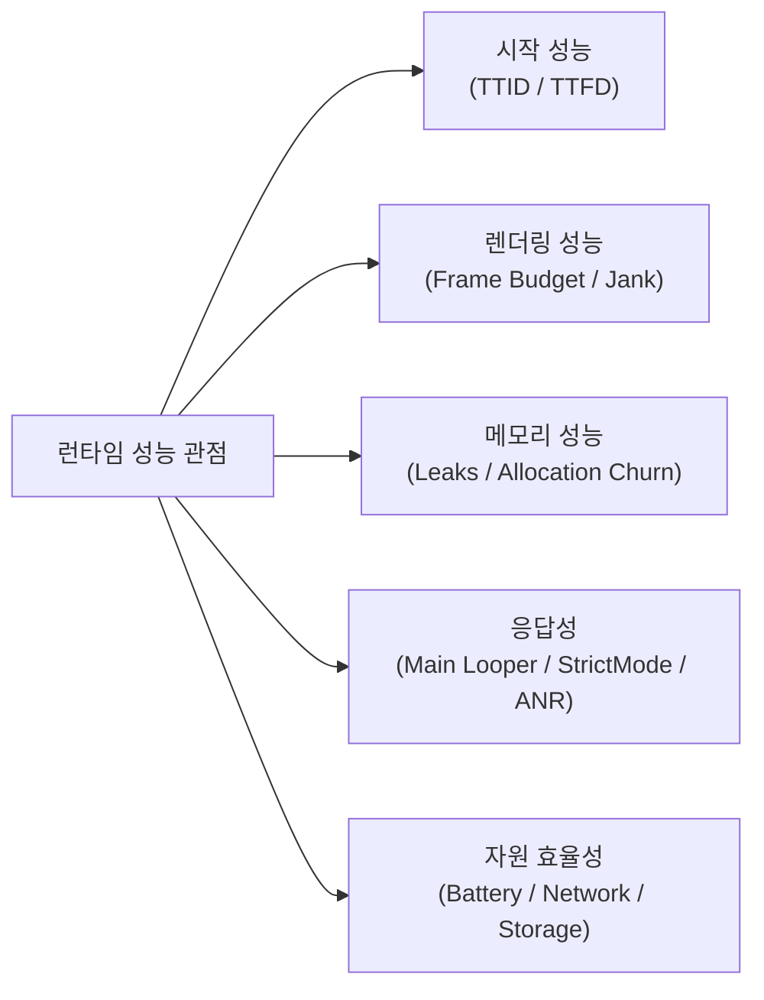

## 런타임 성능 계약

이 지도는 Android 앱의 시작, 렌더링, 메모리, 응답성, 자원 사용 문제를 측정 가능한 질문으로 나눈다.

### 런타임 성능 측정 관점도

## 정본 노트

- [Android 성능은 측정 후 최적화한다](./measure-before-optimizing-android-performance.md)
- [Android 시작 성능은 TTID와 TTFD로 나눈다](./startup-performance-is-measured-by-ttid-and-ttfd.md)
- [렌더링 성능은 프레임 지연의 원인을 분리한다](./rendering-jank-is-frame-deadline-failure.md)
- [Android 메모리는 사용량보다 회수되지 않는 객체를 본다](./memory-performance-requires-leak-and-allocation-evidence.md)
- [메인 스레드 작업은 앱 응답성을 결정한다](./main-thread-work-controls-responsiveness.md)
- [배터리, 네트워크, 저장소 성능은 자원 정책이다](./battery-network-storage-efficiency-is-resource-policy.md)
- [Profiler, Perfetto, dumpsys는 벤치마크가 아니라 진단 도구다](./profiler-perfetto-dumpsys-are-diagnosis-tools-not-benchmarks.md)

관련 지도: [Benchmark와 Baseline Profile 계약](../benchmark-baseline-contracts/benchmark-baseline-contracts.md), [디버깅 도구 계약](../../debugging/debugging-contracts/debugging-contracts.md)

