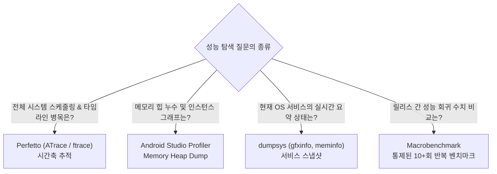

## Profiler, Perfetto, dumpsys는 벤치마크가 아니라 진단 도구다

상위 문서: [Android 성능, 품질, 빌드 최적화 지도](../android-performance-quality-and-build-optimization.md)
관련 지도: [런타임 성능 계약](./performance-contracts.md)

Android Studio Profiler, Perfetto, `dumpsys`는 원인을 탐색하고 병목 구간을 좁히는 **진단 도구(Diagnostic Tools)**이며, 릴리스 간 성능 회귀 여부를 통계적으로 입증하는 **벤치마크(Macrobenchmark)**와 구별해야 한다.

### 1. 진단 도구별 역할과 내부 메커니즘

- **Perfetto (Systrace / ATrace)**:
  - **메커니즘**: 커널 `ftrace` 및 사용자 공간 `ATrace` 트레이스 버퍼 기록. 
  - **특징**: 앱과 Android OS 시스템 스케줄러, VSYNC, Binder, RenderThread를 동일한 타임라인 축에서 0에 가까운 오버헤드로 관측한다.
- **Android Studio Profiler**:
  - **CPU Sampling**: 정기적 콜스택 덤프, 낮은 오버헤드.
  - **CPU Instrumentation**: 모든 메서드 진입/진출에 바이트코드 주입, 정밀하지만 오버헤드가 극대화되어 절대적 타임 측정 왜곡 발생.
  - **Memory Heap Dump**: 힙 객체 참조 그래프를 정적 탐색.
- **dumpsys**:
  - **메커니즘**: Binder IPC를 통해 `activity`, `gfxinfo`, `meminfo`, `batterystats` 등의 OS 프레임워크 서비스의 순간 상태 스냅샷 조회.

### 2. 성능 질문별 진단 도구 선택 의사결정 트리



### 3. Trace 섹션 바인딩 Kotlin 구체 코드 예시

Perfetto 타임라인 상에 특정 핵심 구간(CUJ)을 명시적으로 노출하기 위한 Kotlin `traceSection` 헬퍼:

```kotlin
import androidx.tracing.Trace

inline fun <T> traceSection(sectionName: String, block: () -> T): T {
    // ATrace 시스템 버퍼에 트레이스 마커 전송 (디버그/벤치마크 환경에서 작동)
    Trace.beginSection(sectionName)
    try {
        return block()
    } finally {
        Trace.endSection()
    }
}

// 실제 사용 예시
fun loadAndProcessFeed(feedId: String) = traceSection("CUJ_LoadAndProcessFeed_$feedId") {
    val rawData = repository.fetchFeedData(feedId)
    val parsedUiState = parseFeedToUiState(rawData)
    parsedUiState
}
```

### 4. 관측 가능한 실행 증거 (Observable Evidence)

#### Perfetto CLI 트레이스 캡처 명령
`record_android_trace` 도구를 사용한 커널 및 ATrace 트레이스 파일 캡처:

```bash
# 10초간 스케줄러, gfx, view, am 트레이스 수집
adb shell record_android_trace \
  -c - --out /data/local/tmp/app_trace.perfetto-trace <<EOF
buffers: {
    size_kb: 65536
    fill_policy: RING_BUFFER
}
data_sources: {
    config {
        name: "android.trace_atrace"
        atrace_config {
            atrace_categories: "gfx"
            atrace_categories: "view"
            atrace_categories: "am"
            atrace_categories: "dalvik"
            app_name: "com.example.app"
        }
    }
}
duration_ms: 10000
EOF
```

#### Perfetto 및 dumpsys 결과 수집 로그
```text
Trace saved to /data/local/tmp/app_trace.perfetto-trace (14.2 MB)
Pulling trace: adb pull /data/local/tmp/app_trace.perfetto-trace .
Use https://ui.perfetto.dev to open and analyze the trace timeline.
```

### 5. 도구 사용 가이던스

- **오버헤드 격리**: Profiler instrumentation 상태에서 수집된 프레임 시간이나 메서드 실행 속도를 절대적 벤치마크 수치로 제시하지 않는다.
- **교차 검증**: dumpsys gfxinfo에서 `Slow UI thread` 비중이 높게 확인되면, Perfetto를 실행하여 동일 시나리오의 ATrace 타임라인 상에서 어떤 Trace 섹션이 길어졌는지 좁힌다.

