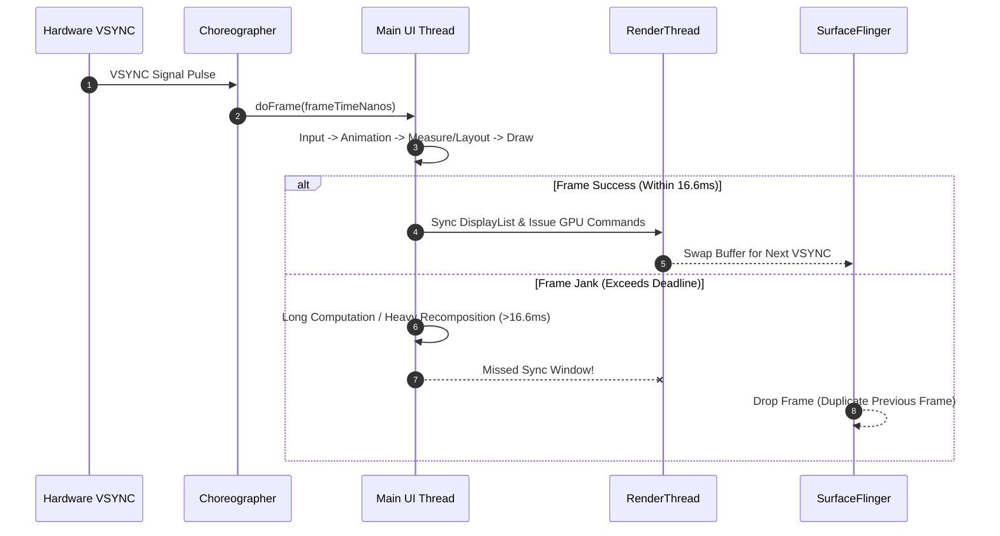

## 렌더링 성능은 프레임 지연의 원인을 분리한다

상위 문서: [Android 성능, 품질, 빌드 최적화 지도](../android-performance-quality-and-build-optimization.md)
관련 지도: [런타임 성능 계약](./performance-contracts.md)

매끄러운 화면 렌더링은 모든 프레임이 주사율 예산(Deadline) 내에 RenderThread와 SurfaceFlinger를 거쳐 화면에 제출(Present)되는 상태를 유지하는 것이다.

### 1. 프레임 파이프라인과 잔크(Jank) 발생 메커니즘

- **프레임 예산(Frame Budget)**: 
  - 60Hz 디스플레이: $1000\text{ms} / 60 \approx 16.6\text{ms}$
  - 90Hz 디스플레이: $1000\text{ms} / 90 \approx 11.1\text{ms}$
  - 120Hz 디스플레이: $1000\text{ms} / 120 \approx 8.33\text{ms}$
- **렌더링 파이프라인 단계**:
  1. **Input & Animation**: 터치 이벤트 처리 및 애니메이션 값 계산.
  2. **Measure & Layout**: View 트리의 크기 계산 및 위치 배치 (Compose에서는 [recomposition](../../../02_app_framework/jetpack-compose/runtime/recomposition.md) 및 Measure/Layout).
  3. **Draw**: **DisplayList**(실제 픽셀을 즉시 그리는 대신 "무엇을 어떻게 그릴지"를 기록해 두는 중간 표현 — 다음 단계에서 RenderThread가 이 기록을 재생하듯 소비한다) 명령 생성.
  4. **RenderThread Sync & Issue**: RenderThread가 DisplayList를 받아 OpenGLES/Vulkan 명령어로 변환 후 GPU 명령 큐 제출.
  5. **SurfaceFlinger Composition**: 하드웨어 컴포저(HWC)를 거쳐 실제 패널 표출.
- **Jank 정의**: UI 스레드 작업 지연 또는 RenderThread sync 지연으로 VSYNC 신호 내에 프레임을 완성하지 못해 이전 프레임이 화면에 재표출(Dropped Frame)되는 현상.

### 2. Choreographer 프레임 파이프라인 및 데드라인 초과 흐름

**Choreographer**는 하드웨어 VSYNC 신호를 받아 매 프레임 `doFrame()` 콜백을 호출함으로써 입력 처리, 애니메이션, 측정/배치, 그리기를 하나의 타이밍 축에 정렬시키는 Android 프레임 스케줄러다. 아래 시퀀스는 VSYNC 신호가 들어온 뒤 데드라인 안에 프레임을 완성하는 경로와, 데드라인을 넘겨 잔크가 발생하는 경로를 대비해서 보여준다.



### 3. Window FrameMetrics 수집 Kotlin 코드 구체 예시

`Window.OnFrameMetricsAvailableListener`를 등록하여 UI 스레드 지연, RenderThread 지연, GPU 대기 시간을 정밀하게 캡처한다.

```kotlin
import android.os.Build
import android.os.Handler
import android.os.Looper
import android.view.FrameMetrics
import android.view.Window
import androidx.annotation.RequiresApi

@RequiresApi(Build.VERSION_CODES.N)
fun registerFrameMetricsMonitor(window: Window) {
    val handler = Handler(Looper.getMainLooper())
    
    window.addOnFrameMetricsAvailableListener(
        { _, frameMetrics, dropCountSinceLastState ->
            val unknownDelayDuration = frameMetrics.getMetric(FrameMetrics.UNKNOWN_DELAY_DURATION)
            val inputHandlingDuration = frameMetrics.getMetric(FrameMetrics.INPUT_HANDLING_DURATION)
            val animationDuration = frameMetrics.getMetric(FrameMetrics.ANIMATION_DURATION)
            val layoutMeasureDuration = frameMetrics.getMetric(FrameMetrics.LAYOUT_MEASURE_DURATION)
            val drawDuration = frameMetrics.getMetric(FrameMetrics.DRAW_DURATION)
            val syncDuration = frameMetrics.getMetric(FrameMetrics.SYNC_DURATION)
            val commandIssueDuration = frameMetrics.getMetric(FrameMetrics.COMMAND_ISSUE_DURATION)
            val totalDuration = frameMetrics.getMetric(FrameMetrics.TOTAL_DURATION)

            val totalNsToMs = totalDuration / 1_000_000.0

            // 16.6ms (60Hz) 기준 초과 시 잔크 기록
            if (totalNsToMs > 16.66) {
                println("Jank Detected! Total: ${totalNsToMs}ms, Layout/Measure: ${layoutMeasureDuration / 1e6}ms, Draw: ${drawDuration / 1e6}ms, Sync: ${syncDuration / 1e6}ms")
            }
        },
        handler
    )
}
```

### 4. 관측 가능한 실행 증거 (Observable Evidence)

#### ADB dumpsys gfxinfo 프레임 통계 덤프
`adb shell dumpsys gfxinfo <package> framestats` 명령으로 잔크 비율 및 백분위 지표를 관측한다.

```bash
adb shell dumpsys gfxinfo com.example.app framestats
```

```text
Applications Graphics Acceleration Info:
Uptime: 45210453 Realtime: 45210453

** Profile data in ms **

com.example.app/com.example.app.MainActivity (Total frames rendered: 1450)
Janky frames: 42 (2.90%)
50th percentile: 6.2ms
90th percentile: 13.8ms
95th percentile: 18.4ms
99th percentile: 34.1ms
Number Missed Vsync: 14
Number High input latency: 8
Number Slow UI thread: 26
Number Slow bitmap uploads: 4
Number Slow issue draw commands: 6
```

### 5. 병목 진단 및 개선 조치 원칙

- **Slow UI thread 고주파 비중**: 불필요한 Compose Recomposition, View 트리의 복잡한 중첩 Layout, 메인 스레드 I/O 작업 제거.
- **Slow bitmap uploads 고주파 비중**: 메인 스레드에서 대형 비트맵 디코딩 금지, Glide/Coil 메모리 캐시 및 하드웨어 비트맵(`Bitmap.Config.HARDWARE`) 활용.
- **Slow issue draw commands 비중**: 오프스크린 버퍼 렌더링(`saveLayer`), 불필요한 알파 블렌딩 및 그림자/클리핑 연산 축소.

