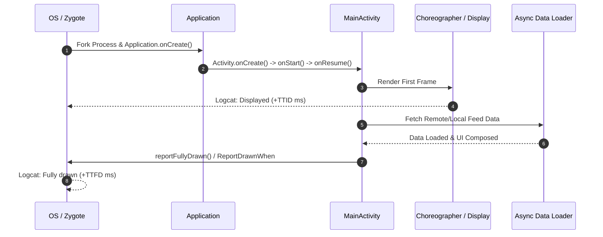

## Android 시작 성능은 TTID와 TTFD로 나눈다

상위 문서: [Android 성능, 품질, 빌드 최적화 지도](../android-performance-quality-and-build-optimization.md)
관련 지도: [런타임 성능 계약](./performance-contracts.md)

앱 시작 시간은 첫 화면 표시와 실제 상호작용 가능한 유효 상태를 명확히 구분해야 한다.

### 1. TTID와 TTFD의 내부 동작 메커니즘

- **TTID (Time To Initial Display)**: OS 프로세스 생성(**Zygote** Fork — 모든 앱 프로세스가 공통으로 상속하는, 시스템 부팅 시 미리 초기화되어 대기 중인 부모 프로세스를 `fork()`로 복제해 새 앱 프로세스를 만드는 것) $\rightarrow$ `ActivityThread.main()` $\rightarrow$ `Application.onCreate()` $\rightarrow$ `Activity.onCreate()` $\rightarrow$ **Choreographer**(하드웨어 VSYNC 신호에 맞춰 매 프레임 그리기 작업을 스케줄링하는 Android 프레임 스케줄러) 첫 바인딩 프레임 렌더링 시점까지의 시간이다.
- **TTFD (Time To Fully Displayed)**: 첫 프레임 표출 후 비동기 데이터 로딩(네트워크/DB), 비동기 이미지 디코딩 및 UI 바인딩이 완료되어 사용자가 실제 기능을 조작할 수 있는 시점까지의 시간이다.
- **Cold vs Warm vs Hot Start**:
  - **Cold Start**: 앱 프로세스가 존재하지 않는 상태에서 Zygote에서 새 VM 프로세스를 Fork하고 전체 클래스 및 단일 인스턴스를 초기화한다.
  - **Warm Start**: 프로세스는 힙 메모리에 유지되어 있지만 `Activity`가 재생성되는 시나리오다.
  - **Hot Start**: `Activity`와 프로세스 모두 메모리에 존재하며 백그라운드에서 foreground로 단순히 다시 전면 복귀한다.

### 2. 시작 단계 시퀀스 및 측정 시점



### 3. TTFD 선언 Kotlin 코드 구체 예시

Compose 환경에서는 `ReportDrawnWhen` 또는 `ReportDrawnAfter`를 사용하여 데이터 로딩이 완료된 시점에 `reportFullyDrawn()`을 안전하게 트리거한다.

```kotlin
import androidx.activity.ComponentActivity
import androidx.activity.compose.ReportDrawnWhen
import androidx.compose.runtime.Composable

@Composable
fun MainFeedScreen(
    [viewmodel](../../../02_app_framework/viewmodel.md): MainFeedViewModel,
    modifier: Modifier = Modifier
) {
    val uiState = viewModel.uiState.collectAsStateWithLifecycle().value

    // UI 상태가 Success 또는 Error로 수신 완료되었을 때 TTFD 신호를 OS에 전달
    ReportDrawnWhen {
        uiState is FeedUiState.Success || uiState is FeedUiState.Error
    }

    when (uiState) {
        is FeedUiState.Loading -> LoadingSpinner()
        is FeedUiState.Success -> FeedContent(items = uiState.items)
        is FeedUiState.Error -> ErrorMessage(message = uiState.message)
    }
}
```

### 4. 관측 가능한 실행 증거 (Observable Evidence)

#### Logcat 시스템 출력 신호
`ActivityTaskManager` 태그를 통해 TTID 및 TTFD 시간이 밀리초 단위로 자동 기록된다.

```text
I/ActivityTaskManager: Displayed com.example.app/.MainActivity: +420ms (total +420ms)
I/ActivityTaskManager: Fully drawn com.example.app/.MainActivity: +850ms
```

#### ADB 실행 명령 및 측정 덤프
`adb shell am start -W` 명령으로 실행 상태(Cold/Warm)와 타임아웃 지표를 관측한다.

```bash
adb shell am start -W -n com.example.app/.MainActivity
```

```text
Starting: Intent { act=android.intent.action.MAIN cat=[android.intent.category.LAUNCHER] cmp=com.example.app/.MainActivity }
Status: ok
LaunchState: COLD
Activity: com.example.app/.MainActivity
TotalTime: 420
WaitTime: 435
Complete
```

### 5. 측정 및 가이던스 원칙

- 첫 화면에 필요하지 않은 SDK 초기화 및 DI 그래프 생성은 지연(Lazy) 처리한다.
- TTID가 감소했으나 TTFD가 증가했다면 초기화를 불필요하게 렌더링 이후 비동기 블록으로 옮겨 사용자 대기 시간을 연장한 것이다.
- Macrobenchmark의 `StartupTimingMetric`을 이용해 릴리스 컴파일 모드에서 냉시작/온시작 지표를 반복 산출한다.

