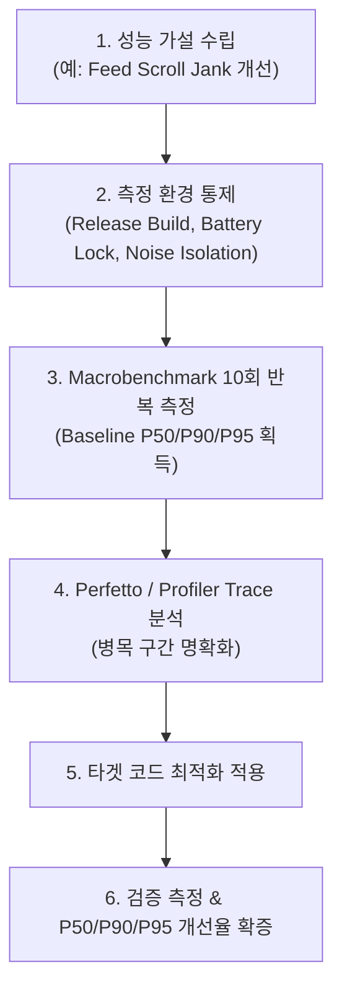

## Android 성능은 측정 후 최적화한다

상위 문서: [Android 성능, 품질, 빌드 최적화 지도](../android-performance-testing-map.md)
관련 지도: [런타임 성능 계약](performance.md)

성능 개선 작업은 직관이나 수치적 추측이 아닌 통제된 환경에서의 반복 측정(Benchmark)과 증거 수집(Profiling Trace)에 기반해야 한다.

### 1. 측정 통제 메커니즘과 노이즈 제거 원칙

- **디버그 빌드 측정의 왜곡**: `debuggable = true` 빌드는 JIT 컴파일러의 디버그 인스펙션 코드가 포함되고, ART 최적화가 비활성화되며, StrictMode 및 디버그 로깅으로 인해 측정치가 200%~500% 왜곡된다.
- **측정 환경 고정 요소**:
  1. **빌드 변형**: R8 수축 및 최적화가 적용된 `release` 또는 `benchmark` buildType 사용 (`isMinifyEnabled = true`, `proguardFiles`).
  2. **열적 스로틀링(Thermal Throttling)**: 측정 전 CPU/GPU 온도를 안정화하고 CPU Clock을 세팅한다 (`adb shell setprop`).
  3. **백그라운드 노이즈 제거**: 동기화 앱 조작 중단, 비행기 모드 전환 또는 제어된 네트워크 환경 설정.
  4. **통계적 유의성**: 단일 실행 수치가 아닌 최소 10회 이상의 반복 실행을 통한 중앙값(P50), P90, P95 백분위수 도출.

### 2. 성능 최적화 수명주기 프로세스



### 3. Gradle Benchmark BuildType 설정 구체 코드 예시

Macrobenchmark 측정을 위해 디버그용 서명키를 공유하면서 최적화 옵션을 동등하게 켜는 `benchmark` buildType 설정 (`build.gradle.kts`):

```kotlin
android {
    buildTypes {
        release {
            isMinifyEnabled = true
            proguardFiles(getDefaultProguardFile("proguard-android-optimize.txt"), "proguard-rules.pro")
            signingConfig = signingConfigs.getByName("debug")
        }
        create("benchmark") {
            initWith(getByName("release"))
            matchingFallbacks.add("release")
            // Macrobenchmark에서 프로파일러 연결 허용
            isDebuggable = false
            signingConfig = signingConfigs.getByName("debug")
        }
    }
}
```

### 4. 관측 가능한 실행 증거 (Observable Evidence)

#### Macrobenchmark 측정 결과 JSON 덤프 리포트

```json
{
  "context": {
    "build": { "brand": "google", "device": "oriole", "fingerprint": "google/oriole/oriole:13/TP1A.220905.004/8927612:user/release-keys" },
    "cpuCoreCount": 8
  },
  "benchmarks": [
    {
      "name": "startupCold",
      "params": {},
      "metrics": {
        "timeToInitialDisplayMs": {
          "minimum": 320.4,
          "maximum": 412.1,
          "median": 345.2,
          "runs": [ 345.2, 320.4, 388.9, 342.1, 412.1 ]
        },
        "frameDurationCpuMs": {
          "P50": 6.8,
          "P90": 12.4,
          "P95": 17.2,
          "P99": 28.5
        }
      }
    }
  ]
}
```

### 5. 최적화 판단 가이던스

- **개선 판단 기준**: 중앙값(P50)이 15% 이상 개선되고 상위 꼬리 지표(P95, P99)가 악화되지 않아야 성공으로 인정한다.
- **수치 기록 보관**: 측정 스펙트럼(트레이스 파일, 기기 정보, commit hash, JSON 지표)을 릴리스 노티에 첨부한다.

