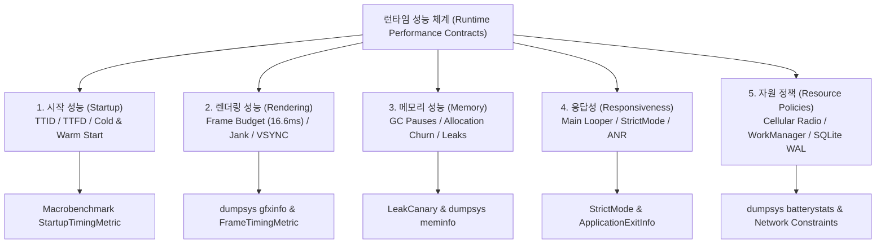
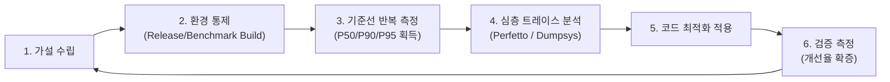

## 런타임 성능 계약

이 지도는 Android 앱의 시작 속도, 화면 렌더링 주사율, 메모리 힙 누수, 메인 스레드 응답성, 배터리/네트워크 자원 효율성을 추측이 아닌 통제된 환경에서 측정하고 최적화하는 런타임 성능 계약을 다룬다.

---

### 1. 런타임 성능 5대 관점 및 진단 체계도

---

### 2. 런타임 성능 5대 지표 및 진단 도구 매트릭스

| 성능 관점 | 핵심 측정 지표 | 허용 임계값 / 목표치 | 1차 관측 도구 | 심층 진단 도구 |
| :--- | :--- | :--- | :--- | :--- |
| **시작 성능 (Startup)** | TTID (첫 프레임), TTFD (완전 렌더링) | Cold < 500ms, Warm < 200ms | Logcat (`ActivityTaskManager`), ADB `am start -W` | Macrobenchmark (`StartupTimingMetric`) |
| **렌더링 성능 (Rendering)** | Janky frame %, Frame duration CPU/GPU | Jank < 2%, 60Hz: < 16.6ms, 120Hz: < 8.3ms | `dumpsys gfxinfo framestats`, `Window.OnFrameMetrics` | Perfetto (`atrace: gfx, view`), Android Studio Profiler |
| **메모리 성능 (Memory)** | Retained Activities, PSS, Allocation Churn | Activity 누수 0건, GC Pause 최소화 | `dumpsys meminfo <pkg>`, LeakCanary | Memory Heap Dump (HPROF / Shark) |
| **응답성 (Responsiveness)** | Main Looper Block time, StrictMode 위반 | ANR 0건, 메인 스레드 I/O 0건 | StrictMode (`ThreadPolicy`), `dumpsys activity exit-info` | ANR Trace (`/data/anr/traces.txt`), JDWP |
| **자원 효율성 (Resource)** | Radio Tail Time, Wakelock 유지 시간 | 무선 라디오 불필요 깨움 0회, WAL 활성화 | `dumpsys batterystats --charged` | WorkManager Inspector, SQLite WAL |

---

### 3. 성능 최적화 수명주기 루프

성능 엔지니어링은 "측정 없는 최적화 금지" 원칙에 따라 아래 6단계를 엄격히 순환한다:

---

## 정본 노트

- [Android 성능은 측정 후 최적화한다](performance-measurement-principles.md) - 측정 환경 통제, 릴리스 빌드, P50/P90/P95 통계 기준
- [Android 시작 성능은 TTID와 TTFD로 나눈다](startup-performance-metrics.md) - Zygote, ActivityThread, `ReportDrawnWhen`, `reportFullyDrawn`
- [렌더링 성능은 프레임 지연의 원인을 분리한다](rendering-jank-frame-deadlines.md) - Frame Budget (16.6ms/8.3ms), Choreographer, RenderThread, `dumpsys gfxinfo`
- [Android 메모리는 사용량보다 회수되지 않는 객체를 본다](memory-performance-leak-evidence.md) - GC Root 사슬, PSS, Shark/LeakCanary, WeakReference
- [메인 스레드 작업은 앱 응답성을 결정한다](main-thread-responsiveness.md) - Main Looper, StrictMode, 5초 Input ANR, `ApplicationExitInfo`
- [배터리, 네트워크, 저장소 성능은 자원 정책이다](resource-efficiency-policies.md) - Cellular Radio Power State (DCH/FACH), WorkManager 배치, SQLite WAL
- [Profiler, Perfetto, dumpsys는 벤치마크가 아니라 진단 도구다](profiler-perfetto-diagnosis.md) - Diagnostic Tools vs Automated Macrobenchmark 경계

---

### 관련 지도 (Related Maps)

- [Android 성능, 품질, 빌드 최적화 지도](../android-performance-testing-map.md)
- [Benchmark와 Baseline Profile 계약](../benchmark/benchmark-baseline.md)
- [디버깅 도구 계약](../debugging/debugging.md)
- [테스트 품질 계약](../testing/testing-quality.md)

