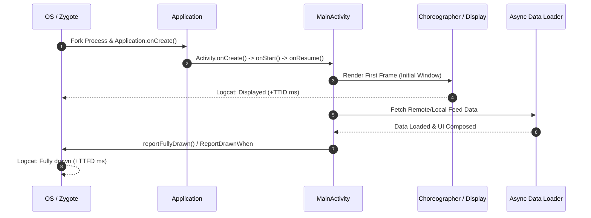

## Android 시작 성능은 TTID와 TTFD로 나눈다

상위 문서: [Android 성능, 품질, 빌드 최적화 지도](../android-performance-testing-map.md)
관련 지도: [런타임 성능 계약](./performance.md)
관련 노트: [Startup mode와 reportFullyDrawn이 시작 측정 기준을 정한다](../benchmark/startup-measurement-reportfullydrawn.md), [앱 실행 경로 계약](../../00_foundations/overview/foundation/app-launch-crosses-launcher-system-server-zygote-and-activitythread.md)

앱 시작 시간(App Startup Time)은 사용자 이탈률과 직결되는 핵심 런타임 지표이다. Android 앱 성능 측정에서는 앱 아이콘 탭 후 첫 화면이 렌더링되는 시점인 **TTID (Time To Initial Display)** 와 실제 모든 비동기 데이터 로딩이 완료되어 사용자가 조작 가능한 시점인 **TTFD (Time To Fully Drawn)** 를 엄격히 구분하여 관측해야 한다.

---

### 1. 직관적 비유로 이해하는 시작 지표

* **TTID (Time To Initial Display - 식당 첫 물컵/수저 세팅 시간)**:
  - 손님이 식당에 들어왔을 때 종업원이 **첫 물컵과 수저를 테이블에 차려놓는 시간**. 사용자는 "앱이 정상적으로 켜졌고 곧 화면이 나오겠구나" 하고 인지한다(첫 윈도우 프레임 노출).
* **TTFD (Time To Fully Drawn - 메인 요리 완성 및 식사 시작 시간)**:
  - 주방에서 주문한 메인 요리가 모두 나와 **손님이 실제로 젓가락을 들고 식사를 시작할 수 있는 시간**(네트워크/DB 데이터 로딩 및 이미지 디코딩까지 완료된 실제 기능 조작 가능 시점).

---

### 2. TTID와 TTFD 내부 동작 메커니즘

- **TTID (Time To Initial Display)**:
  - OS 프로세스 생성(**Zygote** Fork) $\rightarrow$ `ActivityThread.main()` $\rightarrow$ `Application.onCreate()` $\rightarrow$ `Activity.onCreate()` / `onStart()` / `onResume()` $\rightarrow$ **Choreographer** 첫 VSYNC 바인딩 프레임 렌더링 시점까지의 시간.
  - **측정 주체**: Android OS (`system_server` / `WindowManagerService` / `ActivityTaskManager`).
  - **시스템 로그**: `ActivityTaskManager: Displayed com.example.app/.MainActivity: +420ms`
- **TTFD (Time To Fully Drawn)**:
  - 첫 프레임 표출 후 비동기 데이터 로딩(네트워크/Room DB), 비동기 이미지 디코딩 및 Compose/View 상태 바인딩이 완료되어 사용자가 실제 기능을 조작할 수 있는 시점까지의 시간.
  - **측정 주체**: 개발자 소스 코드(`reportFullyDrawn()` 또는 Compose `ReportDrawnWhen` 호출).
  - **시스템 로그**: `ActivityTaskManager: Fully drawn com.example.app/.MainActivity: +850ms`
- **Cold vs Warm vs Hot Start 수명주기**:
  - **Cold Start**: 앱 프로세스가 메모리에 존재하지 않는 상태에서 Zygote로부터 새 VM 프로세스를 Fork하고 전체 `Application` 클래스 및 의존성 그래프를 초기화.
  - **Warm Start**: 프로세스는 힙 메모리에 상주해 있지만 `Activity`가 재생성(`onCreate`)되는 시나리오.
  - **Hot Start**: `Activity`와 프로세스가 모두 메모리에 대기 중이며 백그라운드에서 포그라운드로 전면 전환(`onResume`)만 일어남.

---

### 3. TTID vs TTFD 비교 매트릭스

| 비교 항목 | TTID (Time To Initial Display) | TTFD (Time To Fully Drawn) |
| :--- | :--- | :--- |
| **측정 시점** | 앱의 **첫 번째 화면 프레임**이 렌더링된 순간 | 네트워크/DB 비동기 로딩까지 마치고 **모든 데이터가 그려진 순간** |
| **측정 주체** | **안드로이드 OS (`ActivityTaskManager`)** | **앱 소스 코드 (`reportFullyDrawn()` 호출)** |
| **로그 출력 예시** | `Displayed com.example.app/.MainActivity: +420ms` | `Fully drawn com.example.app/.MainActivity: +850ms` |
| **사용자 체감** | 앱이 튕기거나 먹통이 되지 않고 반응함을 확인 | **실제로 앱의 모든 기능을 클릭하고 사용할 수 있음** |
| **최적화 타겟** | `Application.onCreate()` 축소, Lazy DI 초기화 | 데이터 프리페치, 백그라운드 스레드 병렬화, 뷰 바인딩 최적화 |

---

### 4. 시작 단계 시퀀스 및 측정 타임라인



---

### 5. TTFD 선언 코드 예시 (Compose & View)

#### 1) Jetpack Compose 환경 (`ReportDrawnWhen` / `ReportDrawnAfter`)
Compose 환경에서는 `androidx.activity.compose.ReportDrawnWhen` 또는 `ReportDrawnAfter`를 사용하여 데이터 로딩이 완료된 시점에 `reportFullyDrawn()`을 안전하게 트리거한다.

```kotlin
import androidx.activity.compose.ReportDrawnWhen
import androidx.compose.runtime.Composable
import androidx.compose.runtime.getValue
import androidx.lifecycle.compose.collectAsStateWithLifecycle

@Composable
fun MainFeedScreen(
    viewModel: MainFeedViewModel,
    modifier: Modifier = Modifier
) {
    val uiState by viewModel.uiState.collectAsStateWithLifecycle()

    // UI 상태가 Success 또는 Error로 수신 완료되었을 때 TTFD 신호를 OS에 전달
    ReportDrawnWhen {
        uiState is FeedUiState.Success || uiState is FeedUiState.Error
    }

    when (val state = uiState) {
        is FeedUiState.Loading -> LoadingSpinner()
        is FeedUiState.Success -> FeedContent(items = state.items)
        is FeedUiState.Error -> ErrorMessage(message = state.message)
    }
}
```

#### 2) 전통적 View / ComponentActivity 환경 (`reportFullyDrawn()`)

```kotlin
import android.os.Bundle
import androidx.activity.ComponentActivity
import androidx.lifecycle.lifecycleScope
import kotlinx.coroutines.flow.launchIn
import kotlinx.coroutines.flow.onEach

class MainActivity : ComponentActivity() {
    override fun onCreate(savedInstanceState: Bundle?) {
        super.onCreate(savedInstanceState)
        setContentView(R.layout.activity_main)

        viewModel.uiState.onEach { state ->
            if (state is UiState.Success || state is UiState.Error) {
                // 비동기 데이터 로딩 및 뷰 렌더링이 완료되면 OS에 TTFD 리포트
                reportFullyDrawn()
            }
        }.launchIn(lifecycleScope)
    }
}
```

---

### 6. 관측 가능한 실행 증거 (Observable Evidence)

#### 1) Logcat 시스템 출력 신호
`ActivityTaskManager` 태그를 통해 TTID 및 TTFD 시간이 밀리초 단위로 자동 기록된다.

```text
I/ActivityTaskManager: Displayed com.example.app/.MainActivity: +420ms (total +420ms)
I/ActivityTaskManager: Fully drawn com.example.app/.MainActivity: +850ms
```

#### 2) ADB 실행 명령 및 측정 덤프
`adb shell am start -W` 명령으로 실행 상태(Cold/Warm)와 대기 시간을 직접 측정할 수 있다.

```bash
adb shell am start -W -n com.example.app/.MainActivity
```

```text
Starting: Intent { act=android.intent.action.MAIN cat=[android.intent.category.LAUNCHER] cmp=com.example.app/.MainActivity }
Status: ok
LaunchState: COLD
Activity: com.example.app/.MainActivity
TotalTime: 420
WaitTime: 435
Complete
```

---

### 7. 시작 성능 최적화 및 측정 원칙

1. **초기화 지연 (Lazy Initialization)**: 첫 화면 렌더링(TTID)에 즉시 필요 없는 서드파티 SDK 및 DI 싱글톤 그래프는 App Startup 라이브러리 또는 백그라운드 코루틴으로 지연 초기화한다.
2. **TTID vs TTFD 트레이드오프 경계**: TTID를 줄이기 위해 무거운 작업을 무작정 렌더링 직후로 미루면, 첫 화면 이후 긴 로딩 스피너로 인해 TTFD가 폭증하여 실제 사용자 체감 성능이 악화된다.
3. **Macrobenchmark 연계**: Macrobenchmark의 `StartupTimingMetric`을 활용하여 릴리스 컴파일 모드(`CompilationMode.Partial`)에서 COLD/WARM 시작 성능 회귀를 자동화 게이트로 감시한다.

---

### 8. 연결 문서 (Related Links)

- [Startup mode와 reportFullyDrawn이 시작 측정 기준을 정한다](../benchmark/startup-measurement-reportfullydrawn.md) - Macrobenchmark 기반 시작 성능 자동화 테스트
- [앱 실행 경로 계약](../../00_foundations/overview/foundation/app-launch-crosses-launcher-system-server-zygote-and-activitythread.md) - Launcher $\rightarrow$ Zygote $\rightarrow$ ActivityThread 실행 시퀀스
- [Android 성능은 측정 후 최적화한다](./performance-measurement-principles.md) - 측정 환경 통제 및 노이즈 제거 원칙
- [메인 스레드 작업은 앱 응답성을 결정한다](./main-thread-responsiveness.md) - Main Looper 블로킹 방지 및 StrictMode 정책


