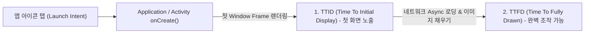

# TTID & TTFD (안드로이드 앱 시작 성능 2대 지표)

## 1. 개요 (Overview)

Android 앱 성능 측정에서 앱 실행 시 사용자 경험을 결정짓는 대표적인 2대 시간 측정 지표는 **TTID (Time To Initial Display)** 와 **TTFD (Time To Fully Drawn)** 이다.

앱 아이콘 클릭 후 화면에 첫 프레임이 나오는 시점과, 사용자가 실제로 모든 데이터를 로딩받아 앱 조작이 가능한 완성 시점을 정밀하게 구분하여 관측한다.

---

### 초보자를 위한 쉽게 이해하는 비유

* **TTID (Time To Initial Display - 첫 테이블 물 컵 셋팅 시간)**:
  - 손님이 식당에 들어왔을 때 종업원이 **첫 물 컵과 수저를 테이블에 차려놓는 시간**. 손님은 "아, 주문이 접수되었고 음식이 나오겠구나" 하고 안심한다 (첫 윈도우 프레임 노출).
* **TTFD (Time To Fully Drawn - 메인 요리 완성 및 식사 시작 시간)**:
  - 주방에서 메인 요리가 모두 조리되어 **손님이 실제로 젓가락을 들고 식사를 시작할 수 있는 시간** (네트워크 데이터 로딩까지 완비된 실제 사용 가능 시점).



---

## 2. TTID vs TTFD 상세 비교

| 지표 | TTID (Time To Initial Display) | TTFD (Time To Fully Drawn) |
| :--- | :--- | :--- |
| **측정 시점** | 앱의 **첫 번째 화면 프레임**이 렌더링된 순간 | 네트워크/DB 비동기 로딩까지 마치고 **모든 데이터가 그려진 순간** |
| **측정 측정 주체** | **안드로이드 OS (System Server / WindowManager)** | **개발자 소스 코드 (`reportFullyDrawn()` 호출)** |
| **로그 출력 예시** | `Displayed com.example.app/.MainActivity: +480ms` | `Fully drawn com.example.app/.MainActivity: +1250ms` |
| **사용자 체감** | 앱이 튕기거나 먹통이 되지 않고 반응함을 확인 | **실제로 앱의 모든 기능을 클릭하고 사용할 수 있음** |

---

## 3. 측정 및 코드 적용 방법

### 1) Android 코드에서 TTFD 리포팅
```kotlin
class MainActivity : ComponentActivity() {
    override fun onCreate(savedInstanceState: Bundle?) {
        super.onCreate(savedInstanceState)
        
        viewModel.uiState.onEach { state ->
            if (state is UiState.Success) {
                // 비동기 데이터 로딩이 완료되면 OS 에 TTFD 리포트
                reportFullyDrawn()
            }
        }.launchIn(lifecycleScope)
    }
}
```

### 2) CLI 명령어 관측
```bash
# TTID 및 Displayed 시간 관측
adb logcat -d -s ActivityTaskManager | grep Displayed
```

---

## 4. 연결 문서 (Related Links)

- [앱 실행 경로 계약](../../00_foundations/overview/foundation/app-launch-crosses-launcher-system-server-zygote-and-activitythread.md) - Launcher 에서 TTID/TTFD 로 이어지는 앱 구동 시퀀스
- [ActivityThread](../../02_app_framework/architecture/app-components/activity-thread.md) - 앱 구동 및 렌더링 제출을 주도하는 메인 스레드
