## Coroutine 과 Flow 테스트는 dispatcher 와 virtual time 을 통제해야 한다

상위 문서: [Android 성능, 품질, 빌드 최적화 지도](../performance/android-performance-quality-and-build-optimization.md)
관련 지도: [테스트 품질 계약](./testing-quality/testing-quality.md)

Coroutine 및 Flow 단위 테스트가 실제 `Dispatchers.IO`, `Dispatchers.Main`, 또는 비동기 `delay()`에 직접 의존하면 스레드 스케줄링 레이스 조건에 의해 플래키(Flaky) 테스트가 유발되므로, `TestDispatcher`와 가상 시간(`TestCoroutineScheduler` Virtual Time)으로 비동기 실행을 결정론적으로 제어해야 한다.

### 1. TestDispatcher 및 Virtual Time 메커니즘

- **`TestCoroutineScheduler` (가상 시간 스케줄러)**:
  - 실제 시스템 시계(Wall-clock time)를 대기하지 않고, 스케줄러 내부 가상 시간 축(Virtual clock time)을 `advanceTimeBy()` 또는 `advanceUntilIdle()`로 순간 이동시켜 `delay()`를 즉시 실행한다.
- **`StandardTestDispatcher`**:
  - 생성된 모든 코루틴을 실행하지 않고 가상 시간 큐에 대기(Queueing)시킨다. 명시적으로 `runCurrent()` 또는 `advanceUntilIdle()`을 호출해야만 큐의 코루틴이 수행된다.
- **`UnconfinedTestDispatcher`**:
  - 자식 코루틴을 첫번째 중단점(Suspension point)까지 즉시 동기적(Eagerly)으로 실행한다. 코루틴 수집([stateflow](../../02_app_framework/data/async-flow/flow-state/stateflow-and-sharedflow.md) assertion) 시 `runCurrent()` 호출 횟수를 줄여주나 실행 순서 제어권은 낮다.
- **`Dispatchers.setMain` / `resetMain`**:
  - JVM 환경 단위 테스트 실행 시 Android UI Looper 메인 스레드가 없으므로 JUnit Rule을 통해 `Dispatchers.Main`을 `TestDispatcher`로 교체(Replace)해야 한다.

### 2. 가상 시간 스케줄링 타임라인 비교

```mermaid
gantt
    title Real-Time Delay vs Virtual-Time Advancement
    dateFormat  SS
    axisFormat  %S
    
    section Real Time Sleep
    Thread Sleep 10s       :a1, 00, 10s
    Assert Result          :after a1, 01s

    section Virtual Time Test
    Enqueue Coroutines     :b1, 00, 01s
    advanceUntilIdle (0ms) :b2, after b1, 01s
    Assert Result Instant  :after b2, 01s
```



### 3. MainDispatcherRule 및 Flow 테스트 Kotlin 코드 구체 예시

```kotlin
import kotlinx.coroutines.Dispatchers
import kotlinx.coroutines.ExperimentalCoroutinesApi
import kotlinx.coroutines.flow.MutableStateFlow
import kotlinx.coroutines.flow.asStateFlow
import kotlinx.coroutines.test.*
import org.junit.Assert.assertEquals
import org.junit.Rule
import org.junit.Test
import org.junit.rules.TestWatcher
import org.junit.runner.Description

@OptIn(ExperimentalCoroutinesApi::class)
class MainDispatcherRule(
    val testDispatcher: TestDispatcher = StandardTestDispatcher()
) : TestWatcher() {
    override fun starting(description: Description) {
        Dispatchers.setMain(testDispatcher)
    }

    override fun finished(description: Description) {
        Dispatchers.resetMain()
    }
}

class UserViewModelTest {

    @get:Rule
    val mainDispatcherRule = MainDispatcherRule()

    @Test
    fun fetchUser_updatesState_withVirtualTimeDelay() = runTest {
        // ViewModel에 TestDispatcher / TestScope 제공
        val viewModel = UserViewModel(
            ioDispatcher = mainDispatcherRule.testDispatcher
        )

        viewModel.fetchUserData(userId = "123")

        // 1. 코루틴 시작 직후 초기 로딩 상태 검증
        assertEquals(UserUiState.Loading, viewModel.uiState.value)

        // 2. 5초 delay가 포함된 비동기 코루틴 작업을 가상 시간으로 즉시 완수
        advanceUntilIdle()

        // 3. 완료 후 최종 성공 상태 검증
        assertEquals(
            UserUiState.Success(userName = "Alice"),
            viewModel.uiState.value
        )
    }
}
```

### 4. 관측 가능한 실행 증거 (Observable Evidence)

#### JUnit 실행 시간 측정 로그
10초 이상의 `delay()`가 포함된 테스트 100개가 단 0.14초 내에 완수되는 실행 증거:

```text
Task :app:testDebugUnitTest

com.example.app.UserViewModelTest > fetchUser_updatesState_withVirtualTimeDelay PASSED [0.004s]
com.example.app.UserViewModelTest > pollNetworkFeed_advancesVirtualClock PASSED [0.003s]

BUILD SUCCESSFUL in 140ms
100 tests completed, 0 failed.
```

### 5. Coroutine 테스트 가이던스

- **교체 가능한 Dispatcher 경계**: 가상 시간으로 제어해야 하는 repository/use case의 `IO`·`Default` dispatcher는 constructor parameter, default parameter, 수동 factory, service locator 또는 DI container 등 프로젝트에 맞는 방식으로 교체 가능하게 만든다. Hilt/Koin 사용은 필수가 아니다. `viewModelScope`처럼 라이브러리가 `Dispatchers.Main`을 제공하는 경우에는 제품 코드에 dispatcher를 억지로 주입하지 않고 테스트에서 `Dispatchers.setMain()`으로 교체할 수 있다.
- **Turbine 라이브러리 활용**: Cold Flow나 복잡한 SharedFlow 연산 테스트 시에는 `app.cash.turbine:turbine` 라이브러리의 `awaitItem()` 및 `cancelAndIgnoreRemainingEvents()` 연동을 권장한다.

### 공식 문서

- https://developer.android.com/kotlin/coroutines/coroutines-best-practices
- https://developer.android.com/kotlin/coroutines/test
- https://kotlinlang.org/api/kotlinx.coroutines/kotlinx-coroutines-test/

검증일: 2026-08-06. Dispatcher 교체 가능성은 유지하되 Hilt/Koin을 모든 코드에 강제하지 않고, `viewModelScope`의 Main dispatcher는 테스트에서 교체하는 공식 패턴을 반영했다.
