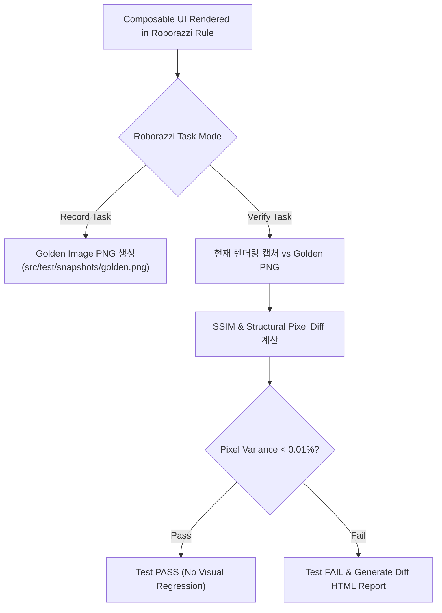

## Screenshot testing은 시각 회귀를 검출한다

상위 문서: [Android 성능, 품질, 빌드 최적화 지도](../android-performance-testing-map.md)
관련 지도: [테스트 품질 계약](./testing-quality.md)
관련 노트: [Compose UI 테스트는 testTag 와 semantics 를 분리한다](compose-ui-tests-semantics.md)

스크린샷 테스트(Screenshot Testing)는 픽셀 차원의 화면 렌더링 결과물(Golden Image)과의 픽셀 변위(Visual Pixel Difference)를 추적하여 시각적 회귀(UI Regression)를 포착하는 도구이며, 도메인 비즈니스 정합성(Domain Correctness)을 입증하는 단위 테스트를 대체할 수 없다.

### 1. 스크린샷 렌더링 및 픽셀 Diffing 메커니즘

- **Canvas Snapshot Engine (Roborazzi / Paparazzi)**:
  - **Paparazzi**: JVM 렌더링 엔진(LayoutLib)을 가상 포크하여 Android OS 디바이스 및 GPU 없이 호스트 JVM 상에서 직접 Composable 캔버스를 렌더링.
  - **Roborazzi**: Robolectric + Graphics(Native Graphics Core)를 결합하여 Compose UI 노드를 캡처하고 PNG 픽셀 버퍼 수집.
- **SSIM (Structural Similarity Index Metric)**:
  - 단순 픽셀 RGB 차이 계산 외에 구조적 픽셀 유사도를 0.0 ~ 1.0 비율로 산출하여, 허용 픽셀 임계값(Comparison Threshold: 0.99) 미달 시 실패(Mismatch) 포착.
- **Record vs Verify Mode**:
  - `record`: 소스 변경 후 새로운 골든 이미지 PNG 파일 덮어쓰기 저장.
  - `verify`: 기존 저장된 골든 이미지 PNG와 현재 테스트 실행 캡처본 픽셀 대조.

### 2. 스크린샷 테스트 파이프라인 워크플로우



### 3. Roborazzi 스크린샷 테스트 Kotlin 코드 구체 예시

```kotlin
import androidx.compose.ui.test.junit4.createComposeRule
import androidx.compose.ui.test.onRoot
import com.github.takahirom.roborazzi.RoborazziOptions
import com.github.takahirom.roborazzi.captureRoboImage
import org.junit.Rule
import org.junit.Test
import org.junit.runner.RunWith
import org.robolectric.RobolectricTestRunner
import org.robolectric.annotation.GraphicsMode

@RunWith(RobolectricTestRunner::class)
@GraphicsMode(GraphicsMode.Mode.NATIVE) // Native Graphics On
class ProfileCardScreenshotTest {

    @get:Rule
    val composeTestRule = createComposeRule()

    @Test
    fun profileCard_lightMode_matchesGolden() {
        composeTestRule.setContent {
            AppTheme(darkTheme = false) {
                ProfileCard(
                    name = "Jane Doe",
                    role = "Android Engineer",
                    avatarUrl = null
                )
            }
        }

        // 시맨틱 루트 트리를 캡처하여 골든 이미지 비교 검증
        composeTestRule.onRoot().captureRoboImage(
            filePath = "src/test/snapshots/profile_card_light.png",
            roborazziOptions = RoborazziOptions(
                compareOptions = RoborazziOptions.CompareOptions(changeThreshold = 0.01f) // 1% 이하 변경 허용
            )
        )
    }
}
```

### 4. 관측 가능한 실행 증거 (Observable Evidence)

#### Roborazzi Gradle Verify 실행 및 Diff 리포트 덤프

```bash
$ ./gradlew verifyRoborazziDebug
```

```text
Task :app:verifyRoborazziDebug FAILED

Roborazzi Verification Failures:
1 image mismatch detected!
  File: profile_card_light.png
  Golden: src/test/snapshots/profile_card_light.png
  Actual: build/outputs/roborazzi/profile_card_light_actual.png
  Diff:   build/outputs/roborazzi/profile_card_light_diff.png
  Reason: Image mismatch ratio: 0.042 (4.2% pixel difference exceeds 1.0% threshold)
```

### 5. 스크린샷 테스트 운영 원칙

- **폰트 및 OS 버전 고정**: 호스트 OS(macOS vs Linux CI) 폰트 렌더링 안티앨리어싱 차이로 인한 거짓 실패(False Positive)를 막기 위해 Roborazzi 폰트 모드를 고정한다.
- **도메인 Assertion과 분리**: 스크린샷 테스트 안에서 비즈니스 로직(예: 계산 결과 문자열 정합성)을 검증하지 말고, 비주얼 패딩/컬러/폰트 회귀 검출용으로만 한정한다.


