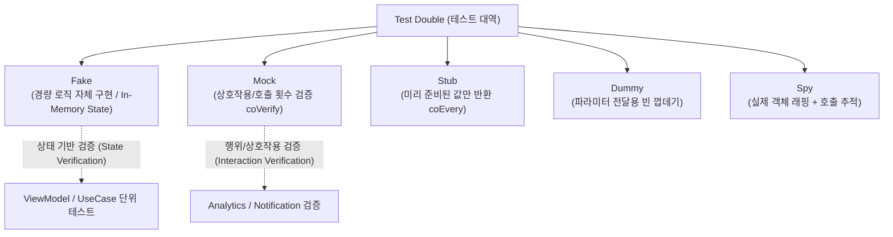

## Test double 는 행동의 소유권으로 Fake 와 Mock 을 구분해 선택한다

상위 문서: [테스트 품질 계약](testing-quality.md)
관련 지도: [Android 성능, 품질, 빌드 최적화 지도](../android-performance-testing-map.md)
관련 노트: [테스트 레이어는 피드백 비용으로 선택한다](test-pyramid-strategy.md), [Coroutine 과 Flow 테스트는 dispatcher 와 virtual time 을 통제해야 한다](coroutine-flow-testing.md), [회귀와 flaky 테스트는 릴리즈 게이트의 신뢰도를 낮춘다](flaky-tests-regression-gates.md)

---

### 1. 핵심 주장 및 Test Double 분류 체계

테스트 대역(Test Double)은 테스트 대상 객체가 의존하는 협력 객체를 격리하고 결정론적 테스트 환경을 구성하기 위한 객체 대역이다.

* **Fake (행동의 소유)**: 실제 동작하는 간단한 비즈니스 로직(예: In-memory `MutableMap` 기반 Repository)을 스스로 구현한 대역.
* **Mock / Stub (상호작용 검증 및 응답 고정)**: 호출 여부, 호출 횟수, 전달 인자를 기록하거나(`verify`), 미리 정해진 반환값만 스텁(`every { ... } returns ...`)하는 대역.
* **Dummy / Spy**: 인자 전달용 빈 객체(Dummy) 또는 실제 객체를 감싸 호출을 감시하는 대역(Spy).



---

### 2. 왜 ViewModel 테스트에서 Fake가 Mock보다 우수한가?

1. **리팩터링 내성 (Refactoring Resistance)**:
   - `UserRepository` 인터페이스의 시그니처나 반환 타입이 변경될 때, **Fake는 컴파일 에러**를 발생시켜 수정 누락을 즉시 감지한다.
   - 반면 Mock은 `every { repo.getUser(any()) }` 스텁이 인터페이스 내부 로직 변경과 무관하게 거짓 양성(False Positive)으로 통과할 위험이 높다.
2. **다양한 분기 시나리오 재사용**:
   - Fake 클래스 내부에 성공, 실패, 빈 리스트, 네트워크 지연 플래그를 두면 여러 단위 테스트에서 일관된 비즈니스 상태 전이를 검증할 수 있다.

---

### 3. Fake vs MockK 구현 및 테스트 Kotlin 코드 구체 예시

#### 1) Fake Repository 구현 예시

```kotlin
// 인터페이스 정의
interface UserRepository {
    suspend fun getUser(id: String): Result<User>
    suspend fun saveUser(user: User)
}

// In-Memory Fake 구현 (행동을 스스로 소유함)
class FakeUserRepository : UserRepository {
    private val userMap = mutableMapOf<String, User>()
    var shouldReturnError: Boolean = false

    override suspend fun getUser(id: String): Result<User> {
        if (shouldReturnError) return Result.failure(RuntimeException("Network error"))
        val user = userMap[id] ?: return Result.failure(NoSuchElementException("User not found"))
        return Result.success(user)
    }

    override suspend fun saveUser(user: User) {
        userMap[user.id] = user
    }
}
```

#### 2) Fake를 사용한 ViewModel 테스트 (상태 기반 검증)

```kotlin
class UserViewModelWithFakeTest {
    @get:Rule
    val mainDispatcherRule = MainDispatcherRule()

    private val fakeRepository = FakeUserRepository()
    private lateinit var viewModel: UserViewModel

    @Before
    fun setup() {
        viewModel = UserViewModel(userRepository = fakeRepository)
    }

    @Test
    fun loadUser_success_updatesUiState() = runTest {
        // Given
        fakeRepository.saveUser(User("123", "Alice"))

        // When
        viewModel.loadUser("123")

        // Then (상태 검증)
        assertEquals(UserUiState.Success(User("123", "Alice")), viewModel.uiState.value)
    }
}
```

#### 3) MockK를 사용한 Analytics 상호작용 테스트 (행위 기반 검증)

```kotlin
import io.mockk.*
import org.junit.Test

class AnalyticsTrackerTest {
    private val analyticsClient = mockk<AnalyticsClient>(relaxed = true)
    private val tracker = EventTracker(analyticsClient)

    @Test
    fun trackCheckout_callsAnalyticsClient_withCorrectParams() {
        // When
        tracker.trackCheckoutSuccess(orderId = "ORD-999", amount = 49.99)

        // Then (상호작용 검증: 정확히 1회 전달 인자와 함께 호출되었는지 확인)
        verify(exactly = 1) {
            analyticsClient.sendEvent(
                eventName = "checkout_success",
                params = match { it["order_id"] == "ORD-999" && it["amount"] == 49.99 }
            )
        }
    }
}
```

---

### 4. Strict Mock vs Relaxed Mock 메커니즘

MockK는 Mock을 **Strict**(기본값)와 **Relaxed**(`relaxed = true`)로 나눈다:

```kotlin
// 1. Strict Mock: 스텁하지 않은 호출은 MockKException 발생
val repo = mockk<UserRepository>()
every { repo.getUser("1") } returns Result.success(User("1", "Alice"))
// repo.saveUser(user) 호출 시 -> io.mockk.MockKException: no answer found for UserRepository.saveUser()

// 2. Relaxed Mock: 스텁하지 않은 호출에 대해 기본값(0, false, 빈 객체) 반환
val relaxedRepo = mockk<UserRepository>(relaxed = true)
relaxedRepo.saveUser(User("1", "Bob")) // Unit 반환, 예외 없음
```

* **주의사항**: `relaxed = true`는 테스트 관심사 밖의 부수 효과를 무시하기 위한 편의 장치이며, 실제 검증 대상 로직에 남용하면 버그를 은폐하는 원인이 된다.

---

### 5. Test Double 선택 판단 매트릭스

| 검증 상황 | 추천 Test Double | 이유 |
| :--- | :--- | :--- |
| **ViewModel / UseCase 비즈니스 규칙** | **Fake** | 다양한 데이터 상태 분기(성공/실패/빈값)를 실제 로직으로 통과시켜 리팩터링 안전성 극대화 |
| **Room DB / DataStore 저장소** | **In-Memory DB / Fake** | 실제 쿼리 실행 및 트랜잭션 무결성 검증 |
| **Analytics / Push Notification 전송** | **Mock (`verify`)** | 상태가 아닌 외부 시스템과의 호출 계약(횟수, 파라미터) 자체가 검증 대상 |
| **복잡한 인터페이스 중 일부만 사용** | **Relaxed Mock** | 불필요한 부수 인터페이스 스텁 작성 보일러플레이트 제거 |

---

### 6. 관측 가능한 신호 (Observable Signals)

- **`MockKException: no answer found`**: Strict Mock에서 스텁하지 않은 의존성 호출이 발생했을 때 나타나는 실패 신호. 테스트 대상 코드가 의도치 않게 추가적인 외부 협력 객체를 호출하고 있음을 즉시 감지할 수 있다.

---

### 7. 연결 문서 (Related Links)

- [테스트 레이어는 피드백 비용으로 선택한다](test-pyramid-strategy.md) - 피라미드 전략과 레이어별 대역 선택
- [Coroutine 과 Flow 테스트는 dispatcher 와 virtual time 을 통제해야 한다](coroutine-flow-testing.md) - 비동기 코루틴 통제
- [회귀와 flaky 테스트는 릴리즈 게이트의 신뢰도를 낮춘다](flaky-tests-regression-gates.md) - Shared State 오염 방지

