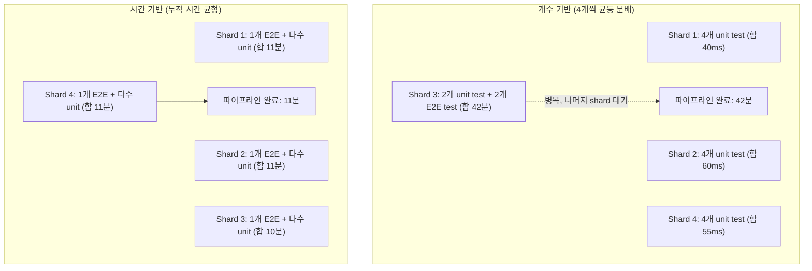

## 파이프라인 sharding 은 테스트 개수가 아니라 과거 실행 시간 기준으로 분배해야 한다

상위 문서: [테스트 품질 계약](./testing-quality.md)
관련 노트: [CI 는 Firebase Test Lab 같은 클라우드 디바이스 매트릭스에서 테스트를 실행하고 로컬 에뮬레이터 매트릭스와는 다른 계약을 가진다](firebase-test-lab-matrix.md)

Instrumented test 수백 개를 병렬 shard 로 나눠 CI 시간을 줄이려는 시도는, shard 를 테스트 "개수" 로 균등 분배하면 오히려 병목을 만든다. shard 전체의 완료 시각은 가장 느린 shard 가 결정하므로, 개수가 아니라 과거 실행 시간(historical duration) 으로 분배해야 wall-clock 시간이 실제로 줄어든다.

### 1. 개수 기반 sharding 이 실패하는 이유

- Android 테스트 스위트의 실행 시간은 균일하지 않다. 순수 로직을 검증하는 unit test 는 수 ms 안에 끝나지만, Espresso/Compose UI test 나 DB migration test 는 초 단위, 실기기 E2E flow 는 수십 초가 걸릴 수 있다.
- 테스트 개수를 shard 수로 나눠 기계적으로 배분하면, 무거운 테스트가 몰린 shard 하나가 전체 파이프라인의 완료 시각을 결정한다. 나머지 shard 는 먼저 끝나고 CI runner 를 놀리며 대기한다.
- 이 병목은 shard 수를 늘려도 해소되지 않는다. 무거운 테스트가 어느 shard 에 들어가느냐의 문제이지, shard 개수의 문제가 아니기 때문이다.

### 2. 시간 기반 분배 메커니즘

- 이전 CI 실행에서 테스트 클래스/메서드별 실행 시간을 기록한 timing 데이터를 남긴다(JUnit XML 의 `time` 속성, 또는 CI 벤더가 제공하는 test insight 데이터).
- 다음 실행에서 그 timing 데이터를 읽어 그리디 최장 처리 시간 우선(Longest Processing Time first) 같은 bin-packing 방식으로 shard 를 구성한다 — 가장 무거운 테스트부터 그 시점에 누적 시간이 가장 적은 shard 에 배정한다.
- 결과적으로 각 shard 의 예상 완료 시각이 비슷해지므로, 전체 파이프라인 wall-clock 시간은 "가장 느린 shard" 가 아니라 "shard 평균 실행 시간" 에 수렴한다.
- **중요한 경계**: Firebase Test Lab 자체의 `--num-uniform-shards` 옵션은 테스트를 균등 개수로 나누는 count 기반 sharding 이며 과거 실행 시간을 고려하지 않는다(공식 문서 확인, 2026-08-04). 시간 기반 분배가 필요하면 CI 파이프라인 쪽에서 timing 데이터를 직접 관리하고, 그 결과로 나뉜 그룹을 `--test-targets-for-shard` 같은 수동 shard 지정 옵션에 넘기는 방식으로 조합해야 한다. Test Lab 이 자동으로 시간 기반 분배를 해주지 않는다.

### 3. 개수 기반 vs 시간 기반 분배 비교



### 4. timing 데이터 기반 shard 그룹 생성 스크립트 예시

```python
# 이전 실행의 JUnit XML에서 클래스별 실행 시간(초)을 읽어
# 그리디 LPT(Longest Processing Time) 방식으로 N개 shard에 분배한다.
import json

def balance_shards(test_durations: dict[str, float], num_shards: int) -> list[list[str]]:
    shards = [[] for _ in range(num_shards)]
    shard_totals = [0.0] * num_shards

    # 무거운 테스트부터 배정해야 뒤로 갈수록 미세 조정 여지가 줄어드는 문제를 피한다
    for test_name, duration in sorted(test_durations.items(), key=lambda kv: -kv[1]):
        lightest = shard_totals.index(min(shard_totals))
        shards[lightest].append(test_name)
        shard_totals[lightest] += duration

    return shards

with open("previous_run_timings.json") as f:
    durations = json.load(f)  # {"com.app.LoginFlowTest": 38.2, "com.app.UtilTest": 0.01, ...}

shard_groups = balance_shards(durations, num_shards=4)
for i, group in enumerate(shard_groups):
    print(f"shard-{i}.txt", "\n".join(group))
```

### 5. 관찰 가능한 증거

sharding 이 개수 기반에서 시간 기반으로 바뀌면 CI 대시보드의 shard 별 소요 시간 로그에서 편차가 좁아진다.

```text
# 개수 기반 sharding 적용 시 (before)
Shard 0 finished in 1m12s
Shard 1 finished in 0m54s
Shard 2 finished in 42m03s   <- 병목: E2E 테스트 몰림
Shard 3 finished in 1m05s
Pipeline total: 42m03s (가장 느린 shard 가 전체 시간을 결정)

# 시간 기반 sharding 적용 후 (after)
Shard 0 finished in 11m02s
Shard 1 finished in 10m48s
Shard 2 finished in 11m15s
Shard 3 finished in 10m51s
Pipeline total: 11m15s
```

shard 간 완료 시간 편차가 수십 배에서 1~2 분 이내로 좁혀지는 것이 시간 기반 분배가 실제로 동작하고 있다는 신호다. 편차가 여전히 크다면 timing 데이터가 오래돼 최근에 추가된 무거운 테스트를 반영하지 못했을 가능성을 먼저 의심한다.

### 경계

이 노트는 "왜 시간 기준으로 나눠야 하는가" 와 "어떻게 나누는가" 만 다룬다. 클라우드 디바이스 매트릭스 자체의 구성(기기 조합, locale/orientation)은 [CI는 Firebase Test Lab 같은 클라우드 디바이스 매트릭스에서 테스트를 실행하고 로컬 에뮬레이터 매트릭스와는 다른 계약을 가진다](firebase-test-lab-matrix.md) 를 본다. flaky test 자체의 격리/quarantine 정책은 [회귀와 flaky 테스트는 릴리즈 게이트의 신뢰도를 낮춘다](flaky-tests-regression-gates.md) 를 본다.

출처: [gcloud CLI로 Firebase Test Lab 테스트 실행 - 샤딩 옵션](https://firebase.google.com/docs/test-lab/android/command-line)
