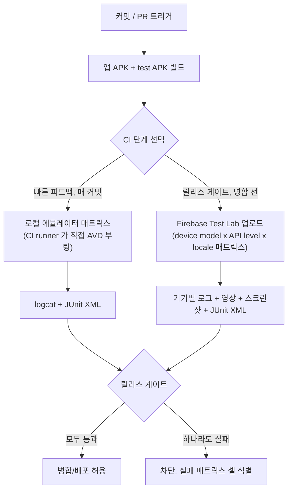

## CI 는 Firebase Test Lab 같은 클라우드 디바이스 매트릭스에서 테스트를 실행하고 로컬 에뮬레이터 매트릭스와는 다른 계약을 가진다

상위 문서: [테스트 품질 계약](./testing-quality-contracts.md)

CI 파이프라인이 "instrumented test 를 통과시켰다"는 말은 어떤 실행 환경에서 통과시켰는지에 따라 의미가 다르다. CI runner 위에서 직접 부팅하는 로컬 에뮬레이터 매트릭스와, Firebase Test Lab 같은 클라우드 디바이스 매트릭스는 서로 다른 결함을 검증하며 하나가 다른 하나를 대체하지 못한다.

### 1. 두 매트릭스가 검증하는 것이 다른 이유

- **로컬 에뮬레이터 매트릭스**: CI runner(GitHub Actions/GitLab CI/Jenkins 등)가 자체 가상화 위에서 Android Emulator(AVD)를 직접 부팅한다. CI runner 의 CPU 아키텍처와 가상화 지원(KVM/HAXM) 범위 안에서만 API level 을 고를 수 있고, 실행 가능한 조합 수가 runner 자원(코어, 메모리, 동시 job 수)에 의해 제한된다. 카메라, 센서, 지문, OEM skin 의 실제 하드웨어 동작은 재현하지 않는다.
- **클라우드 디바이스 매트릭스(Firebase Test Lab)**: Google 이 호스팅하는 실물 기기(physical device)와 가상 기기(virtual device) 풀에 test APK 를 업로드해 실행한다. device model × API level × orientation × locale 조합을 매트릭스로 지정하면 각 조합이 별도 기기에서 병렬 실행된다. 실물 기기 위에서만 드러나는 OEM 커스터마이징, 실제 카메라/센서 동작, 기기별 메모리 압박 상황의 결함을 잡는다.
- **결론적 계약**: "에뮬레이터 매트릭스 green" 은 로직/레이아웃 회귀가 없다는 증거일 뿐, "실기기 매트릭스 green" 이 보장하는 기기 파편화(fragmentation) 내성까지 보장하지 않는다. release gate 는 두 결과를 같은 신뢰도로 취급하면 안 되며, 어느 매트릭스에서 통과했는지를 아티팩트에 명시해야 한다.

### 2. 파이프라인 흐름



### 3. 클라우드 매트릭스 실행 설정 예시

```bash
# 앱 APK와 instrumented test APK를 빌드한 뒤 매트릭스 지정
gcloud firebase test android run \
  --type instrumentation \
  --app app-debug.apk \
  --test app-debug-androidTest.apk \
  --device model=redfin,version=30,locale=ko_KR,orientation=portrait \
  --device model=oriole,version=33,locale=en_US,orientation=landscape \
  --timeout 20m \
  --num-flaky-test-attempts 1
```

`--device` 플래그를 여러 번 반복하면 각 조합이 별도 물리 기기에서 병렬 실행된다. 로컬 에뮬레이터 CI 단계에는 이런 물리 기기 지정 자체가 존재하지 않는다 — CI runner 가 스스로 부팅할 수 있는 AVD 이미지로 조합이 제한된다.

### 4. 관찰 가능한 증거

`gcloud firebase test android run` 실행 결과는 매트릭스 셀 단위로 분리된 상태를 보고한다.

```text
Instrumentation testing complete.

Matrix ID: matrix-abc123
+--------------------------+----------------+---------------------------------+
| DEVICE                   | OUTCOME        | TEST_DETAILS                    |
+--------------------------+----------------+---------------------------------+
| redfin-30-ko_KR-portrait | Passed         | 42 test cases passed             |
| oriole-33-en_US-landscape| Failed         | 1 test case failed: LoginFlowTest|
+--------------------------+----------------+---------------------------------+

More details are available at [Firebase console URL].
```

`oriole-33` 셀에서만 실패했다면 결함이 로직이 아니라 특정 기기/API level/locale 조합에서만 재현되는 파편화 결함이라는 신호다. 이런 실패는 로컬 에뮬레이터 매트릭스에서는 애초에 그 조합을 실행하지 않았다면 드러나지 않는다.

### 경계

이 노트는 "클라우드 매트릭스와 로컬 매트릭스가 왜 다른 것을 검증하는가"만 다룬다. 파이프라인이 각 매트릭스 셀에 테스트를 어떻게 분배하는지는 [파이프라인 sharding 은 테스트 개수가 아니라 과거 실행 시간 기준으로 분배해야 한다](./pipeline-sharding-should-balance-by-historical-duration-not-test-count.md) 를 본다. CI/CD 파이프라인 단계 구성 자체(체크아웃 → lint → test → 서명 → 배포)는 이 노트의 범위가 아니다.

출처: [Firebase Test Lab: Android Studio 로 테스트 실행](https://firebase.google.com/docs/test-lab/android/android-studio), [gcloud CLI 로 Firebase Test Lab 테스트 실행](https://firebase.google.com/docs/test-lab/android/command-line)
