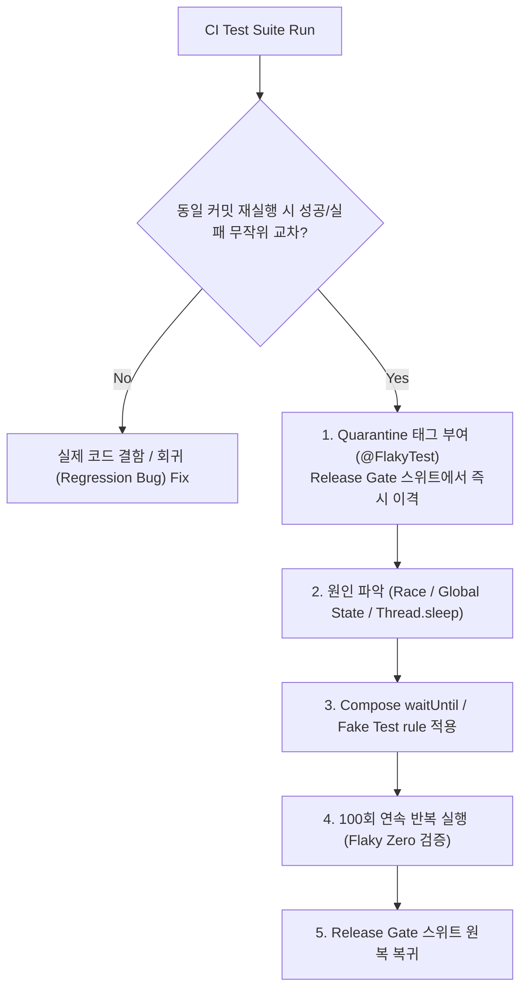

## 회귀와 flaky 테스트는 릴리즈 게이트의 신뢰도를 낮춘다

상위 문서: [Android 성능, 품질, 빌드 최적화 지도](../../performance/android-performance-quality-and-build-optimization.md)
관련 지도: [테스트 품질 계약](./testing-quality-contracts.md)
관련 노트: [테스트 레이어는 피드백 비용으로 선택한다](./test-layer-is-chosen-by-feedback-cost-and-risk.md)

동일한 소스 코드 조건에서도 환경/타이밍 경합에 의해 성공과 실패를 오가는 플래키 테스트(Flaky Test)는 배포 차단(Release Gate)에 대한 개발팀의 신뢰를 무너뜨리며, 실패 시 재실행(Retry)으로 무마하는 습관은 실제 회귀(Regression) 결함을 은폐시키는 위험한 안티패턴이다.

### 1. 테스트 플래키니스 원인 및 격리 메커니즘

- **주요 원인 분석**:
  1. **비동기 스레드 레이스 (Async Race Condition)**: 비동기 데이터 로딩이 완료되기 전 UI Assertion 실행.
  2. **전역 잔존 상태 (Shared State Pollution)**: Singleton, SharedPreferences, Room In-memory DB가 이전 테스트 실행 상태를 잔존 유지.
  3. **시스템 디바이스 변동성**: 시스템 애니메이션, 소프트 키보드 팝업, 알림 드로어 팝업.
- **격리 해결 메커니즘**:
  - **Compose `waitUntil` & `IdlingResource`**: `Thread.sleep()` 사용 전면 금지 및 명시적 UI idle 조건 대기.
  - **Test Rule 격리**: Hilt `@UninstallModules` 및 `@TestInstallIn`을 이용한 Fake 의존성 강제 주입.
  - **Quarantine(격리) 정책**: 플래키 테스트 발견 즉시 `@FlakyTest` Annotate 후 메인 Release Gate CI 스위트에서 분리 조치.

### 2. Flaky Test 격리 및 수정 워크플로우



### 3. Compose `waitUntil` 및 Hilt Fake 주입 Kotlin 코드 구체 예시

```kotlin
import androidx.compose.ui.test.junit4.createComposeRule
import androidx.compose.ui.test.onNodeWithTag
import androidx.compose.ui.test.performClick
import dagger.hilt.android.testing.HiltAndroidRule
import dagger.hilt.android.testing.HiltAndroidTest
import org.junit.Rule
import org.junit.Test

@HiltAndroidTest
class FeedFlakyFixTest {

    @get:Rule(order = 0)
    val hiltRule = HiltAndroidRule(this)

    @get:Rule(order = 1)
    val composeTestRule = createComposeRule()

    @Test
    fun fetchFeed_showsItems_withoutFlakiness() {
        hiltRule.inject()
        
        composeTestRule.setContent {
            FeedScreen()
        }

        // Thread.sleep()을 절대 쓰지 않고 명시적 조건 대기 (최대 5초)
        composeTestRule.waitUntil(timeoutMillis = 5_000) {
            composeTestRule
                .selectAllNodes(hasTestTag("feed_item"))
                .fetchSemanticsNodes().isNotEmpty()
        }

        // 안정적으로 준비된 UI 항목 조작
        composeTestRule
            .onNodeWithTag("feed_item_0")
            .performClick()
    }
}
```

### 4. 관측 가능한 실행 증거 (Observable Evidence)

#### Gradle 테스트 플래키 리포트 덤프 로그

```text
Task :app:connectedDebugAndroidTest

[Flaky Test Detected]: com.example.app.FeedFlakyFixTest > fetchFeed_flakyLegacy
  Run #1: FAILED (ComposeTimeoutException: Condition not met within 1000ms)
  Run #2: PASSED
  Run #3: PASSED
  Result: FLAKY (Quarantined by CI Policy - Excluded from Release Gate)

BUILD FAILED (Release Gate Blocked due to 1 Quarantined Flaky Test)
```

### 5. 릴리스 게이트 운영 원칙

- **Retry 무제한 금지**: CI 파이프라인에서 테스트 실패 시 자동 재실행(Retry) 횟수를 최대 1회로 제한하고, 재실행 성공 시에도 경고 알림을 전송한다.
- **Flaky Zero 데드라인**: Quarantine 처리된 플래키 테스트는 sprint 내에 원인을 규명하여 수정하거나 수명이 다한 테스트인 경우 폐기 삭제한다.

