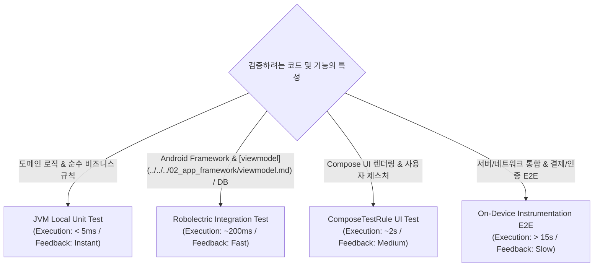

## 테스트 레이어는 피드백 비용으로 선택한다

상위 문서: [Android 성능, 품질, 빌드 최적화 지도](../../performance/android-performance-quality-and-build-optimization.md)

관련 지도: [테스트 품질 계약](./testing-quality-contracts.md)

관련 노트: [Unit, Integration, UI, E2E 테스트는 실패 신호가 다르다](./unit-integration-ui-e2e-tests-have-different-failure-signals.md)

테스트 레이어(JVM Unit, Robolectric Integration, On-device UI, E2E)의 선택은 `개발자 피드백 루프 속도(Execution Speed)`, `환경 구축 비용(Setup Cost)`, `결함 검출의 신뢰성(Fidelity)` 사이의 기회비용을 정밀하게 타협하는 품질 계약이다.

### 1. 테스트 레이어별 실행 메커니즘 및 피드백 비용

- **JVM Local Unit Test**:
  - **환경**: Android SDK 묵시적 Mocking 또는 순수 Java/Kotlin Virtual Machine.
  - **피드백 속도**: 초당 수백 개 테스트 실행 (< 5ms per test).
  - **주요 검증**: Domain Business Logic, State Reducers, pure Utility mapping.
- **Robolectric Integration Test**:
  - **환경**: JVM 상에서 Android Framework C/C++ 네이티브(Shadows) 및 뷰/리소스 스냅샷 시뮬레이션.
  - **피드백 속도**: 건당 100ms ~ 500ms.
  - **주요 검증**: Fragment / Activity 생명주기, Navigation Component 통합.
- **Instrumentation UI Test (On-Device)**:
  - **환경**: 에뮬레이터 또는 실기기 상의 Android OS ART 런타임.
  - **피드백 속도**: 건당 5 초 ~ 30 초 (기기 구동 및 APK 설치 오버헤드).
  - **주요 검증**: Custom View Drawing, Canvas rendering, 하드웨어 센서 연동.

### 2. 테스트 레이어 선택 의사결정 매트릭스



### 3. JVM Unit vs Instrumented UI 테스트 Kotlin 코드 구체 예시

```kotlin
// 1. JVM Local Unit Test (빠른 피드백, 0ms 가상 시간)
class CalculatorUnitTest {
    @Test
    fun calculateTax_returnsCorrectAmount() {
        val calculator = TaxCalculator()
        val result = calculator.compute(amount = 100.0, rate = 0.1)
        assertEquals(10.0, result, 0.001)
    }
}

// 2. Instrumented UI Test (높은 실재감, 기기 조작 비용 발생)
@RunWith(AndroidJUnit4::class)
class LoginActivityUiTest {
    @get:Rule
    val activityRule = ActivityScenarioRule(LoginActivity::class.java)

    @Test
    fun clickLogin_showsErrorDialog_whenPasswordEmpty() {
        onView(withId(R.id.username_input)).perform(typeText("user@example.com"))
        onView(withId(R.id.login_button)).perform(click())
        onView(withText(R.string.error_empty_password)).check(matches(isDisplayed()))
    }
}
```

### 4. 관측 가능한 실행 증거 (Observable Evidence)

#### Gradle 빌드 타임라인 비교 측정 로그

```text
# 1. JVM Local Unit Test Task
$ ./gradlew :app:testDebugUnitTest
BUILD SUCCESSFUL in 1.4s (420 unit tests passed)

# 2. On-Device Instrumentation Test Task
$ ./gradlew :app:connectedDebugAndroidTest
BUILD SUCCESSFUL in 1m 24s (24 UI tests passed)
```

### 5. 레이어 선택 가이던스

- **피라미드 비율 유지**: 전체 테스트 릴리스 게이트 스위트의 70% 이상을 JVM Unit Test 로 채우고, UI 및 E2E 테스트는 핵심 CUJ 로 한정한다.
- **실패 격리**: UI 테스트가 실패했을 때 domain logic 결함인지 UI Selector 결함인지를 명확히 포착할 수 있도록 단위 테스트 계층을 항상 먼저 실행한다.
