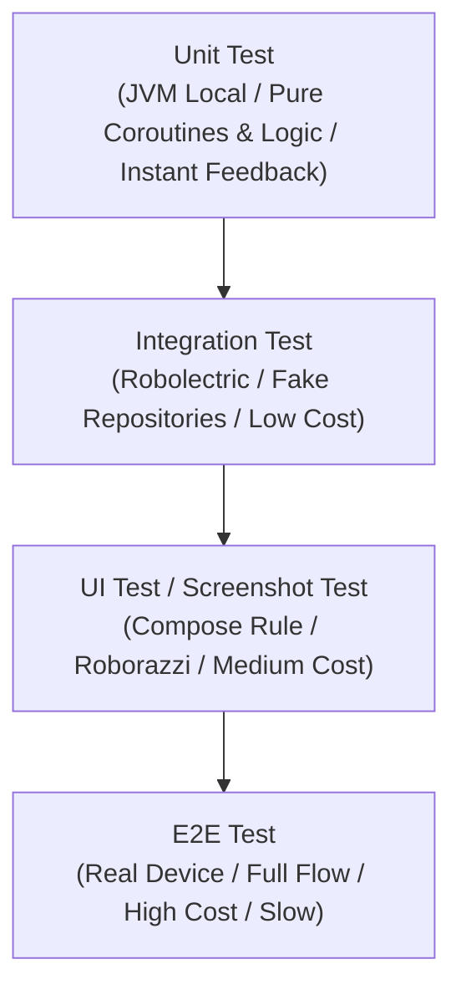

## 테스트 품질 계약

이 지도는 테스트를 단순한 종류 구분이 아니라 피드백 속도, 실행 비용, 실패 신호의 격리 범위, 회귀 방지 피라미드 계약으로 나눈다.

### 테스트 피라미드 & 피드백 속도 계약

## 정본 노트

- [테스트 레이어는 피드백 비용으로 선택한다](./test-layer-is-chosen-by-feedback-cost-and-risk.md)
- [Unit, Integration, UI, E2E 테스트는 실패 신호가 다르다](./unit-integration-ui-e2e-tests-have-different-failure-signals.md)
- [Compose UI 테스트는 testTag와 semantics를 분리한다](./compose-ui-tests-should-use-stable-selectors-and-semantics.md)
- [Espresso 는 View 기반 UI 를 동기적으로 테스트하며 IdlingResource 로 비동기 작업 완료를 기다린다](./espresso-owns-synchronous-view-ui-tests-with-idling-resource-for-async-waits.md)
- [Screenshot testing은 시각 회귀를 검출한다](./screenshot-testing-detects-visual-regression-not-business-correctness.md)
- [회귀와 flaky 테스트는 릴리즈 게이트의 신뢰도를 낮춘다](./regression-and-flaky-tests-are-release-gate-risks.md)
- [Coroutine 과 Flow 테스트는 dispatcher 와 virtual time 을 통제해야 한다](../coroutine-flow-tests-control-dispatchers-and-virtual-time.md)
- [CI는 Firebase Test Lab 같은 클라우드 디바이스 매트릭스에서 테스트를 실행하고 로컬 에뮬레이터 매트릭스와는 다른 계약을 가진다](./firebase-test-lab-runs-ci-tests-on-a-cloud-device-matrix-not-local-emulators.md)
- [파이프라인 sharding 은 테스트 개수가 아니라 과거 실행 시간 기준으로 분배해야 한다](./pipeline-sharding-should-balance-by-historical-duration-not-test-count.md)
- [TalkBack 수동 검증과 Accessibility Scanner 자동 검사는 서로 다른 결함군을 잡는다](./talkback-and-accessibility-scanner-catch-different-defect-classes.md)
- [Test double는 행동의 소유권으로 Fake와 Mock을 구분해 선택한다](./test-doubles-choose-between-fake-and-mock-by-behavior-ownership.md)

관련 지도: [Android 성능, 품질, 빌드 최적화 지도](../../performance/android-performance-quality-and-build-optimization.md), [디버깅 도구 계약](../../debugging/debugging-contracts/debugging-contracts.md), [Benchmark와 Baseline Profile 계약](../../performance/benchmark-baseline-contracts/benchmark-baseline-contracts.md)
