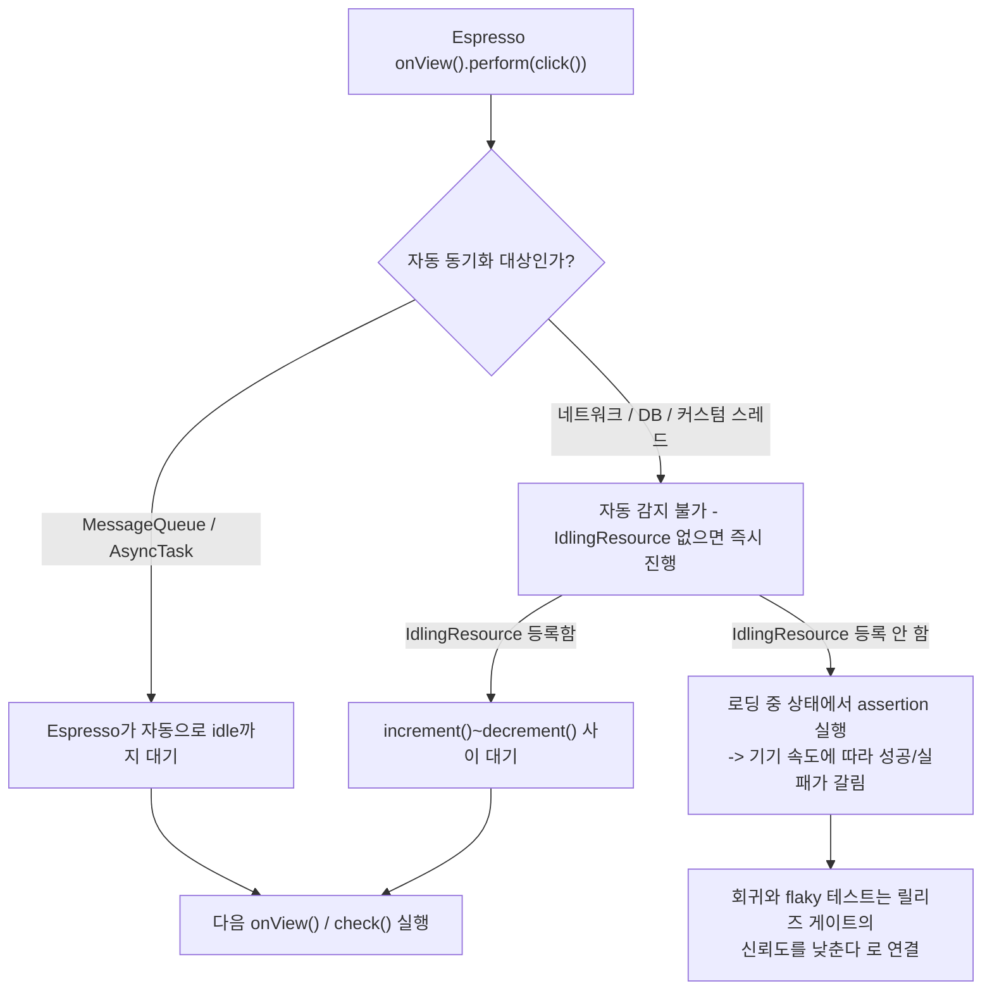

## Espresso 는 View 기반 UI 를 동기적으로 테스트하며 IdlingResource 로 비동기 작업 완료를 기다린다

상위 문서: [테스트 품질 계약](./testing-quality.md)
관련 노트: [Compose UI 테스트는 testTag 와 semantics 를 분리한다](./compose-ui-tests-should-use-stable-selectors-and-semantics.md), [회귀와 flaky 테스트는 릴리즈 게이트의 신뢰도를 낮춘다](./regression-and-flaky-tests-are-release-gate-risks.md)

`Espresso` 는 `View`/`ViewGroup` 기반 화면과 View-Compose가 혼재된 hybrid 화면을 계측(instrumented) 환경에서 동기적으로 테스트하는 도구다. Compose 전용 화면은 Espresso 가 아니라 Compose Testing API(`createComposeRule`, `onNodeWithTag`)가 담당한다. 두 도구 모두 UI 가 idle 상태가 될 때까지 자동으로 기다리지만, `MessageQueue` 에 올라오지 않는 비동기 작업(네트워크, DB, 백그라운드 스레드)은 자동으로 감지하지 못한다. 이 gap 을 `IdlingResource` 로 명시적으로 메워야 하며, 놓치면 flaky test 로 나타난다.

### 1. 도구 선택 경계: Espresso vs Compose Testing API

- **Espresso 가 담당하는 범위**: `Button`, `RecyclerView`, `Fragment` 같은 전통적인 View 기반 화면. Espresso 는 `onView(withId(...))` 로 View 트리를 탐색하고 `perform()`/`check()` 로 조작·검증한다. Compose 로 전환 중인 프로젝트에서 Compose 화면 안에 `AndroidView` 로 감싼 legacy View 가 남아있는 hybrid 화면도 Espresso 의 범위다.
- **Compose Testing API 가 담당하는 범위**: Compose 로만 구성된 화면. Layout Node Tree 가 아니라 Semantics Tree 를 기반으로 탐색·조작한다(자세한 내용은 [Compose UI 테스트는 testTag 와 semantics 를 분리한다](./compose-ui-tests-should-use-stable-selectors-and-semantics.md) 참조).
- **선택 기준은 "화면을 그리는 툴킷" 이지 "테스트하려는 동작의 성격" 이 아니다.** 같은 로그인 검증 로직이라도 View 로 그린 화면이면 Espresso, Compose 로 그린 화면이면 Compose Testing API 를 쓴다. 한 Activity 안에 두 화면이 섞여 있으면 두 도구를 같은 테스트 스위트 안에서 병행 사용한다 — 어느 한쪽으로 통일할 필요는 없다.
- 둘 다 계측 테스트(instrumented test)로 분류되어 JVM 이 아니라 기기/에뮬레이터에서 실행되고, 앱 코드에 직접 접근한다는 공통점을 가진다.

### 2. `IdlingResource` 계약: Espresso 의 자동 동기화가 못 잡는 지점

- Espresso 의 `onView()` 호출은 기본적으로 `MessageQueue` 가 비었는지(대기 중인 View 그리기 작업이 없는지)와 `AsyncTask` 실행 여부를 자동으로 확인한 뒤에야 다음 동작을 수행한다. 이 자동 동기화 덕분에 화면 그리기 관련 작업은 별도 대기 코드 없이도 안정적으로 테스트된다.
- 하지만 네트워크 호출, Room 쿼리, 커스텀 스레드 풀에서 실행되는 작업은 `MessageQueue` 에 잡히지 않는다. 이런 비동기 작업이 끝나기 전에 Espresso 가 assertion 을 실행하면, 작업이 완료되기 전 상태(로딩 스피너가 떠 있는 상태)를 검증하게 되어 테스트가 기기 성능에 따라 성공/실패를 오간다.
- `IdlingResource` 는 이런 비동기 작업에 "지금 몇 개의 작업이 진행 중인가" 를 Espresso 에 알려주는 명시적 신호다. 가장 흔한 구현체인 `CountingIdlingResource` 는 작업 시작 시 `increment()`, 완료 시 `decrement()` 를 호출해 카운터가 0이 될 때까지 Espresso 가 대기하게 만든다.
- `IdlingRegistry.getInstance().register()`/`unregister()` 로 테스트의 `@Before`/`@After` 에서 등록·해제한다. 프로덕션 코드에는 카운터 증감 로직만 두고, 등록/해제는 테스트 코드에만 둬서 프로덕션 코드가 테스트 프레임워크를 몰라도 되게 캡슐화한다.

### 3. 흐름 다이어그램: 동기화 자동 감지 vs `IdlingResource` 필요 지점



### 4. `CountingIdlingResource` 등록과 Espresso 테스트 코드 예시

```kotlin
// 프로덕션 코드: 비동기 작업의 시작/종료를 카운터로 알린다
object EspressoIdlingResourceHolder {
    const val RESOURCE = "GLOBAL"
    val countingIdlingResource = CountingIdlingResource(RESOURCE)
}

class FeedRepository(private val api: FeedApi) {
    suspend fun fetchFeed(): List<FeedItem> {
        EspressoIdlingResourceHolder.countingIdlingResource.increment()
        try {
            return api.fetchFeed()
        } finally {
            EspressoIdlingResourceHolder.countingIdlingResource.decrement()
        }
    }
}
```

```kotlin
// 테스트 코드: 등록/해제는 여기서만 한다
import androidx.test.espresso.Espresso.onView
import androidx.test.espresso.IdlingRegistry
import androidx.test.espresso.assertion.ViewAssertions.matches
import androidx.test.espresso.matcher.ViewMatchers.*
import org.junit.After
import org.junit.Before
import org.junit.Test

class FeedActivityTest {

    @Before
    fun registerIdlingResource() {
        IdlingRegistry.getInstance()
            .register(EspressoIdlingResourceHolder.countingIdlingResource)
    }

    @After
    fun unregisterIdlingResource() {
        IdlingRegistry.getInstance()
            .unregister(EspressoIdlingResourceHolder.countingIdlingResource)
    }

    @Test
    fun feedLoads_showsFirstItem() {
        // IdlingResource가 등록돼 있으므로 fetchFeed()의 increment~decrement 사이
        // Espresso가 자동으로 대기한 뒤에야 아래 assertion이 실행된다.
        onView(withId(R.id.feed_item_0))
            .check(matches(isDisplayed()))
    }
}
```

### 5. `IdlingResource` 를 놓쳤을 때의 flaky test 관찰 신호

`IdlingResource` 미등록 상태에서 네트워크 지연이 있는 API 를 테스트하면 다음과 같은 실패가 기기/에뮬레이터 속도에 따라 간헐적으로 발생한다.

```text
androidx.test.espresso.NoMatchingViewException:
No views in hierarchy found matching: with id: R.id.feed_item_0

(로딩 스피너가 아직 표시된 시점에 assertion이 실행됨 - 실제 기기에서는 통과,
느린 CI 에뮬레이터에서는 실패하는 전형적 패턴)
```

`Thread.sleep()` 을 끼워 넣어 이 실패를 "고치는" 접근은 테스트를 느리게 만들 뿐 아니라 더 느린 환경에서는 여전히 flaky 하다. 이 증상과 quarantine/재발 방지 정책은 [회귀와 flaky 테스트는 릴리즈 게이트의 신뢰도를 낮춘다](./regression-and-flaky-tests-are-release-gate-risks.md) 에서 다루는 "비동기 스레드 레이스" 원인 항목과 같은 뿌리를 가진다 — Espresso 쪽 원인은 구체적으로 `IdlingResource` 미등록이다.

### 경계

이 노트는 Espresso 의 담당 범위와 `IdlingResource` 계약만 다룬다. Compose 화면의 selector/semantics 선택 원칙은 [Compose UI 테스트는 testTag 와 semantics 를 분리한다](./compose-ui-tests-should-use-stable-selectors-and-semantics.md) 를 본다. UI Automator 처럼 앱 프로세스 경계를 넘어 시스템 UI 까지 조작하는 도구는 이 노트의 범위가 아니다.

출처: [Espresso 기본 개념](https://developer.android.com/training/testing/espresso), [IdlingResource로 비동기 작업 테스트하기](https://developer.android.com/training/testing/espresso/idling-resource)
