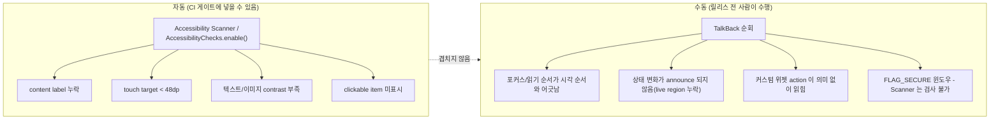

## TalkBack 수동 검증과 Accessibility Scanner 자동 검사는 서로 다른 결함군을 잡는다

상위 문서: [테스트 품질 계약](./testing-quality.md)
관련 노트: [Accessibility quality requires service scanner and Semantics verification](../../../02_app_framework/jetpack-compose/layout-and-ui/compose-ui/accessibility-quality-requires-service-scanner-and-semantics-verification.md)

`Accessibility Scanner` 를 CI 에 자동으로 돌려서 통과했다고 접근성 품질이 검증된 것은 아니다. Scanner 는 측정 가능한 정적 결함만 검사하고, TalkBack 을 사람이 직접 켜서 화면을 순회해야만 드러나는 경험적 결함이 따로 존재한다. 이 노트는 두 검사 방식이 잡는 결함군의 경계를 test-strategy 관점(무엇을 CI 게이트에 넣을 수 있고 무엇을 릴리스 전 수동 QA 체크리스트에 남겨야 하는가)에서 다룬다. Compose semantics tree 와 `testTag` 를 이용한 접근성 코드 작성 방법 자체는 [Accessibility quality requires service scanner and Semantics verification](../../../02_app_framework/jetpack-compose/layout-and-ui/compose-ui/accessibility-quality-requires-service-scanner-and-semantics-verification.md) 가 정본이며 여기서 반복하지 않는다.

### 1. 두 검사가 잡는 결함이 겹치지 않는 이유

- **Accessibility Scanner(자동)** 는 화면을 정적으로 분석해 다음 네 항목만 규칙 기반으로 검사한다: content label(설명 누락), touch target 크기(최소 48dp 미만), 텍스트/이미지 명암비(contrast), clickable item 식별. 이 네 항목은 "측정 가능"하기 때문에 자동화할 수 있다.
- Scanner 는 사용자가 TalkBack 으로 화면을 실제로 순회할 때의 **읽기 순서(traversal order)**, **상태 변화가 음성으로 announce 되는지**, **커스텀 위젯이 실제로 의미 있는 action 을 노출하는지**, **`FLAG_SECURE` 윈도우** 는 검사 항목에 없다 — 화면 스크린샷과 접근성 노드 트리를 정적으로 훑을 뿐, 사용자가 실제로 듣는 음성 순서와 문맥적 의미는 판단하지 못한다.
- **TalkBack 수동 검증(사람)** 은 정확히 이 빈틈을 채운다. 실제로 스와이프해서 포커스가 시각적 순서와 일치하는지, 커스텀 Compose 캔버스 컨트롤이 "버튼, 더블탭하여 활성화" 처럼 의미 있게 읽히는지, 리스트 갱신 같은 상태 변화가 live region 으로 announce 되는지는 사람이 듣고 판단해야 한다.
- 그래서 두 검사는 상호 대체가 아니라 상호 보완이다. CI 게이트에는 Scanner 류의 **결정적(deterministic)이고 재현 가능한** 자동 검사만 넣을 수 있고, TalkBack 순회는 릴리스 전 사람이 수행하는 수동 QA 체크리스트 항목으로 남아야 한다 — CI 자동화가 TalkBack 순회를 완전히 대체한다고 가정하면 순서/문맥 결함이 릴리스까지 새어 나간다.

### 2. 검사 경계 다이어그램



### 3. CI 게이트에 넣는 자동 검사와 릴리스 체크리스트의 수동 검증 예시

```kotlin
// CI가 매 PR마다 자동 실행할 수 있는 결정적 검사 (Compose instrumented test)
import androidx.compose.ui.test.junit4.createComposeRule
import androidx.compose.ui.test.junit4.AndroidComposeTestRule
import com.google.android.apps.common.testing.accessibility.framework.AccessibilityChecks
import org.junit.Rule
import org.junit.Test

class LoginScreenAccessibilityGateTest {

    @get:Rule
    val composeTestRule = createComposeRule()

    @Test
    fun loginScreen_passesAutomatedAccessibilityChecks() {
        // touch target, contrast, content label 같은 정적 규칙만 검사한다.
        // 읽기 순서/announce 같은 경험적 결함은 이 테스트로 잡히지 않는다.
        AccessibilityChecks.enable().setRunChecksFromRootView(true)

        composeTestRule.setContent { LoginScreen() }
        composeTestRule.onRoot().assertIsDisplayed()
    }
}
```

```text
## 릴리스 전 수동 QA 체크리스트 (자동화 불가 항목)
- [ ] TalkBack 켠 상태로 화면을 처음부터 끝까지 스와이프하며 순회했다
      (adb shell settings put secure enabled_accessibility_services \
       com.google.android.marvin.talkback/com.google.android.marvin.talkback.TalkBackService)
      (adb shell settings put secure accessibility_enabled 1)
- [ ] 포커스 이동 순서가 화면에 보이는 시각 순서와 일치한다
- [ ] 리스트 항목 추가/삭제, 에러 메시지 표시가 음성으로 announce 된다
- [ ] 커스텀 그래프/캔버스 위젯이 "무엇을 할 수 있는지" 의미 있게 읽힌다
```

### 4. 관찰 가능한 증거

Accessibility Scanner 리포트는 항목별 결함을 텍스트로 나열하지만 순서 문제는 언급하지 않는다.

```text
Accessibility Scanner Report - LoginScreen
1. [Touch target size] "닫기" 아이콘 버튼: 32x32dp (권장: 48x48dp 이상)
2. [Text contrast] "비밀번호를 잊으셨나요?" 링크: 명암비 2.8:1 (권장: 4.5:1 이상)
3. [Content labels] ImageView(id=ic_profile): content description 없음

>> 이 리포트는 4개 항목(label/touch target/contrast/clickable) 안에서만 결함을 나열한다.
>> 포커스 순서, announce 여부, FLAG_SECURE 화면은 이 리포트에 나타나지 않는다.
```

같은 화면에서 Scanner 리포트가 "이상 없음" 이어도, TalkBack 으로 직접 순회하면 "비밀번호를 잊으셨나요?" 링크에 포커스가 비밀번호 입력창보다 먼저 도달하는 순서 결함이 들릴 수 있다. 이 순서 결함은 Scanner 항목 어디에도 속하지 않으므로, Scanner 가 green 이라는 사실이 TalkBack 검증을 생략해도 된다는 근거가 될 수 없다.

### 경계

이 노트는 두 검사 방식이 CI 게이트/릴리스 체크리스트 안에서 어떤 역할을 나눠 맡아야 하는지만 다룬다. Compose 화면에서 `Modifier.semantics`, `testTag`, merged/unmerged tree 를 코드로 어떻게 구성하는지는 [Accessibility quality requires service scanner and Semantics verification](../../../02_app_framework/jetpack-compose/layout-and-ui/compose-ui/accessibility-quality-requires-service-scanner-and-semantics-verification.md) 와 [Semantics Tree는 UI 의미를 접근성 서비스와 테스트에 드러낸다](../../../02_app_framework/jetpack-compose/layout-and-ui/compose-ui/semantics-tree-makes-ui-meaning-visible-to-accessibility-and-tests.md) 를 본다.

출처: [Accessibility Scanner 지원 문서](https://support.google.com/accessibility/android/answer/6376570), [Compose 레이아웃 테스트 - Accessibility Checks](https://developer.android.com/develop/ui/compose/testing)
