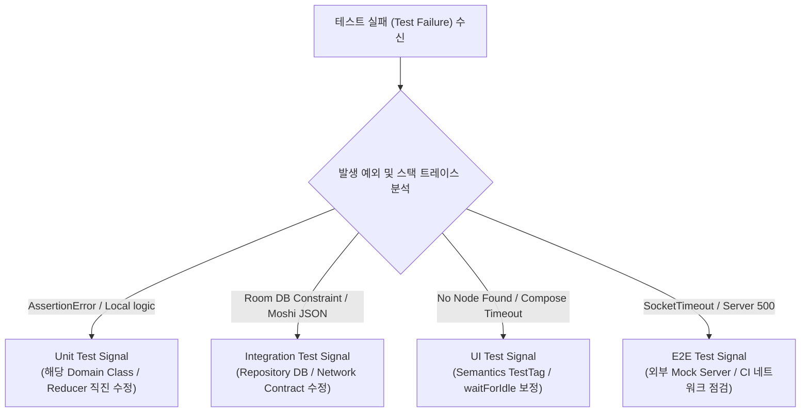

## Unit, Integration, UI, E2E 테스트는 실패 신호가 다르다

상위 문서: [Android 성능, 품질, 빌드 최적화 지도](../../performance/android-performance-quality-and-build-optimization.md)
관련 지도: [테스트 품질 계약](./testing-quality.md)
관련 노트: [테스트 레이어는 피드백 비용으로 선택한다](./test-layer-is-chosen-by-feedback-cost-and-risk.md)

각 테스트 레이어는 서로 다른 격리 범위(Isolation Scope)를 형성하므로, 발생한 실패 신호(Failure Signal)의 스택 트레이스와 예외 유형에 따라 진단 대상(도메인 규칙 vs DI/DB 계약 vs UI 노드 및 레이스 vs 네트워크 환경)을 다르게 포착해야 한다.

### 1. 테스트 레이어별 실패 신호 분류 메커니즘

- **Unit Test Failure Signal**:
  - **신호**: `AssertionError`, `NullPointerException`.
  - **진단**: 특정 클래스 메서드의 순수 로직, 상태 전이 규칙, 매핑 코드 결함.
- **Integration Test Failure Signal**:
  - **신호**: `SQLiteConstraintException`, `Moshi/Gson DataBindingException`, `Hilt CreationException`.
  - **진단**: DB 스키마 쿼리, JSON 직렬화/역직렬화 계약 미스, 모듈 간 의존성 주입 연결 미스.
- **UI Test Failure Signal**:
  - **신호**: `PerformException`, `AssertionError: No node found with tag`, `ComposeTimeoutException`.
  - **진단**: UI 노드 리소스 ID 변경, 비동기 상태 표출 타임아웃, Semantics 트리 불일치.
- **E2E Test Failure Signal**:
  - **신호**: `HttpException 500/503`, `SocketTimeoutException`, `UiObjectNotFoundException`.
  - **진단**: 서드파티 backend API 계약 파기, 인증 토큰 만료, 물리 기기 연결 이탈.

### 2. 실패 신호 분기 진단 트리아지 워크플로우



### 3. 레이어별 실패 assertion Kotlin 코드 구체 예시

```kotlin
// 1. Unit Test: 도메인 로직 실패 신호 포착
@Test
fun calculateDiscount_fails_whenInvalidCoupon() {
    val result = discountPolicy.apply(coupon = "INVALID")
    // 실패 신호: java.lang.AssertionError: Expected 0.0 but was 15.0
    assertEquals(0.0, result, 0.001)
}

// 2. Integration Test: Room DB Constraints 실패 신호 포착
@Test(expected = SQLiteConstraintException::class)
fun insertUser_fails_onDuplicatePrimaryKey() {
    db.userDao().insert(User(id = 1, name = "Alice"))
    db.userDao().insert(User(id = 1, name = "Bob")) // PrimaryKey 중복 신호!
}

// 3. UI Test: Compose Node 탐색 실패 신호 포착
@Test
fun clickSubmit_showsSuccessScreen() {
    composeTestRule.onNodeWithTag("submit_btn").performClick()
    // 실패 신호: AssertionError: Assert failed: No node found with testTag 'success_title'
    composeTestRule.onNodeWithTag("success_title").assertIsDisplayed()
}
```

### 4. 관측 가능한 실행 증거 (Observable Evidence)

#### 스택 트레이스 실패 신호 대조 덤프

```text
# Case A: Unit Test Logic Error
java.lang.AssertionError: expected:<FeedState.Success> but was:<FeedState.Loading>
    at org.junit.Assert.fail(Assert.java:89)
    at com.example.app.ui.FeedViewModelTest.fetchFeed_success(FeedViewModelTest.kt:45)

# Case B: UI Test Semantics Node Missing
java.lang.AssertionError: Failed to assert the following condition(s):
Already found 0 nodes matching: (TestTag = 'submit_btn')
Tree dump:
Node #1 at (l=0, t=0, r=1080, b=2400)px
 |-Node #2 at (l=48, t=120, r=1032, b=300)px, Tag: 'header_title'
    at androidx.compose.ui.test.SemanticsNodeInteraction.assertExists(SemanticsNodeInteraction.kt:120)
```

### 5. 실패 대응 가이던스

- **E2E 실패의 가장 낮은 적절한 레이어로 회귀 테스트 추가**: 순수 도메인 규칙이면 unit test로 축소하지만, DB migration·직렬화·DI wiring은 integration test가, semantics·navigation·system UI 상호작용은 UI test가 더 정확할 수 있다. 서버 장애나 실제 네트워크/기기 통합처럼 낮은 레이어로 동일하게 재현할 수 없는 실패는 E2E 계약 자체와 관측성을 보강한다. 모든 E2E 실패를 unit test로 재현할 수 있다고 강제하지 않는다.
- **Flaky Exception 분류**: UI 스레드 타임아웃 예외(`ComposeTimeoutException`) 발생 시 단순 타임아웃을 늘리기보다 로직 내 무한 루프나 코루틴 교착 상태(Deadlock)를 우선 의심한다.

검증일: 2026-08-06. 실패 원인이 실제로 존재하는 가장 낮은 테스트 레이어에 회귀 테스트를 두도록 절대 규칙을 교정했다.
