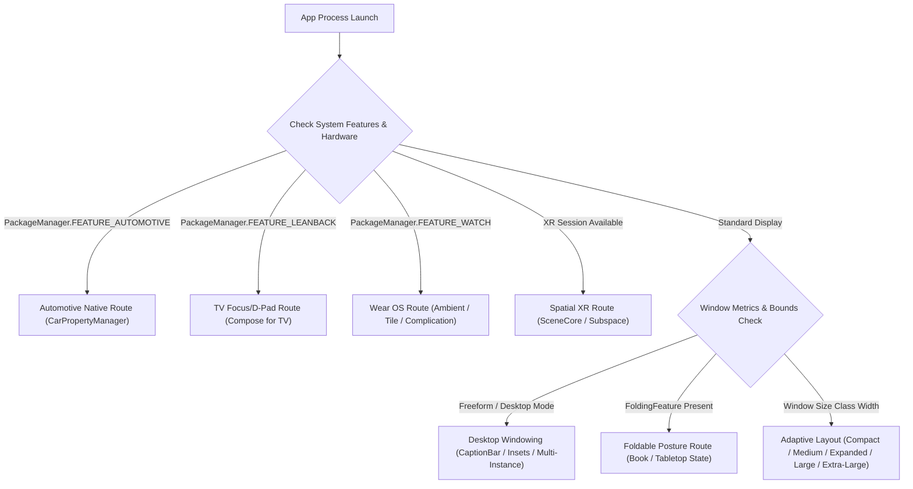

## Android 폼 팩터와 플랫폼 확장 지도

배경 지식: [Learning Spine 12장 — compatibility, update, form factor](../00_foundations/learning-spine/12-compatibility-update-and-form-factor.md)

Android 앱은 더 이상 단일 휴대폰 화면만 대상으로 하지 않는다. 이 지도는 큰 화면, 폴더블, 데스크톱 윈도잉, XR, TV, Wear OS, Auto/Automotive, ChromeOS 처럼 앱 창과 입력 환경이 바뀌는 플랫폼 표면을 나눈다.

### 플랫폼별 런타임 특성 매트릭스

| Platform / Form Factor | Windowing Model | Primary Input | Core Framework / Library | Diagnostic Dump Signal |
| :--- | :--- | :--- | :--- | :--- |
| **Large Screens & Foldables** | Multi-Window / Freeform / Posture | Touch, Stylus, Mouse, Keyboard | Jetpack WindowManager, Compose Material3 Adaptive | `adb shell dumpsys window displays` |
| **Desktop Windowing** | Freeform Resizable + Caption Bar | Mouse, Trackpad, Keyboard | WindowInsets (`captionBar`), Task Launch Flags | `adb shell dumpsys activity containers` |
| **Android XR** | Spatial Panels + 3D Space (Subspace) | Gaze + Pinch, Controllers, Hands | Jetpack XR SDK, SceneCore, Compose for XR | `adb shell dumpsys window windows` (Spatial) |
| **Android TV** | Fullscreen 10-foot UI | D-Pad Remote, Voice | Compose for TV, Leanback | `adb shell dumpsys input` |
| **Wear OS** | Circular/Square Compact + Ambient | Touch, Rotary (RSB), Voice | Wear Compose, Horologist, ProtoLayout | `adb shell dumpsys wear` |
| **Android Auto** | Projection Template UI | Touch, Rotary, Steering Controls | Android Auto App Library (`CarAppService`) | `adb shell dumpsys activity service` |
| **Android Automotive OS** | Embedded Vehicle Systems | Touch, Rotary, VHAL Signals | CarPropertyManager, Car API | `adb shell dumpsys car_service` |
| **ChromeOS** | ARC++ container 또는 ARCVM virtual machine의 resizable window | Mouse, Keyboard, Touch | Android Framework / ChromeOS integration | `adb shell dumpsys window displays` / `dumpsys input` |

### 폼 팩터 판단 및 런타임 수신 흐름



### 문제 분류

- 콘텐츠가 남거나 잘리는 문제는 먼저 기기명이 아니라 현재 창의 width/height class 와 레이아웃 구조에서 찾는다.
- 접힘 영역에 UI 가 걸리는 문제는 window size class 가 아니라 `FoldingFeature` 의 posture 와 bounds 문제다.
- resize, focus, 여러 창, caption bar 문제는 적응형 레이아웃보다 windowing 과 task/lifecycle 계약에서 찾는다.
- XR 에서 패널은 보이지만 공간 기능이 실패하면 2D 레이아웃이 아니라 session, space mode, runtime capability 를 확인한다.
- TV 에서 리모컨 방향키로 요소에 도달하지 못하면 포커스 순서와 d-pad 탐색 가능성을 확인한다.
- Wear OS 에서 화면이 꺼진 듯 보이면 ambient mode 콜백 구현 여부를 확인한다.
- Auto/Automotive 에서 앱이 안 보이거나 레이아웃이 깨지면 투영(Auto)과 내장(Automotive OS)을 혼동했는지, Car App Library 템플릿 제약을 지켰는지 확인한다.
- ChromeOS 에서 마우스/키보드 조작이 안 되면 large-screen 레이아웃이 아니라 터치 전용으로 설계된 인터랙션이 있는지 확인한다.

### 정본 노트

- [큰 화면 적응 계약](./large-screens/large-screen-contracts/large-screen-contracts.md)
- [데스크톱 윈도잉과 멀티태스킹 계약](./large-screens/windowing-multitasking-contracts/windowing-multitasking-contracts.md)
- [Android XR 계약](./xr/xr-contracts/xr-contracts.md)
- [Android TV 계약](./tv/tv-contracts/tv-contracts.md)
- [Wear OS 계약](./wear/wear-contracts/wear-contracts.md)
- [Android Auto/Automotive 계약](./auto/auto-contracts/auto-contracts.md)
- [ChromeOS 고유 계약](./chromeos/chromeos-contracts/chromeos-contracts.md)

### 관측 가능한 증거 (Observable Evidence)

```bash
# 1. 디스플레이 및 윈도우 메트릭스 모니터링
adb shell dumpsys window displays

# 2. 현재 실행 중인 폼 팩터 태스크 및 컨테이너 상태 확인
adb shell dumpsys activity containers

# 3. 차량 서비스 상태 확인 (Android Automotive OS)
adb shell dumpsys car_service

# 4. Wear OS 센서 및 Ambient Mode 상태 진단
adb shell dumpsys wear

# 5. 시스템 기능 서명 확인
adb shell pm list features | grep -E "automotive|leanback|watch|hardware.type"
```

### 판단 순서

1. 먼저 기기 이름이 아니라 현재 앱 창의 크기와 비율을 본다.
2. 폴더블에서는 hinge, posture, display feature 가 레이아웃을 나누는지 확인한다.
3. 데스크톱 윈도잉에서는 창 크기 변경, caption bar, 여러 작업 인스턴스를 검증한다.
4. XR 에서는 2D 앱을 띄우는 것과 공간 UI 를 설계하는 것을 분리한다.
5. TV/Wear OS/Auto 처럼 터치가 없거나 제한된 표면에서는 대체 입력 경로(d-pad, 리모컨, 음성, 마우스/키보드)로 모든 기능에 도달 가능한지 확인한다.
6. 모든 폼 팩터에서 터치 외 입력과 접근성 경로를 테스트한다.

### 읽는 순서

1. 큰 화면 계약에서 앱 창과 물리 기기를 분리하고 adaptive structure 를 정한다.
2. 데스크톱 윈도잉 계약에서 resize, lifecycle, task, system UI 를 검증한다.
3. XR 계약에서 2D 호환 실행과 공간화, runtime capability 와 출시 조건을 분리한다.
4. TV 계약에서 d-pad 입력, 10-foot UI, 배포 조건을 확인한다.
5. Wear OS 계약에서 동반 앱과의 독립성, ambient mode, tile/complication 을 확인한다.
6. Auto/Automotive 계약에서 투영과 내장 OS 를 구분하고 Car App Library 템플릿, 차량 신호 접근을 확인한다.
7. ChromeOS 계약에서 large-screen/windowing 위에 얹히는 실행 환경, 배포, 입력 우선순위 차이를 확인한다.

검증일: 2026-08-06. 현재 공식 품질 기준은 큰 화면을 포함한 [Adaptive app quality](https://developer.android.com/docs/quality-guidelines/adaptive-app-quality) 와 별도의 [Android XR app quality](https://developer.android.com/docs/quality-guidelines/android-xr) 로 나뉜다. 런타임 기능 상수는 `PackageManager.FEATURE_AUTOMOTIVE`, `FEATURE_LEANBACK`, `FEATURE_WATCH`로 공식 API reference와 재대조했다.
