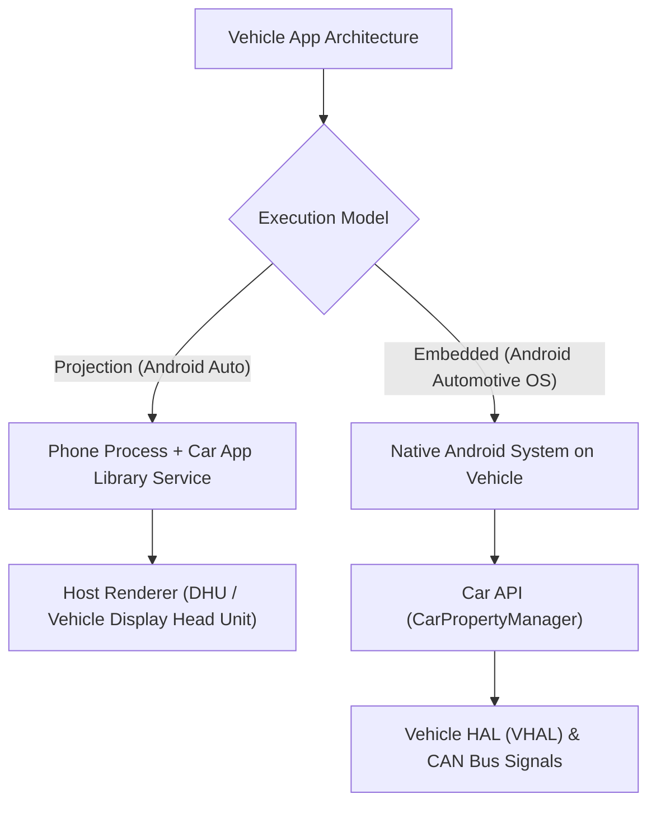

## Android Auto/Automotive 계약

상위 문서: [Android 폼 팩터와 플랫폼 확장 지도](../../android-platforms-and-form-factors.md)

이 지도는 투영형(Android Auto)과 내장형(Android Automotive OS)의 구분, 운전 중 배포 제약, 차량 신호 접근이라는 세 계약을 분리한다.

### 차량 아키텍처 및 시스템 레이어 흐름



### 읽는 순서

1. [Android Auto는 투영이고 Android Automotive OS는 차량에 내장된 독립 OS다](./android-auto-is-projection-android-automotive-os-is-an-embedded-os.md) 에서 두 플랫폼을 혼동하지 않는 법을 본다.
2. [Car App Library는 운전 중 배포 콘텐츠를 제한된 템플릿으로만 허용한다](./car-app-library-restricts-content-to-approved-templates.md) 에서 자유 레이아웃이 금지되는 이유를 본다.
3. [Android Automotive는 Car HAL을 통해 차량 신호에 접근한다](./android-automotive-accesses-vehicle-signals-through-car-hal.md) 에서 속도/기어 같은 차량 데이터 접근 경로를 본다.

### 문제 분류

| 증상 | 먼저 확인할 경계 |
| --- | --- |
| 앱이 Android Auto 에서 아예 안 보임 | Car App Library 카테고리 선언, Google 검토/화이트리스트 상태 |
| 화면 레이아웃이 예상과 다르게 렌더링됨 | 커스텀 레이아웃 대신 승인된 템플릿을 썼는지 |
| 차량 속도/기어 정보를 못 가져옴 | 일반 앱 permission 이 아니라 Car API/Car HAL 접근 경로 필요 여부 |

### 관측 가능한 증거 (Observable Evidence)

```bash
# 1. Automotive Vehicle Service 및 CarPropertyManager 덤프
adb shell dumpsys car_service

# 2. Car App Library Host 바인딩 서비스 관측
adb shell dumpsys activity service | grep -E "CarAppService|CarAppHost"

# 3. 차량 하드웨어 패키지 피처 선언 검증
adb shell pm list features | grep -i "android.hardware.type.automotive"
```

### 책임 경계

- Android Auto 는 휴대폰의 앱 화면을 차량 디스플레이에 투영하는 것이고, Android Automotive OS 는 차량 자체에 내장되어 독립적으로 부팅되는 Android 다. 같은 이름의 "Auto"로 묶어 생각하면 배포·개발 모델을 혼동한다.
- 운전 중 방해 최소화(driver distraction) 정책은 디자인 선호가 아니라 Car App Library 가 강제하는 템플릿 제약으로 구현된다.

### 정본 노트

- [Android Auto는 투영이고 Android Automotive OS는 차량에 내장된 독립 OS다](./android-auto-is-projection-android-automotive-os-is-an-embedded-os.md)
- [Car App Library는 운전 중 배포 콘텐츠를 제한된 템플릿으로만 허용한다](./car-app-library-restricts-content-to-approved-templates.md)
- [Android Automotive는 Car HAL을 통해 차량 신호에 접근한다](./android-automotive-accesses-vehicle-signals-through-car-hal.md)

검증일: 2026-08-03. [Android for Cars 개발 가이드](https://developer.android.com/training/cars) 를 기준으로 확인했다.

