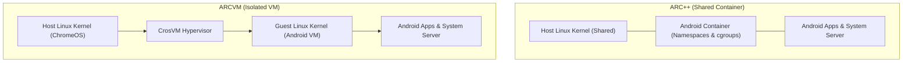

## ARC++ vs ARCVM: 공유 컨테이너와 격리된 가상머신

상위 문서: [Android 폼 팩터와 플랫폼 확장 지도](../android-platforms-and-form-factors.md)

관련 지도: [ChromeOS 고유 계약](./chromeos/chromeos.md)

실행 환경 노트: [ChromeOS는 Android 앱을 컨테이너에서 실행하고 창을 데스크톱 윈도우로 매핑한다](./chromeos/chromeos-runs-android-apps-in-a-container-mapped-to-desktop-windows.md)

---

### 1. 개요 및 비유로 이해하는 개념 (Overview & Intuitive Analogy)

**ARC(Android Runtime for Chrome)** 은 ChromeOS 플랫폼 위에서 안드로이드 앱을 실행하기 위한 가상화 아키텍처 환경입니다. Google 은 보안성, 성능, OS 자율 업데이트 요구사항에 따라 **ARC++** 와 **ARCVM** 두 가지 실행 패러다임을 개발하여 채택해 왔습니다.

- **ARC++ (Android Runtime for Chrome via Containers)**: ChromeOS 호스트 Linux 커널을 공유하며 `namespaces` 와 `cgroups` 로 자원을 분리하는 경량 **컨테이너(Container)** 방식입니다.
- **ARCVM (Android Runtime for Chrome via VM)**: ChromeOS 하이퍼바이저(`crosvm`) 위에서 독립된 게스트 Linux 커널을 별도로 구동하는 **가상머신(VM)** 방식입니다.

#### 초보자를 위한 쉬운 비유

- **ARC++ (공유 컨테이너)**: **"큰 집(호스트 커널) 안에서 칸막이로 나눈 방(Container)"**
  집 전체의 전기, 수도, 난방(커널 자원)을 직접 공유하므로 매우 가볍고 빠르게 이동할 수 있지만, 방 하나에서 발생한 심각한 문제(보안 취약점)가 집 전체로 번질 위험이 상대적으로 큽니다.
- **ARCVM (격리된 가상머신)**: **"완전히 독립된 개별 아파트 단지(Isolated VM)"**
  전용 계량기와 자체 전기 시스템(게스트 커널)을 따로 갖추고 있으므로, 아파트 내부에서 무슨 일이 일어나도 외부 건물(ChromeOS 호스트)에 전혀 피해를 주지 않습니다. 철저한 보안 격리를 보장하는 대신, 전용 계량기와 경비실(VM 하이퍼바이저 및 게스트 OS)을 유지하는 자원 오버헤드가 발생합니다.



---

### 2. 핵심 메커니즘 및 기술 아키텍처 비교 (Core Mechanism & Architecture)

#### 1) ARC++ (컨테이너 방식) 메커니즘
- ChromeOS 호스트의 Linux 커널 기능을 직접 활용합니다.
- `cgroups`를 통한 자원 제한 및 `namespaces`를 통한 프로세스, 파일시스템, 네트워크 아이솔레이션을 적용합니다.
- 호스트 커널을 직접 공유하므로 시스템 콜(Syscall) 오버헤드가 거의 없어 실행 속도가 빠르고 메모리 점유율이 낮습니다.
- **한계**: Android 시스템 버전을 업그레이드하려면 호스트 ChromeOS 커널 패치 및 전체 OS 빌드가 필요하여 커널 독립적인 업데이트가 어렵습니다.

#### 2) ARCVM (가상머신 방식) 메커니즘
- Google 이 Rust 언어로 작성한 **crosvm** 하이퍼바이저를 사용하여 Android 전용 게스트 Linux 커널을 독립 실행합니다.
- **VirtIO 프로토콜**: 그래픽 디스플레이(VirtIO-Wayland), 파일 시스템 통신(VirtIO-FS), 메모리 공유(VirtIO-Wayland/WL) 등을 가상화 드라이버 인터페이스를 통해 처리합니다.
- **독립성 및 보안성**: 호스트 커널과 안드로이드 게스트 커널이 완벽히 분리되어 있어, 안드로이드 게스트 OS 가 공격당해도 ChromeOS 호스트 시스템의 안전을 보장합니다. 또한 ChromeOS 커널 버전과 무관하게 안드로이드 프레임워크(Android 11 R 이상)를 독립적으로 업그레이드할 수 있습니다.

#### 3) 아키텍처 사양 비교표

| 항목 | ARC++ (Container) | ARCVM (Virtual Machine) |
| :--- | :--- | :--- |
| **격리 수준** | 호스트 커널 공유 프로세스 격리 | 하이퍼바이저 기반 독립 게스트 커널 격리 |
| **핵심 기술** | Linux `namespaces`, `cgroups` | `crosvm` 하이퍼바이저, VirtIO 드라이버 |
| **보안성** | 호스트 커널 취약점 노출 가능성 있음 | 호스트 시스템과 완벽 차단된 높은 보안성 |
| **메모리/CPU 오버헤드** | 최소 (매우 가볍고 즉각적) | 게스트 커널 및 가상화 관리 오버헤드 존재 |
| **OS 업데이트 독립성** | ChromeOS 호스트 커널에 종속적 | Android OS 버전 독립적 업그레이드 용이 |
| **표준 적용 대상** | 레거시 Chromebook (Android 9 P 이하) | 최신 Chromebook 표준 (Android 11 R 이상) |

---

### 3. 실전 런타임 진단 및 판별 (Implementation & Diagnostics)

앱 개발자나 시스템 엔지니어는 ADB 명령어를 통해 현재 Chromebook 기기가 ARC++ 와 ARCVM 중 어떤 런타임에서 동작하는지 판별할 수 있습니다.

```bash
# 1. 런타임 하드웨어 파라미터 확인 (cheets = ARC++, beret/arcvm = ARCVM)
adb shell getprop ro.boot.hardware

# 2. ARC 버전 및 안드로이드 SDK 레벨 조회
adb shell getprop ro.arc.version
adb shell getprop ro.build.version.sdk

# 3. ARCVM 게스트 프로세스 및 가상화 디바이스 관측 (ChromeOS crosh shell)
# ARCVM 인스턴스의 crosvm 프로세스 작동 여부 확인
ps aux | grep crosvm
```

---

### 4. 판단 기준 및 설계 선택 (Decision Criteria & Boundaries)

1. **앱 코드 상에서의 Transparent 보장**:
   - Android 상위 API(Activity, View, Compose, Service 등)를 사용하는 일반 앱은 ARC++ 와 ARCVM 중 어느 환경에서 구동되더라도 동일하게 동작하도록 안드로이드 프레임워크가 추상화되어 있습니다. 개발자가 런타임을 구분하는 별도 분기 코드를 작성할 필요는 없습니다.
2. **JNI / NDK 및 저기능 파일 입출력 검증**:
   - C/C++ NDK 로 직접 Linux 커널 디바이스(`/dev/`)나 메모리 매핑(`mmap`)을 다루는 앱은 VirtIO 가상화 레이어를 거치는 ARCVM 환경에서 입출력 지연(Latency)이 다를 수 있으므로 실기기 ARCVM 환경에서 직접 벤치마크 검증이 필요합니다.

---

### 5. 관측 가능한 증거 및 관련 노트 (Observable Evidence & Related Notes)

#### 관측 가능한 증거 (Observable Evidence)
- `adb shell getprop ro.boot.hardware`: ARC++ 환경에서는 `cheets`, ARCVM 환경에서는 `beret` 또는 `arcvm` 출력.
- `adb shell dumpsys activity displays`: ARC 실행 체계 아래에서 생성된 Window Surface 매핑 정보 관측.

#### 관련 노트
- [ChromeOS는 Android 앱을 컨테이너에서 실행하고 창을 데스크톱 윈도우로 매핑한다](./chromeos/chromeos-runs-android-apps-in-a-container-mapped-to-desktop-windows.md)
- [ChromeOS 고유 계약](./chromeos/chromeos.md)
- [Android 폼 팩터와 플랫폼 확장 지도](../android-platforms-and-form-factors.md)
