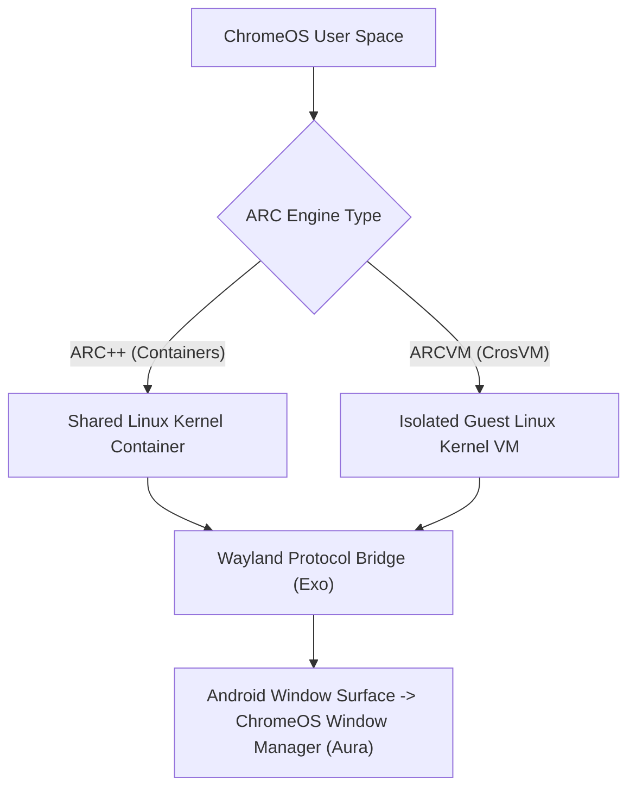

## ChromeOS 는 Android 앱을 컨테이너에서 실행하고 창을 데스크톱 윈도우로 매핑한다

상위 문서: [Android 폼 팩터와 플랫폼 확장 지도](../../android-platforms-and-form-factors.md)

배경 지식: [컨테이너와 가상머신(VM)의 차이](01_inbox/linux/container-basics.md)

관련 지도: [ChromeOS 고유 계약](./chromeos-contracts.md)

### 핵심 정의

ChromeOS 는 Android 앱을 두 가지 방식 중 하나로 격리해서 실행한다. ARC++ 는 **컨테이너**(container; 호스트 Linux 커널을 그대로 공유하면서 네임스페이스와 cgroup 으로 프로세스·파일시스템만 격리하는 경량 가상화 방식) 안에서 Android 시스템을 띄우고, ARCVM 은 별도의 게스트 Linux 커널 전체를 통째로 띄우는 가상머신(VM) 방식으로 Android 를 격리한다. 컨테이너는 호스트와 커널을 공유해 가볍지만 격리 경계가 상대적으로 얕고, VM 은 커널까지 분리해 격리는 강하지만 오버헤드가 더 크다. 두 방식 모두 결과적으로 앱의 각 Activity/Task 창은 ChromeOS 데스크톱 환경의 일반 윈도우처럼 리사이즈·이동·최소화 가능한 창으로 매핑된다. 사용자 입장에서는 크롬 브라우저 창, 리눅스 앱 창과 함께 Android 앱 창이 동일한 데스크톱 윈도우 매니저 아래 공존한다.

### ARC++ 컨테이너 vs ARCVM 시스템 아키텍처



### 판단 기준

- 창 크기 변화에 대한 대응은 ChromeOS 전용 코드를 새로 작성하지 않고 `07_platforms/large-screens/large-screen-contracts` 와 `windowing-multitasking-contracts` 가 다루는 일반적인 적응형 레이아웃/윈도잉 계약을 그대로 따른다.
- 파일 선택기, 클립보드 공유처럼 ChromeOS 네이티브 앱과 상호작용해야 하는 기능은 일반 Android Intent/Storage Access Framework 경로가 컨테이너 경계를 넘어 정상 동작하는지 실기기(Chromebook)에서 별도로 검증한다.
- 에뮬레이터로 이 컨테이너 매핑을 완벽히 재현하기 어려운 경우가 있으므로, ChromeOS 고유 동작은 가능하면 실제 Chromebook 에서 검증한다.

### 경계

- 이 노트는 실행 환경과 창 매핑 자체를 다룬다. Play 배포 심사 조건은 [ChromeOS 전용 배포는 Play 콘솔에서 Chromebook 지원 여부를 별도로 선언한다](./chromeos-distribution-requires-a-separate-play-console-declaration.md) 가 다룬다.
- 창 크기별 레이아웃 구조 자체는 `07_platforms/large-screens/large-screen-contracts` 가 다루며 이 노트에서 반복하지 않는다.

### 관측 가능한 증거 (Observable Evidence)

```bash
# 1. ARCVM / ARC++ 런타임 하드웨어 파라미터 및 커널 디버깅
adb shell getprop ro.boot.hardware
adb shell getprop ro.arc.version

# 2. Wayland Window Surface 및 ChromeOS Window Insets 덤프
adb shell dumpsys activity displays | grep -E "mWindowingMode|mBounds"
```

### 공식 문서

- https://developer.android.com/topic/arc
- https://chromeos.dev/en/android

