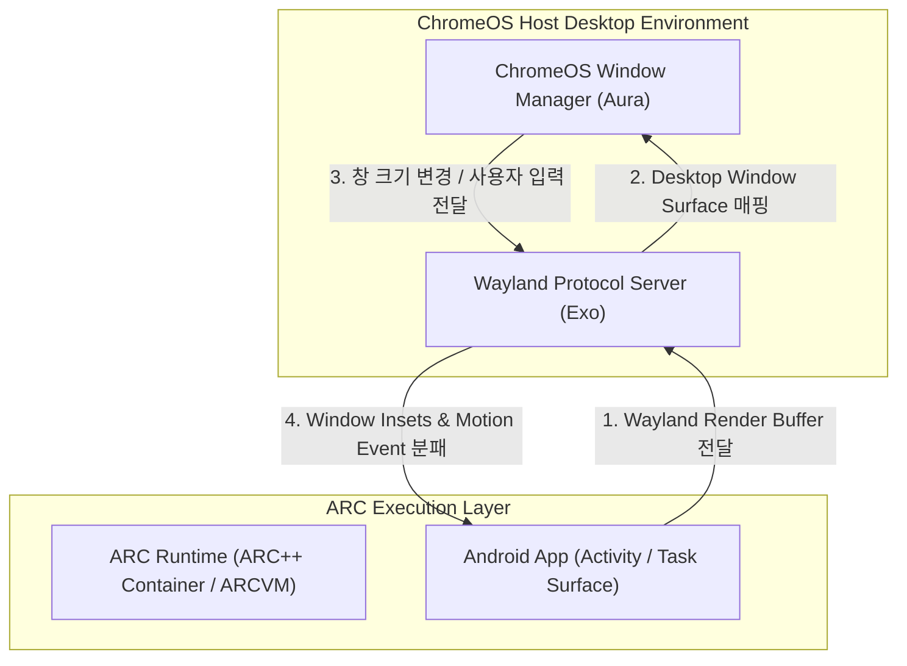

## ChromeOS 는 Android 앱을 컨테이너에서 실행하고 창을 데스크톱 윈도우로 매핑한다

상위 문서: [Android 폼 팩터와 플랫폼 확장 지도](../../android-platforms-and-form-factors.md)

관련 지도: [ChromeOS 고유 계약](./chromeos.md)

세부 비교: [ARC++ vs ARCVM 기술 비교 및 선택](../arc-plus-plus-vs-arcvm.md)

배경 지식: [컨테이너와 가상머신(VM)의 차이](../../../../../linux/container-basics.md)

---

### 1. 개요 및 비유로 이해하는 개념 (Overview & Intuitive Analogy)

**ChromeOS 는 Android 앱을 가상화 런타임(ARC)에서 격리하여 실행하고, 앱의 화면 표면(Surface)을 데스크톱 윈도우 매니저의 자유형 창(Freeform Window)으로 매핑합니다.**

Android 앱의 각 Activity / Task 창은 크기 조 조절, 이동, 최소화, 최대화가 가능한 데스크톱 윈도우로 1:1 변환되어, 크롬 브라우저 창 및 리눅스 앱 창과 완전히 동등한 데스크톱 멀티태스킹 환경 아래 공존합니다.

#### 초보자를 위한 쉬운 비유

- **"대형 쇼핑몰(ChromeOS) 안의 모바일 팝업스토어(Android App Container)"**
  모바일 전용 팝업스토어(Android 앱)를 대형 쇼핑몰(ChromeOS) 건물 내부 격리된 매장 공간(ARC Runtime)에 그대로 옮겨 설치한 것과 같습니다. 매장 내부의 조명과 상품 진열(Android UI 렌더링)은 원래 방식대로 작동하지만, 매장 유리문과 외벽 간판(데스크톱 윈도우 프레임 및 최소화/최대화 버튼)은 쇼핑몰 중앙 관리실(ChromeOS Window Manager)의 규칙과 통제를 받게 됩니다.



---

### 2. 핵심 메커니즘 및 윈도우 매핑 원리 (Core Mechanism)

#### 1) ARC(Android Runtime for Chrome) 격리 실행
ChromeOS 는 Android 시스템 파티션과 앱 프로세스를 격리된 런타임 환경에서 실행합니다. 아키텍처 방식에 따라 호스트 커널을 공유하는 **ARC++ (컨테이너 방식)** 와 독립 게스트 커널을 구동하는 **ARCVM (가상머신 방식)** 으로 나뉩니다. 두 방식의 상세 구조 및 비교는 [ARC++ vs ARCVM 기술 비교 및 선택](../arc-plus-plus-vs-arcvm.md) 에서 다룹니다.

#### 2) Wayland 프로토콜 브릿지 (Exo)
Android 앱이 그려내는 Activity Surface 렌더링 버퍼는 ChromeOS 내부의 **Exo(Wayland Server)** 컴포넌트를 통해 전달됩니다. Exo 는 안드로이드의 `SurfaceFlinger` 버퍼를 ChromeOS 데스크톱 윈도우 매니저인 **Aura** 가 이해할 수 있는 Wayland 서피스로 라이브 변환합니다.

#### 3) 자유형 데스크톱 윈도잉 매핑 (Freeform Window Mapping)
매핑이 완료되면 사용자 눈에는 Android 앱 창이 크롬 브라우저 탭이나 다른 데스크톱 프로그램 창과 완전히 동일하게 보입니다. 사용자가 창 모서리를 드래그하여 크기를 조절하거나 상단 캡션 바의 최소화/최대화 버튼을 누르면, 이 이벤트가 역으로 Exo 와 Android `WindowManagerService` 로 전달되어 Activity 재구성(Configuration Change) 또는 멀티 윈도우 리사이즈 이벤트가 발생합니다.

---

### 3. 실전 창 매핑 및 코드 패턴 (Implementation Pattern)

ChromeOS 데스크톱 매핑에 올바르게 대응하기 위해 앱 매니페스트 및 Activity 설정에서 적응형 창 속성을 보장해야 합니다.

```xml
<!-- AndroidManifest.xml: 자유형 창 크기 조절 허용 설정 -->
<activity
    android:name=".MainActivity"
    android:resizeableActivity="true"
    android:configChanges="orientation|screenSize|smallestScreenSize|screenLayout|keyboardHidden">
    
    <!-- ChromeOS 데스크톱 실행 시 기본 창 크기 및 캡션 지정 -->
    <layout
        android:defaultWidth="800dp"
        android:defaultHeight="600dp"
        android:minWidth="420dp"
        android:minHeight="320dp"
        android:gravity="center" />
</activity>
```

```kotlin
// Compose UI: 데스크톱 WindowInsets(캡션 바, 시스템 바) 및 크기 변경 수신
@Composable
fun ChromeOSAppContent() {
    val windowInsets = WindowInsets.systemBars
    
    Box(
        modifier = Modifier
            .fillMaxSize()
            .windowInsetsPadding(windowInsets)
    ) {
        Text(text = "ChromeOS Desktop Window Mapped UI")
    }
}
```

---

### 4. 판단 기준 및 경계 (Decision Criteria & Boundaries)

- **적응형 레이아웃 계약 준수**: 창 크기 변화에 대한 대응은 ChromeOS 전용 코드를 별도로 작성하지 않고, 플랫폼 표준 적응형 레이아웃 및 윈도잉 계약을 그대로 따릅니다.
- **실기기(Chromebook) 연동 검증**: 파일 선택기(Storage Access Framework), 클립보드 공유, Intent 처리 등 ChromeOS 네이티브 시스템 환경과의 상호작용은 에뮬레이터만으로 완벽히 재현하기 어려우므로 실제 Chromebook 기기에서 직접 검증합니다.
- **경계 분리**:
  - Play 콘솔 배포 심사 조건 및 기기 카탈로그 지원 선언은 [ChromeOS 전용 배포는 Play 콘솔에서 Chromebook 지원 여부를 별도로 선언한다](./chromeos-distribution-requires-a-separate-play-console-declaration.md) 가 다룹니다.
  - 마우스/키보드 중심 입력 체계는 [ChromeOS 입력은 마우스/트랙패드/키보드를 우선하고 터치는 보조 입력이다](./chromeos-input-prioritizes-mouse-trackpad-and-keyboard-over-touch.md) 가 다룹니다.
  - ARC++ 컨테이너와 ARCVM 가상머신의 세부 아키텍처 비교는 [ARC++ vs ARCVM 기술 비교 및 선택](../arc-plus-plus-vs-arcvm.md) 노트가 다룹니다.

---

### 5. 관측 가능한 증거 및 관련 노트 (Observable Evidence & Related Notes)

#### 관측 가능한 증거 (Observable Evidence)

```bash
# 1. ARCVM / ARC++ 런타임 하드웨어 파라미터 및 프로퍼티 관측
adb shell getprop ro.boot.hardware
adb shell getprop ro.arc.version

# 2. Wayland Window Surface 및 ChromeOS Window Bounds 덤프 확인
adb shell dumpsys activity displays | grep -E "mWindowingMode|mBounds"
```

#### 관련 노트

- [ARC++ vs ARCVM 기술 비교 및 선택](../arc-plus-plus-vs-arcvm.md)
- [ChromeOS 전용 배포는 Play 콘솔에서 Chromebook 지원 여부를 별도로 선언한다](./chromeos-distribution-requires-a-separate-play-console-declaration.md)
- [ChromeOS 입력은 마우스/트랙패드/키보드를 우선하고 터치는 보조 입력이다](./chromeos-input-prioritizes-mouse-trackpad-and-keyboard-over-touch.md)
- [ChromeOS 고유 계약](./chromeos.md)
- [Android 폼 팩터와 플랫폼 확장 지도](../../android-platforms-and-form-factors.md)
