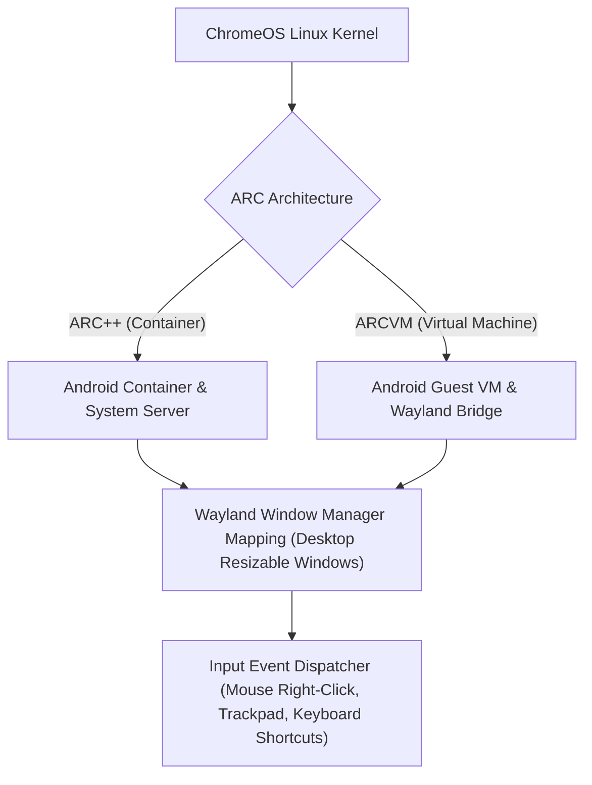

## ChromeOS 고유 계약

상위 문서: [Android 폼 팩터와 플랫폼 확장 지도](../../android-platforms-and-form-factors.md)

이 지도는 large-screen/windowing 지도가 다루지 않는 ChromeOS 만의 실행 환경, 배포 선언, 입력 우선순위 차이를 다룬다.

### ARC(Android Runtime for Chrome) 실행 구조



### 읽는 순서

1. [ChromeOS는 Android 앱을 컨테이너에서 실행하고 창을 데스크톱 윈도우로 매핑한다](./chromeos-runs-android-apps-in-a-container-mapped-to-desktop-windows.md) 에서 실행 환경 자체의 차이를 본다.
2. [ChromeOS 전용 배포는 Play 콘솔에서 Chromebook 지원 여부를 별도로 선언한다](./chromeos-distribution-requires-a-separate-play-console-declaration.md) 에서 배포 심사 조건을 본다.
3. [ChromeOS 입력은 마우스/트랙패드/키보드를 우선하고 터치는 보조 입력이다](./chromeos-input-prioritizes-mouse-trackpad-and-keyboard-over-touch.md) 에서 입력 우선순위 가정을 본다.

### 문제 분류

| 증상 | 먼저 확인할 경계 |
| --- | --- |
| 앱이 Chromebook 에서 Play 스토어에 안 보임 | Play 콘솔의 Chromebook 지원 선언, 호환성 제외 사유 |
| 창 크기 조절 시 레이아웃이 깨짐 | large-screen 적응형 레이아웃을 갖췄는지(ChromeOS 고유 문제 아님) |
| 마우스 우클릭/키보드 단축키가 안 먹음 | 터치 전용으로 설계된 인터랙션에 데스크톱 입력 경로가 없는지 |

### 관측 가능한 증거 (Observable Evidence)

```bash
# 1. ChromeOS ARC Container / ARCVM 시스템 프로퍼티 확인
adb shell getprop | grep -E "ro.arc|ro.boot.hardware"

# 2. ChromeOS 데스크톱 윈도우 프레임 매핑 상태 관측
adb shell dumpsys window displays | grep -E "mAppWidth|mBounds"

# 3. Chromebook 하드웨어 기능 매니페스트 호환성 확인
adb shell pm list features | grep -E "hardware.camera|hardware.sensor"
```

### 책임 경계

- 창 크기별 레이아웃 적응 자체는 이 지도가 아니라 `07_platforms/large-screens/large-screen-contracts` 와 `07_platforms/large-screens/windowing-multitasking-contracts` 가 담당한다. 이 지도는 그 위에 얹히는 ChromeOS 만의 실행 환경·배포·입력 차이만 다룬다.
- ChromeOS 는 Android 앱을 실행 방식(ARC++ 의 컨테이너 또는 ARCVM 의 가상머신)에 따라 서로 다른 격리 메커니즘으로 실행하지만, 이 격리 메커니즘의 세부 구현은 다루지 않는다.

### 정본 노트

- [ChromeOS는 Android 앱을 컨테이너에서 실행하고 창을 데스크톱 윈도우로 매핑한다](./chromeos-runs-android-apps-in-a-container-mapped-to-desktop-windows.md)
- [ARC++ vs ARCVM: 공유 컨테이너와 격리된 가상머신](../arc-plus-plus-vs-arcvm.md)
- [ChromeOS 전용 배포는 Play 콘솔에서 Chromebook 지원 여부를 별도로 선언한다](./chromeos-distribution-requires-a-separate-play-console-declaration.md)
- [ChromeOS 입력은 마우스/트랙패드/키보드를 우선하고 터치는 보조 입력이다](./chromeos-input-prioritizes-mouse-trackpad-and-keyboard-over-touch.md)

검증일: 2026-08-03. [ChromeOS에서 Android 앱 최적화](https://developer.android.com/topic/arc) 를 기준으로 확인했다.

검증일: 2026-08-06. "가상화가 아니라 컨테이너"라는 이전 서술이 ARCVM(가상머신 방식)의 존재와 모순되어 "실행 방식에 따라 컨테이너 또는 가상머신"으로 수정했다. 두 방식의 구조는 [ChromeOS는 Android 앱을 컨테이너에서 실행하고 창을 데스크톱 윈도우로 매핑한다](./chromeos-runs-android-apps-in-a-container-mapped-to-desktop-windows.md) 참고.

