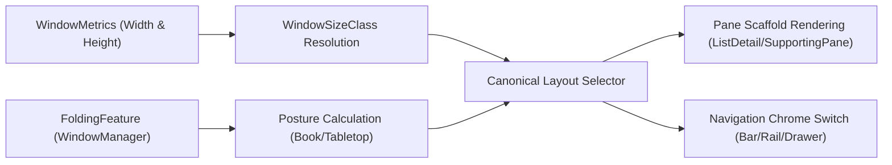

## 큰 화면 적응 계약

상위 문서: [Android 폼 팩터와 플랫폼 확장 지도](../android-platforms-and-form-factors.md)

큰 화면 지원은 태블릿용 별도 화면을 만드는 일이 아니라 현재 앱 창, posture, 입력 장치에 맞춰 UI 구조를 바꾸는 계약이다.

### 적응형 렌더링 파이프라인



### 읽는 순서

1. window size class 로 현재 앱 창을 분류한다. 이 값으로 태블릿 같은 기기 종류를 추론하지 않는다.
2. canonical layout 과 navigation chrome 으로 정보 구조를 적응시킨다.
3. `FoldingFeature` 는 창 크기와 별개의 posture/layout 입력으로 합성한다.
4. keyboard, pointer, stylus 와 drag and drop 을 핵심 과업별로 검증한다.
5. PiP 와 desktop windowing 은 별도의 lifecycle/windowing 계약으로 검증한다.

### 경계

- size class 는 사용 가능한 창 영역, posture 는 창 안의 물리적 분리나 가림을 설명한다.
- adaptive structure 는 pane 과 navigation 배치를 정하지만 task, back stack, caption bar 를 소유하지 않는다.
- 품질 등급은 특정 태블릿 한 대의 스크린샷이 아니라 창 크기, 입력, posture, 멀티태스킹 테스트 결과로 판정한다.

### 관측 가능한 증거 (Observable Evidence)

```bash
# 1. 현재 윈도우 크기 및 메트릭 디스플레이 dump
adb shell dumpsys window displays | grep -E "init|app|bounds"

# 2. 에뮬레이터 해상도 실시간 동적 변경으로 breakpoint 테스트
adb shell wm size 1600x2560
adb shell wm density 320

# 3. 해상도 및 밀도 원복
adb shell wm size reset
adb shell wm density reset
```

### 정본 노트
- [창 크기 클래스는 기기 종류가 아니라 앱 창을 분류한다](window-size-class-classification.md)
- [적응형 레이아웃은 같은 화면을 늘리는 것이 아니라 구조를 바꾼다](adaptive-layout-structure.md)
- [큰 화면 내비게이션은 목적지 중요도와 창 폭에 따라 chrome을 바꾼다](large-screen-navigation-chrome.md)
- [폴더블 posture는 레이아웃 입력이지 별도 기기 분기가 아니다](foldable-posture-layout.md)
- [PiP는 백그라운드 UI가 아니라 연속 시청을 위한 멀티윈도우 모드다](picture-in-picture-continuity.md)
- [드래그 앤 드롭은 창 사이 데이터 이동 계약이다](drag-and-drop-cross-window.md)
- [키보드, 포인터, 스타일러스는 큰 화면의 기본 입력이다](large-screen-input-modalities.md)
- [적응형 앱 준비도는 창, posture, 입력 테스트로 판단한다](adaptive-app-readiness-testing.md)

검증일: 2026-08-03. [Use window size classes](https://developer.android.com/develop/adaptive-apps/guides/use-window-size-classes), [Adaptive app quality](https://developer.android.com/docs/quality-guidelines/adaptive-app-quality)
