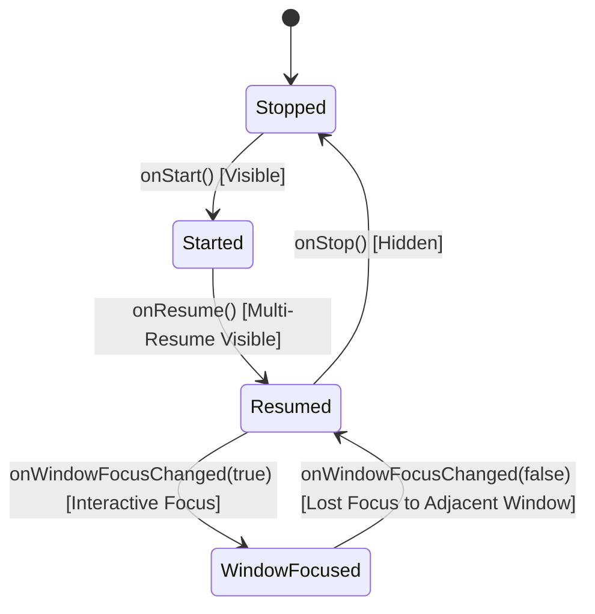

## Multi-window 생명주기는 단일 전체 화면 가정을 깨뜨린다

상위 문서: [데스크톱 윈도잉과 멀티태스킹 계약](./windowing-multitasking-contracts.md)

Multi-window 에서는 앱이 화면 전체를 독점한다는 가정이 깨진다. 사용자는 다른 앱과 동시에 상호작용하고, Android 는 창 크기와 focus 상태를 바꾸며, 새 task 가 새 window 로 열릴 수 있다.

### Multi-Resume 수명주기 및 Window Focus 감지 메커니즘

```kotlin
class MultiWindowAwareActivity : ComponentActivity() {
    private var isWindowFocused = false

    override fun onWindowFocusChanged(hasFocus: Boolean) {
        super.onWindowFocusChanged(hasFocus)
        this.isWindowFocused = hasFocus
        if (!hasFocus) {
            // Unfocused (Multi-resume state: Visible but lost input focus)
            pauseNonEssentialAnimations()
        } else {
            resumeEssentialAnimations()
        }
    }

    override fun onMultiWindowModeChanged(isInMultiWindowMode: Boolean, newConfig: Configuration) {
        super.onMultiWindowModeChanged(isInMultiWindowMode, newConfig)
        // Split-screen 또는 Desktop Freeform 진입/이탈 반응
    }
}
```



### 실무 규칙

- `onResume()` 이 곧 전체 화면 독점 사용을 뜻한다고 가정하지 않는다.
- focus 상실, pause, stop, configuration change, resize 를 각각 다른 사건으로 다룬다.
- media, sensor, camera, location 같은 자원은 실제 visible/interactive 상태와 정책을 기준으로 점유한다.
- deep link 나 새 task launch 가 어떤 window 와 back stack 에 붙는지 명시적으로 테스트한다.

### 경계

multi-window 에서 여러 activity 가 동시에 `RESUMED` 일 수 있으므로 `onResume()` 만으로 topmost 나 독점 입력을 추론하지 않는다. 사용자 상호작용의 독점 여부가 필요하면 window focus 를 별도로 관찰하고, resize 에 따른 configuration change 와 process death 후 복원을 같은 사건으로 취급하지 않는다.

### 관측 가능한 증거 (Observable Evidence)

```bash
# 동시 실행 중인 Resumed Activity 목록 (Multi-resume) 확인
adb shell dumpsys activity activities | grep -E "mResumedActivity|topResumedActivity"

# Window Focus 상태 전환 모니터링
adb shell dumpsys input | grep -i "FocusedApplication"
```

### 관련 문서

- [데스크톱 윈도잉에서는 앱 창이 자유롭게 변한다](./desktop-windowing-makes-android-app-window-freeform.md)
- [Task와 새 창 실행은 back stack 재사용을 명시해야 한다](./task-and-window-launch-must-declare-back-stack-reuse.md)

공식 문서: [Support desktop windowing](https://developer.android.com/develop/adaptive-apps/guides/support-desktop-windowing)

검증일: 2026-08-03. lifecycle 콜백, window focus, task/window 배치는 서로 다른 상태 축으로 검증한다.

