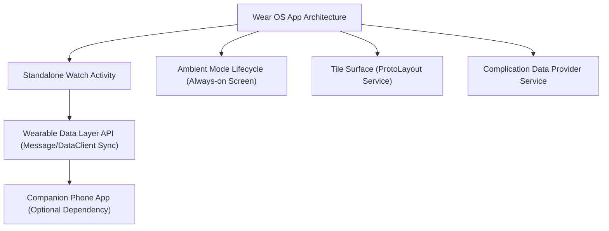

## Wear OS 계약

상위 문서: [Android 폼 팩터와 플랫폼 확장 지도](../../android-platforms-and-form-factors.md)

이 지도는 Wear OS 앱을 동반 앱과의 독립성, ambient mode lifecycle, tile/complication 이라는 워치 고유 표면으로 분리한다.

### Wear OS 멀티 표면 처리 흐름



### 읽는 순서

1. [Wear OS 앱은 동반 휴대폰 앱과 독립적으로 실행될 수 있다](./wear-os-apps-can-run-independently-of-a-companion-phone-app.md) 에서 워치 단독 실행과 동반 앱 통신의 관계를 본다.
2. [Ambient mode는 절전 화면에서 앱 화면을 유지하는 별도 lifecycle이다](./ambient-mode-is-a-separate-lifecycle-for-always-on-screens.md) 에서 일반 lifecycle 과 다른 점을 본다.
3. [Tile과 Complication은 워치페이스/런처에 데이터를 노출하는 별도 표면이다](./tiles-and-complications-are-separate-surfaces-from-the-main-app.md) 에서 앱 밖에서 데이터를 보여주는 경로를 본다.

### 문제 분류

| 증상 | 먼저 확인할 경계 |
| --- | --- |
| 워치 앱이 휴대폰 없이 동작 안 함 | 동반 앱 필수 여부와 standalone 능력 선언 |
| 화면이 어두워지면 앱 정보가 사라짐 | ambient mode 콜백 구현 여부 |
| 워치페이스에 원하는 데이터가 안 뜸 | Complication 데이터 소스 등록, Tile 서비스 갱신 주기 |

### 관측 가능한 증거 (Observable Evidence)

```bash
# 1. Wear OS 센서, Ambient 모드 및 렌더링 덤프 확인
adb shell dumpsys wear

# 2. TileService 및 Complication 바인딩 서비스 관측
adb shell dumpsys activity service | grep -E "TileService|Complication"

# 3. Wearable Data Layer API 노드 연결 상태 덤프
adb shell dumpsys activity service WearableService
```

### 책임 경계

- 동반 앱 통신(Data Layer API)은 두 기기 간 데이터 동기화 계약이며, 워치 앱 자체의 UI/lifecycle 과는 별개다.
- Tile/Complication 은 메인 앱 화면 밖에서 짧은 정보를 보여주는 별도 표면이며, 메인 액티비티의 UI 상태를 그대로 재사용할 수 없다.

### 정본 노트

- [Wear OS 앱은 동반 휴대폰 앱과 독립적으로 실행될 수 있다](./wear-os-apps-can-run-independently-of-a-companion-phone-app.md)
- [Ambient mode는 절전 화면에서 앱 화면을 유지하는 별도 lifecycle이다](./ambient-mode-is-a-separate-lifecycle-for-always-on-screens.md)
- [Tile과 Complication은 워치페이스/런처에 데이터를 노출하는 별도 표면이다](./tiles-and-complications-are-separate-surfaces-from-the-main-app.md)

검증일: 2026-08-03. [Wear OS 개발 가이드](https://developer.android.com/training/wearables) 를 기준으로 확인했다.

