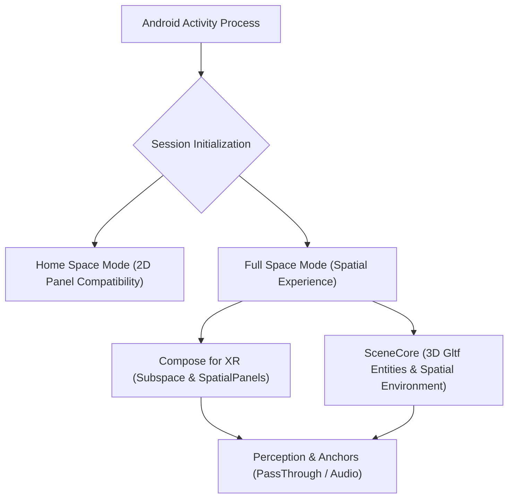

## Android XR 계약

상위 문서: [Android 폼 팩터와 플랫폼 확장 지도](../../android-platforms-and-form-factors.md)

Android XR 은 기존 Android 앱을 공간 안에 띄우는 호환 표면과, Jetpack XR SDK 로 공간 UI 와 3D 콘텐츠를 구성하는 개발 표면을 함께 가진다.

### Android XR 아키텍처 계층 흐름



### 읽는 순서

1. 기존 2D 앱의 호환 실행과 XR differentiated 경험을 구분한다.
2. Jetpack XR 라이브러리별 안정성 단계와 지원 기기를 확인한다.
3. Compose for XR 과 SceneCore 중 UI layout 과 scene graph 책임을 나눈다.
4. Home Space 와 Full Space, runtime capability, session lifecycle 을 상태 입력으로 둔다.
5. eye/hand 중심 입력, comfort, 성능, 실제 기기와 emulator 테스트를 출시 조건으로 검증한다.

### 문제 경계

- 패널 안 2D UI 배치는 Compose, 공간 layout 은 Compose for XR, 3D entity 와 environment 는 SceneCore 책임이다.
- 공간 API 호출 실패는 UI 크기보다 현재 space mode, capability, permission, session 유효성을 먼저 확인한다.
- emulator 의 기능 검증은 실제 기기의 comfort, 발열, tracking, 장시간 사용 검증을 대체하지 않는다.

### 관측 가능한 증거 (Observable Evidence)

```bash
# 1. XR 공간 디스플레이 및 윈도우 인스턴스 덤프 관측
adb shell dumpsys window windows | grep -E "Spatial|Subspace|XR"

# 2. Activity Session 및 Space Mode (Home Space / Full Space) 관측
adb shell dumpsys activity top | grep -E "SpatialCapabilities|SpaceMode"

# 3. XR 시스템 기능 선언 확인
adb shell pm list features | grep -i "android.software.xr"
```

### 정본 노트
- [Android XR은 평면 앱 포트가 아니라 공간 폼 팩터다](./android-xr-is-spatial-form-factor-not-flat-port.md)
- [Home Space vs Full Space 공간 모드 전환](../xr-home-space-vs-full-space.md)
- [2D 호환 실행은 XR 공간화의 시작점일 뿐이다](./two-dimensional-compatibility-is-only-start-of-xr-spatialization.md)
- [Jetpack XR SDK는 preview 성숙도를 전제로 채택해야 한다](./jetpack-xr-sdk-adoption-depends-on-preview-maturity.md)
- [Compose for XR은 기존 Compose를 subspace와 spatial component로 확장한다](./compose-for-xr-extends-compose-with-subspace-and-spatial-components.md)
- [SceneCore는 3D entity와 공간 환경을 다루는 계층이다](./scenecore-manages-3d-entities-and-spatial-environments.md)
- [XR 앱은 공간 capability를 실행 중에 확인해야 한다](./xr-apps-must-check-spatial-capabilities-at-runtime.md)
- [XR 입력은 gaze, hand, controller, keyboard를 함께 설계한다](./xr-input-combines-gaze-hand-controller-and-keyboard.md)
- [XR 품질은 성능, 편안함, 안전을 기능 요구사항으로 포함한다](./xr-quality-includes-performance-comfort-and-safety.md)
- [XR 출시 준비는 기능 시연이 아니라 기기, fallback, 정책 검증이다](./xr-release-readiness-validates-devices-fallbacks-and-policy.md)

검증일: 2026-08-03. [Jetpack XR SDK](https://developer.android.com/develop/xr/jetpack-xr-sdk), [Android XR app quality](https://developer.android.com/docs/quality-guidelines/android-xr)

