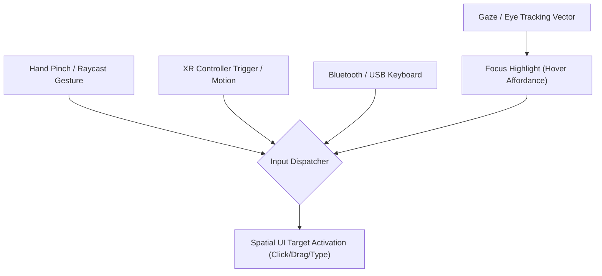

## XR 입력은 gaze, hand, controller, keyboard 를 함께 설계한다

상위 문서: [Android XR 계약](./xr-contracts.md)

XR 입력은 터치 이벤트를 공간으로 옮긴 것이 아니다. Android XR 의 기본 자연 입력인 eye tracking 과 gesture 또는 raycast hand 를 먼저 보장하고, 컨트롤러, 키보드, 마우스 같은 주변 입력으로 확장한다. focus, selection, activation, text input 을 각 경로에서 검증해야 한다.

### XR 멀티모달 입력 파이프라인



시선(gaze)은 포커스 강조 UI 에만 연결되고, 실제 선택 확정(activation)은 반드시 별도 gesture/trigger 가 필요하다. 시선만으로 의도치 않게 요소가 활성화되는 "Midas Touch 문제"를 막기 위한 설계다.

### 입력 소스별 처리 메커니즘

Jetpack XR SDK 는 `SpatialPointerEvent` 와 `InputEvent` 로 입력 소스를 추상화한다. Compose for XR 컴포저블은 `Modifier.onClick`, `Modifier.semantics`(접근성) 등을 통해 공간 포인터 이벤트를 수신한다.

```kotlin
@Composable
fun SpatialButton(
    label: String,
    onClick: () -> Unit
) {
    // Compose for XR 에서 공간 UI 요소는 일반 Compose Modifier 를 그대로 사용한다.
    // 포인터(시선 + 손 raycast / 컨트롤러 레이)가 이 컴포저블에 진입하면
    // 시스템이 자동으로 hover affordance(강조 효과)를 렌더링한다.
    Button(
        onClick = onClick,
        modifier = Modifier
            .semantics { contentDescription = label }
    ) {
        Text(text = label)
    }
}

// 텍스트 입력: XR 환경에서도 일반 TextField 를 사용한다.
// 시스템이 가상 키보드, 물리 Bluetooth 키보드 연결을 자동으로 처리한다.
@Composable
fun SpatialTextInput(
    value: String,
    onValueChange: (String) -> Unit
) {
    TextField(
        value = value,
        onValueChange = onValueChange,
        label = { Text("입력") },
        // keyboardOptions 는 XR 환경의 가상 키보드 타입 힌트로도 사용된다
        keyboardOptions = KeyboardOptions(keyboardType = KeyboardType.Text)
    )
}
```

### 입력 소스별 판단 기준

| 입력 소스 | 기본 제공 | controller 없어도 되는가? | 주의 사항 |
|:---|:---|:---|:---|
| Gaze(시선) | headset 전용 | — | focus 표시 전용, activation 은 별도 gesture 필요 |
| Hand Pinch/Raycast | headset 전용 | ✅ 핵심 경로 | 소형 target 은 누르기 어려움, 최소 48dp 권장 |
| XR Controller | 선택적 주변기기 | — | controller 없는 환경에서도 핵심 기능이 완료 가능해야 함 |
| Bluetooth/USB 키보드 | 선택적 주변기기 | — | 가상 키보드와 함께 동작 확인 필요 |
| 마우스/트랙패드 | 선택적 주변기기 | — | 포인터 이벤트 경로로 처리됨 |

### 판단 기준

- 시선 또는 포인터가 머무는 hover/focus 상태를 명확히 만든다. 시스템이 자동 강조를 제공하지 않는 커스텀 컴포저블은 직접 포커스 표시를 구현한다.
- 손이나 컨트롤러로 누르기 어려운 소형 target(48dp 미만)을 공간 안에 배치하지 않는다.
- text 입력은 가상 키보드, 물리 키보드, 음성 입력 가능성을 함께 고려한다. 앱이 직접 키보드 표시를 제어하려 하지 않는다.
- 같은 명령이 2D panel, orbiter, controller shortcut 중 어디에 있어야 하는지 역할을 나눈다.
- controller 가 없어도 핵심 과업을 완료할 수 있어야 하며, controller 는 선택적 강화 입력으로 둔다.

### 경계

- 이 노트는 입력 소스 설계와 처리 원칙을 다룬다. 공간 capability 의 런타임 확인 방법은 [XR 앱은 공간 capability 를 실행 중에 확인해야 한다](./xr-apps-must-check-spatial-capabilities-at-runtime.md) 가 다룬다.
- 입력 지연(latency)이 멀미에 미치는 영향은 [XR 품질은 성능, 편안함, 안전을 기능 요구사항으로 포함한다](./xr-quality-includes-performance-comfort-and-safety.md) 가 다룬다.

### 관측 가능한 증거 (Observable Evidence)

```bash
# XR 입력 이벤트 모션/Gaze 이벤트 덤프 관측
adb shell dumpsys input | grep -E "GazePointer|SpatialInput|PinchGesture"

# 포커스 이동 및 accessibility 이벤트 확인
adb shell dumpsys accessibility | grep -E "FocusEvent|TYPE_VIEW_HOVER"

# ADB로 XR 내비게이션 이벤트 시뮬레이션
adb shell input keyevent KEYCODE_NAVIGATE_IN
adb shell input keyevent KEYCODE_NAVIGATE_OUT
```

포커스가 의도한 컴포저블에 설정되는지 확인할 때 Layout Inspector 의 "Show semantic information" 옵션을 함께 사용한다. `contentDescription` 누락 요소는 시선 기반 포커스에서도 접근성 트리에 노출되지 않는다.

### 관련 문서

- [XR 품질은 성능, 편안함, 안전을 기능 요구사항으로 포함한다](./xr-quality-includes-performance-comfort-and-safety.md)
- [XR 앱은 공간 capability 를 실행 중에 확인해야 한다](./xr-apps-must-check-spatial-capabilities-at-runtime.md)

공식 문서: [Android XR app quality](https://developer.android.com/docs/quality-guidelines/android-xr), [Develop with the Jetpack XR SDK](https://developer.android.com/develop/xr/jetpack-xr-sdk)

검증일: 2026-08-04. headset 과 wired XR glasses 기준의 기본 입력 계약이며 audio/display glasses 지침은 preview 범위를 별도로 확인한다.
